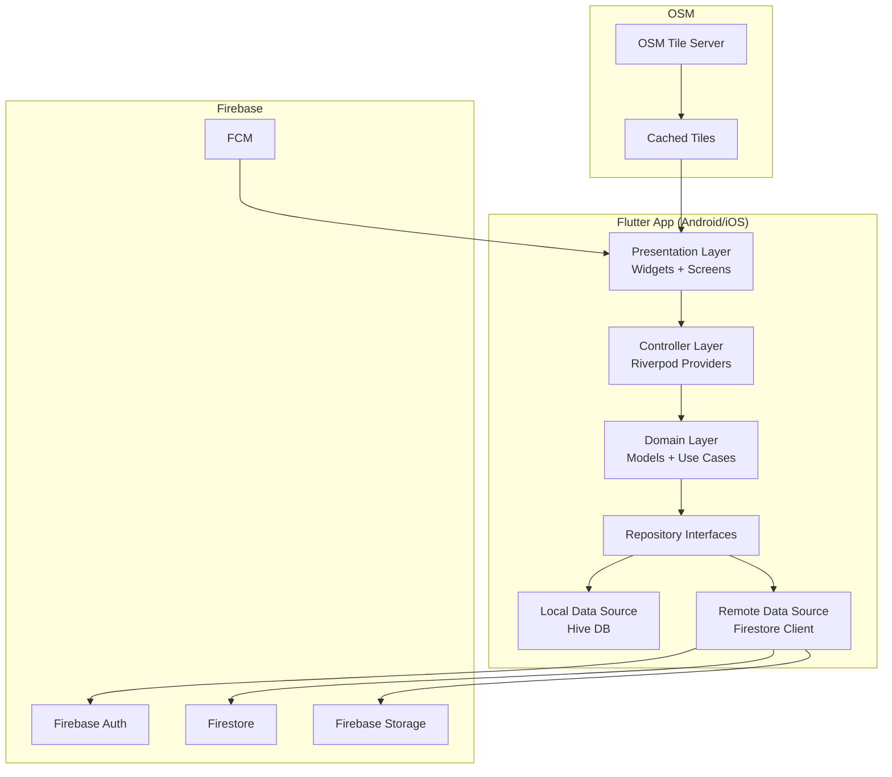
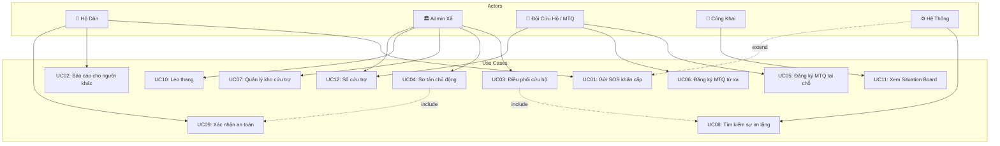
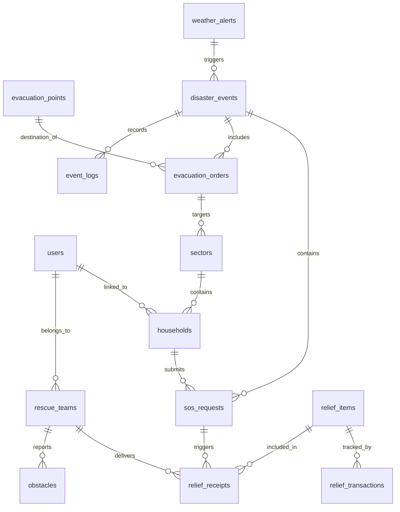
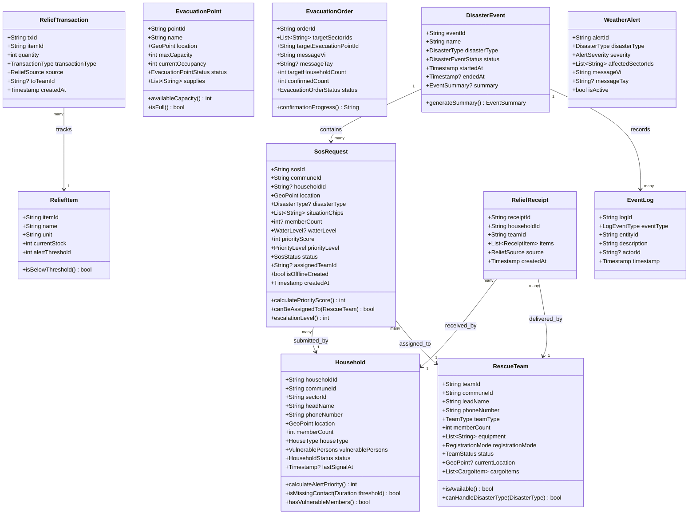

# DISASTERRESCUE — TÀI LIỆU ĐẶC TẢ PHẦN MỀM TỔNG HỢP
## Hệ thống Điều phối Cứu hộ Khẩn cấp Thiên tai tại Việt Nam

**Phiên bản:** 1.1  
**Ngày:** 2026-08-02  
**Dự án:** DisasterRescue  
**Phạm vi demo:** Tỉnh Quảng Ninh (Bình Liêu, Hạ Long)  
**Công nghệ:** Flutter + Firebase + OpenStreetMap  

---

## MỤC LỤC

0. [LỊCH SỬ THAY ĐỔI](#lịch-sử-thay-đổi)
1. [PHẦN 1: TÀI LIỆU ĐẶC TẢ PHẦN MỀM (SRS)](#phần-1)
2. [PHẦN 2: THIẾT KẾ KIẾN TRÚC PHẦN MỀM](#phần-2)
3. [PHẦN 3: ACCEPTANCE TEST SCENARIOS](#phần-3)
4. [PHẦN 4: THIẾT KẾ USE CASE](#phần-4)
5. [PHẦN 5: THIẾT KẾ CƠ SỞ DỮ LIỆU (FIRESTORE)](#phần-5)
6. [PHẦN 6: THIẾT KẾ HƯỚNG ĐỐI TƯỢNG (OOP)](#phần-6)
7. [PHẦN 7: THIẾT KẾ GIAO DIỆN (UI/UX)](#phần-7)

---

## 0. LỊCH SỬ THAY ĐỔI

| Phiên bản | Ngày | Mục bị ảnh hưởng | Tóm tắt thay đổi |
|-----------|------|-------------------|-----------------|
| 1.0 | 2025 | — | Tài liệu gốc |
| 1.1 | 2026-08-02 | FR-01.5 | Viết lại thuật toán định tuyến vai trò sau đăng nhập, bổ sung đổi vai trò trong Hồ sơ |
| 1.1 | 2026-08-02 | FR-11 | Thêm phân định Situation Board là chế độ xem công khai, không phải vai trò |
| 1.1 | 2026-08-02 | FR-03.1 | Loại bỏ Luồng A (form đầy đủ bắt buộc); đổi tên FR-03 thành "Báo tin cho xã" |
| 1.1 | 2026-08-02 | FR-17 (MỚI) | Thêm chức năng Yêu cầu hỗ trợ sơ tán (AssistanceRequest) |
| 1.1 | 2026-08-02 | FR-07.3, FR-06.3 | Thêm mô hình đa nguồn xác nhận an toàn và phân biệt trạng thái mất liên lạc |
| 1.1 | 2026-08-02 | FR-09.6, FR-09.7, FR-09.8 | Thêm phân loại đội thường trực/vãng lai và 5 trạng thái đội |
| 1.1 | 2026-08-02 | FR-10.7, FR-10.8, FR-10.9 | Thêm mô hình kho hai tầng (ReliefPackage) và tổng vật tư khả dụng |
| 1.1 | 2026-08-02 | FR-13.1 | Loại bỏ trường "mức khẩn cấp" tự đánh giá, thay bằng EscalationEvidence tự sinh |
| 1.1 | 2026-08-02 | FR-05.1, FR-05.4, FR-05.5 | Cập nhật Import hộ dân phù hợp mobile; thêm nhập thủ công và xử lý trùng lặp |
| 1.1 | 2026-08-02 | Phần 7.4 | Cập nhật danh sách màn hình từ 23 lên 41 màn, chia 3 nhóm |

---

# PHẦN 1: TÀI LIỆU ĐẶC TẢ PHẦN MỀM (SRS)
*Software Requirements Specification — IEEE 830*

## 1.1 Mục đích tài liệu

Tài liệu này mô tả đầy đủ các yêu cầu chức năng và phi chức năng của hệ thống DisasterRescue — ứng dụng di động điều phối cứu hộ khẩn cấp thiên tai tại Việt Nam. Tài liệu phục vụ:

- Nhóm phát triển phần mềm: làm cơ sở thiết kế và triển khai
- Kiểm thử viên: làm cơ sở viết test cases
- Stakeholder: xác nhận phạm vi và nghiệp vụ hệ thống
- Bên triển khai: hiểu rõ yêu cầu vận hành

## 1.2 Phạm vi hệ thống

**Tên hệ thống:** DisasterRescue  
**Mô tả ngắn:** Ứng dụng mobile-first điều phối cứu hộ khẩn cấp thiên tai, hỗ trợ chính quyền xã quản lý tình huống khẩn cấp, điều phối đội cứu hộ và kết nối với hộ dân bị nạn.

**Phạm vi địa lý demo:** Tỉnh Quảng Ninh — sạt lở (Bình Liêu, Tiên Yên, Ba Chẽ, Hải Hà), bão lũ (Hạ Long, Hòn Gai, Móng Cái)

**Các loại thiên tai được hỗ trợ:**
1. Lũ lụt
2. Sạt lở đất
3. Cháy rừng
4. Bão

**Ngoài phạm vi (không bao gồm):**
- Dashboard tỉnh/huyện (chỉ cấp xã)
- Quản lý ca trực nhân sự
- Đánh giá thiệt hại nhà ở sau thiên tai
- Loa phát thanh tích hợp
- Tình nguyện viên cá nhân (khác với đội MTQ)


## 1.3 Định nghĩa, từ viết tắt, thuật ngữ (Glossary)

| Thuật ngữ | Định nghĩa |
|-----------|------------|
| **SOS** | Tín hiệu khẩn cấp (Save Our Souls) — yêu cầu cứu hộ từ hộ dân |
| **MTQ** | Mặt trận Tổ quốc — tổ chức xã hội tham gia cứu trợ |
| **PCTT** | Phòng chống thiên tai |
| **Admin xã** | Cán bộ chính quyền xã được cấp tài khoản quản trị hệ thống |
| **Admin phụ** | Trưởng thôn — admin hạn chế chỉ thấy thôn mình |
| **Hộ dân** | Hộ gia đình người dân tự đăng ký tài khoản |
| **Đội cứu hộ** | Dân quân, MTQ, tổ chức xã hội tham gia cứu hộ |
| **Situation Board** | Bảng tình hình công khai, không cần đăng nhập |
| **Offline-first** | Ứng dụng hoạt động được khi không có mạng |
| **SOS Queue** | Hàng đợi lưu SOS khi mất mạng, tự đồng bộ khi có mạng |
| **Priority Score** | Điểm ưu tiên tự động tính theo tình trạng hộ dân |
| **SMS Fallback** | Gửi SOS qua tin nhắn SMS khi chỉ có sóng 2G |
| **GPS Cache** | Lưu tọa độ GPS cuối cùng biết được |
| **Leo thang** | Gửi yêu cầu hỗ trợ lên cấp hành chính cao hơn |
| **Sổ cứu trợ** | Hồ sơ điện tử ghi nhận mỗi lần phát hàng cứu trợ |
| **Situation Report** | Báo cáo tình hình chung (loại C — không tạo SOS) |
| **Obstacle** | Chướng ngại vật trên đường cứu hộ (cây đổ, đường sập...) |
| **Sector** | Khu vực địa lý — thôn/xóm trong xã |
| **FCM** | Firebase Cloud Messaging — dịch vụ push notification |
| **Hive** | Thư viện lưu trữ NoSQL local cho Flutter |
| **Riverpod** | Thư viện quản lý state cho Flutter |
| **Firestore** | Cơ sở dữ liệu NoSQL thời gian thực của Firebase |
| **OSM** | OpenStreetMap — bản đồ mã nguồn mở |
| **flutter_map** | Thư viện bản đồ cho Flutter sử dụng OSM tiles |
| **Tiếng Tày** | Ngôn ngữ dân tộc thiểu số tại khu vực Bình Liêu, Quảng Ninh |


## 1.4 Tài liệu tham chiếu

- IEEE 830-1998: Recommended Practice for Software Requirements Specifications
- Firebase Documentation: https://firebase.google.com/docs
- flutter_map Documentation: https://docs.fleaflet.dev
- OpenStreetMap Tile Usage Policy: https://wiki.openstreetmap.org/wiki/Tile_usage_policy
- Hive Documentation: https://docs.hivedb.dev
- Riverpod Documentation: https://riverpod.dev/docs
- Luật Phòng chống thiên tai Việt Nam số 33/2013/QH13
- Quyết định 1002/QĐ-TTg về cơ chế phối hợp ứng phó thiên tai

## 1.5 Tổng quan tài liệu

Tài liệu được tổ chức gồm 7 phần chính:
- **Phần 1 (SRS):** Yêu cầu chức năng và phi chức năng đầy đủ
- **Phần 2 (Kiến trúc):** Thiết kế kiến trúc Flutter + Firebase
- **Phần 3 (Acceptance Tests):** Kịch bản kiểm thử nghiệm thu
- **Phần 4 (Use Cases):** Sơ đồ và mô tả ca sử dụng
- **Phần 5 (Database):** Schema Firestore và security rules
- **Phần 6 (OOP):** Class diagrams và domain models
- **Phần 7 (UI/UX):** Wireframes và design system

---

## 2.1 Mô tả tổng quan hệ thống (System Overview)

DisasterRescue là ứng dụng di động điều phối cứu hộ khẩn cấp thiên tai được thiết kế đặc thù cho bối cảnh Việt Nam. Hệ thống hoạt động theo mô hình phân cấp chính quyền 2 cấp (tỉnh và xã), tập trung vào cấp xã là đơn vị điều phối cơ sở.

**Nguyên tắc thiết kế cốt lõi:**
1. **Offline-first:** Mọi chức năng quan trọng đều hoạt động khi không có mạng
2. **SOS 1 chạm:** Không yêu cầu form phức tạp trong tình huống khẩn cấp
3. **Thông tin tuyệt đối:** Hiển thị số tuyệt đối thay vì tỷ lệ phần trăm
4. **Phù hợp địa phương:** Hỗ trợ đa ngôn ngữ (Tiếng Việt + Tiếng Tày)
5. **Bảo mật thông tin:** Phân quyền chặt chẽ, bảo vệ thông tin hộ dân

**Kiến trúc tổng thể:**
```
[Hộ dân / Đội cứu hộ / Admin] 
        ↕ Flutter App (iOS + Android)
        ↕ Firebase (Auth + Firestore + Storage + FCM)
        ↕ OpenStreetMap Tiles (offline-capable)
```

## 2.2 Các chức năng chính (Product Functions)

1. Gửi và quản lý SOS khẩn cấp
2. Báo cáo chi tiết 3 luồng (tự báo / báo thay / tình hình chung)
3. Điều phối cứu hộ thời gian thực
4. Cảnh báo sớm và sơ tán chủ động
5. Quản lý kho cứu trợ và sổ cứu trợ điện tử
6. Đăng ký và quản lý đội MTQ
7. Tìm kiếm sự im lặng (hộ mất liên lạc)
8. Situation Board công khai
9. Leo thang lên cấp hành chính cao hơn
10. Nhật ký sự kiện thiên tai

## 2.3 Đặc điểm người dùng (User Characteristics)

| Nhóm | Trình độ kỹ thuật | Điều kiện sử dụng | Thiết bị |
|------|-------------------|-------------------|----------|
| Hộ dân | Thấp — trung bình | Căng thẳng, tay ướt, tối, mưa | Android giá rẻ, iOS cũ |
| Admin xã | Trung bình | Văn phòng hoặc thực địa | Android/iOS tầm trung |
| Đội cứu hộ | Trung bình | Thực địa khắc nghiệt | Android bền, đôi khi không có mạng |
| Công chúng | Đa dạng | Nhà / văn phòng | Mọi thiết bị, cả PC |


## 2.4 Ràng buộc chung (Constraints)

- **Platform:** Android 8.0+ và iOS 13.0+
- **Backend:** Chỉ Firebase (không tự host server)
- **Map:** Chỉ OSM tiles, không dùng Google Maps (chi phí)
- **Offline:** Phải hoạt động đầy đủ khi không có mạng (SOS, xác nhận an toàn)
- **Ngôn ngữ:** Tiếng Việt là mặc định, hỗ trợ thêm Tiếng Tày cho thông báo
- **Bảo mật:** Không lưu thông tin hộ dân trên thiết bị đội cứu hộ khi chưa nhận nhiệm vụ
- **Phân quyền:** Admin không được tự đăng ký — phải được cấp tài khoản bởi cấp trên

## 2.5 Giả định và phụ thuộc

**Giả định:**
- Người dùng có smartphone chạy Android 8+ hoặc iOS 13+
- Khu vực có ít nhất sóng 2G để SMS fallback hoạt động
- Admin xã có kết nối 3G/4G trong phần lớn thời gian làm việc
- Danh sách hộ dân đã được chuẩn bị trước mùa thiên tai

**Phụ thuộc:**
- Firebase phải hoạt động (uptime 99.9%)
- API thời tiết bên ngoài cho cảnh báo sớm (có thể nhập thủ công)
- OSM tile server cho bản đồ offline (cần pre-cache trước)
- FCM cho push notification

---

## 3. YÊU CẦU CHỨC NĂNG CHI TIẾT

### FR-01: Quản lý tài khoản và đăng nhập

| Thuộc tính | Chi tiết |
|------------|----------|
| **Mã** | FR-01 |
| **Tên** | Quản lý tài khoản và đăng nhập |
| **Mô tả** | Hệ thống quản lý 5 loại tài khoản với phân quyền khác nhau |
| **Điều kiện kích hoạt** | Người dùng mở ứng dụng hoặc truy cập chức năng cần xác thực |

**FR-01.1 — Đăng nhập:**
- Đầu vào: Số điện thoại hoặc email + mật khẩu
- Xử lý: Xác thực qua Firebase Auth → kiểm tra role → chọn màn hình phù hợp
- Đầu ra: Phiên đăng nhập hợp lệ, chuyển đến màn hình chọn vai trò
- Ngoại lệ: Sai mật khẩu → thông báo "Thông tin đăng nhập không đúng"; tài khoản chờ duyệt → "Tài khoản đang chờ phê duyệt"

**FR-01.2 — Đăng ký hộ dân:**
- Đầu vào: Họ tên, SĐT, mật khẩu, số thành viên, loại nhà, người yếu thế, vị trí GPS
- Xử lý: Tạo account Firebase Auth + document Firestore users/ + households/
- Đầu ra: Tài khoản active, hộ dân có thể gửi SOS ngay

**FR-01.3 — Đăng ký đội cứu hộ/MTQ:**
- Đầu vào: Họ tên, SĐT, số người, phương tiện, tổ chức
- Xử lý: Tạo account + document trạng thái "pending"
- Đầu ra: Thông báo "Đang chờ admin duyệt"

**FR-01.4 — Admin tạo tài khoản:**
- Admin hệ thống tỉnh tạo tài khoản admin xã
- Admin xã tạo tài khoản admin phụ (trưởng thôn)
- Không cho phép admin tự đăng ký

**FR-01.5 — Chọn vai trò:**
- Đầu vào: `user.roles[]` đọc từ Firestore sau khi xác thực thành công.
- Xử lý:
  - `roles.length == 1` → điều hướng THẲNG đến màn tương ứng, KHÔNG hiển thị màn chọn vai trò:
    - `["household"]` → Trang chủ hộ dân
    - `["commune_admin"]` → Dashboard bản đồ
    - `["rescue_team"]` → Danh sách nhiệm vụ
  - `roles.length >= 2` → hiển thị màn Chọn vai trò với đúng các vai user có quyền (không đưa Situation Board vào đây — xem FR-11).
- Bổ sung: phải có chức năng đổi vai trò trong màn Hồ sơ, không yêu cầu đăng xuất.
- Ghi chú: trường hợp nhiều vai rất phổ biến ở cấp xã — trưởng thôn đồng thời là chủ hộ và là dân quân trong đội cứu hộ.

*Lý do (v1.1): tài liệu v1.0 đã quy định đúng nhưng mô tả chưa đủ rõ nên bản thiết kế hiểu sai thành mọi người dùng đều phải chọn vai trò.*


### FR-02: Gửi SOS khẩn cấp

| Thuộc tính | Chi tiết |
|------------|----------|
| **Mã** | FR-02 |
| **Tên** | Gửi SOS khẩn cấp |
| **Mô tả** | Hộ dân gửi tín hiệu cứu hộ bằng 1 lần bấm nút, không cần điền form |
| **Điều kiện kích hoạt** | Hộ dân bấm nút SOS trên màn hình chính |

**FR-02.1 — Gửi SOS 1 chạm:**
- Đầu vào: Bấm nút SOS (250px) — không cần thêm thông tin
- Xử lý: Lấy GPS hiện tại (hoặc cache) → tạo SosRequest với trạng thái pending → gửi lên Firestore
- Đầu ra: Xác nhận "SOS đã gửi", hiển thị trạng thái, admin nhận notification
- Ngoại lệ (offline): Lưu vào SOS Queue local → hiển thị "Đã lưu, sẽ gửi khi có sóng"
- Ngoại lệ (chỉ 2G): Gửi SMS fallback → hiển thị "Đã gửi qua SMS"
- Ngoại lệ (mất GPS): Dùng tọa độ cache → hiển thị "Vị trí gần đúng — cập nhật lúc HH:MM"

**FR-02.2 — Bổ sung thông tin SOS (tuỳ chọn):**
Sau khi gửi SOS, người dùng có thể bổ sung (không bắt buộc):
- Loại thiên tai: lũ lụt / sạt lở / cháy rừng / bão
- Chips tình huống: trẻ em, người già, người ốm, khuyết tật, cần thuốc
- Số người: slider 1-20+
- Mực nước (nếu lũ): đầu gối / ngực / mái nhà
- Ảnh chụp (tuỳ chọn)

**FR-02.3 — Tính điểm ưu tiên tự động:**

| Yếu tố | Điểm |
|--------|------|
| Có trẻ em | +15 |
| Có người già | +15 |
| Người ốm nặng | +20 |
| Khuyết tật | +10 |
| Ngập tầng 1 | +15 |
| Cần thuốc | +10 |
| Nước mức mái nhà | +20 |
| Nước mức ngực | +10 |
| Nhà cấp 4 | +10 |
| >5 người | +5 |

Phân loại: ≥70 điểm → Đỏ (khẩn cấp); 40-69 điểm → Cam (nguy hiểm); <40 điểm → Vàng (cần hỗ trợ)

**FR-02.4 — Leo thang tự động theo thời gian:**
- SOS mức đỏ, chưa có đội nhận sau 15 phút → Cảnh báo cấp 1 đến admin
- SOS mức đỏ, chưa có đội nhận sau 30 phút → Cảnh báo cấp 2 + âm thanh
- SOS mức đỏ, chưa có đội nhận sau 60 phút → Cảnh báo cấp 3 + đề xuất leo thang

**FR-02.5 — Trạng thái SOS:**
pending → verified → assigned → in_progress → completed | rejected | cancelled


### FR-03: Báo tin cho xã

| Mã | FR-03 |
|----|-------|
| **Tên** | Báo tin cho xã |
| **Mô tả** | Hệ thống hỗ trợ 2 luồng báo cáo (stepper 2 bước): Luồng B — báo cho người khác; Luồng C — báo tình hình chung. Luồng A đã được tích hợp vào FR-02 (SOS 1 chạm). |

**FR-03.1 — Luồng A: Tôi cần được cứu [ĐÃ LOẠI BỎ — v1.1]**

*Lý do (v1.1): trùng kết quả với FR-02 (cùng tạo SosRequest, cùng độ tin cậy, cùng tác nhân) và đi ngược nguyên tắc thiết kế "SOS 1 chạm" ở mục 2.1. Bắt người đang gặp nguy điền form đầy đủ trước khi gửi là rủi ro: mọi gián đoạn đều khiến SOS không được gửi. Mọi trường hợp "tôi cần được cứu" phải dùng nút SOS ở FR-02.*

**FR-03.2 — Luồng B: Báo cho người khác**
- Đầu vào: vị trí người cần cứu (bản đồ HOẶC địa chỉ văn bản), mô tả tình huống, ảnh
- Đầu ra: Tạo báo cáo trạng thái "chờ xác minh" (pending_verification)
- Mức tin cậy tự tính: ảnh (+20), GPS gần hiện trường <500m (+15), nhiều người báo cùng nơi (+25), tài khoản đã xác thực (+10), báo từ xa >5km (-15)
- Admin phải duyệt trước khi thành SOS

**FR-03.3 — Luồng C: Báo cáo tình hình chung**
- Thu thập: loại sự cố (đường sập, cây đổ, nước dâng, lửa cháy, cầu hỏng), vị trí, mô tả, ảnh
- KHÔNG tạo SOS — hiển thị như "situation report" trên bản đồ admin
- Dùng để cập nhật tình hình chung cho đội cứu hộ

**FR-03.4 — Cross-reference báo cáo:**
- 2-3 báo cáo độc lập trong bán kính 200m trong 30 phút → tự động nâng mức ưu tiên
- Admin nhận thông báo "Nhiều người báo cùng khu vực"

### FR-04: Cảnh báo sớm và sơ tán chủ động

**FR-04.1 — Cảnh báo sớm:**
- Đầu vào: Dữ liệu API thời tiết hoặc admin nhập thủ công
- Xử lý: Tạo WeatherAlert → gửi FCM notification theo vùng địa lý
- Nội dung notification: loại thiên tai, vùng ảnh hưởng, mức độ, khuyến cáo hành động
- Hỗ trợ ngôn ngữ: Tiếng Việt + Tiếng Tày (cho vùng Bình Liêu)

**FR-04.2 — Phát lệnh sơ tán:**
- Admin chọn: khu vực (thôn/xóm hoặc vẽ trên bản đồ)
- Admin chọn điểm sơ tán đích
- Template tin nhắn tự sinh, có thể chỉnh sửa
- Gửi qua: push notification FCM + hiển thị trên app
- Đầu ra: EvacuationOrder document + notification đến tất cả hộ trong khu vực

**FR-04.3 — Hộ dân xác nhận sơ tán:**
- Nhận notification → mở app → 1 nút "Tôi đã đến điểm sơ tán"
- Hoặc báo "Không thể sơ tán — cần hỗ trợ"
- Admin xem tiến độ: "Đã xác nhận sơ tán: 45/120" (số tuyệt đối)

**FR-04.4 — Quản lý điểm sơ tán:**
- Thuộc tính: tên, tọa độ, sức chứa tối đa, số người hiện tại, tình trạng (mở/đầy/hỏng), vật tư
- Admin cập nhật real-time
- Hiển thị trên bản đồ cho tất cả vai trò


### FR-05: Import và đối chiếu hộ dân

**FR-05.1 — Import danh sách hộ dân:**
- Ghi chú: đây là công tác chuẩn bị trước mùa thiên tai (đã nêu ở mục 2.5), không phải thao tác khẩn cấp. Khuyến nghị thực hiện trên bản web quản trị; bản mobile giữ ở mức rút gọn để dùng khi cần bổ sung gấp ngoài thực địa.
- Đầu vào (3 nguồn thay thế kéo-thả — không phù hợp mobile):
  - Chọn file từ bộ nhớ máy (file picker)
  - Mở file đã tải về từ Zalo hoặc Email
  - Dán link Google Sheet chia sẻ công khai
- "Tải template" → đổi thành "Gửi file mẫu về email" và "Xem cấu trúc 12 cột"
- Xử lý: Parse file → preview bảng dữ liệu → kiểm tra trùng SĐT → xác nhận → lưu vào Firestore
- Đầu ra: Danh sách households/ được tạo, bảng tổng hợp (tổng hộ, nhân khẩu, người yếu thế)
- Ngoại lệ: Xem FR-05.5 để xử lý trùng SĐT; lỗi format file → thông báo chi tiết dòng lỗi

**FR-05.2 — Đối chiếu hộ dân:**
- Bảng tổng hợp theo thôn với các cột: Thôn | Tổng hộ | An toàn | SOS | Mất liên lạc | Đang cứu | Đã cứu
- Sắp xếp mặc định: số "Mất liên lạc" giảm dần
- Có thể filter: tất cả / an toàn / SOS / mất liên lạc / đang cứu / đã cứu
- Card hộ dân: tên chủ hộ, thôn, số người, biểu tượng người yếu thế, trạng thái (chip màu), thời gian cập nhật cuối

**FR-05.3 — Template import:**
```
Cột A: Họ tên chủ hộ (bắt buộc)
Cột B: Số điện thoại (bắt buộc, unique)
Cột C: Thôn/xóm (bắt buộc)
Cột D: Số thành viên (số nguyên ≥1)
Cột E: Loại nhà (cấp4 | tangket)
Cột F: Có trẻ em (1/0)
Cột G: Có người già (1/0)
Cột H: Khuyết tật (1/0)
Cột I: Mang thai (1/0)
Cột J: Ghi chú (tuỳ chọn)
Cột K: Vĩ độ (tuỳ chọn)
Cột L: Kinh độ (tuỳ chọn)
```

**FR-05.4 — Nhập hộ dân thủ công (MỚI v1.1):**
- Admin thực hiện nhập từng hộ thay cho hộ chưa có tài khoản app
- Form: họ tên, SĐT, thôn, số thành viên, loại nhà, người yếu thế, vị trí, ghi chú
- Khi hộ tự đăng ký sau, hệ thống ghép theo số điện thoại

**FR-05.5 — Xử lý trùng lặp (MỚI v1.1):**
- Với mỗi cặp trùng số điện thoại, hiển thị hai cột so sánh:
  - Dữ liệu đang có trong hệ thống
  - Dữ liệu trong file import
- Tô đậm các trường khác nhau
- Ba lựa chọn: giữ bản cũ / ghi đè bằng bản mới / tạo hộ mới kèm sửa số điện thoại

*Lý do (v1.1): Import là công tác chuẩn bị, bản mobile cần tối giản; cần kênh riêng cho nhập thủ công và xử lý trùng có thể phân biệt từng trường.*

### FR-06: Tìm kiếm sự im lặng

**FR-06.1 — Phát hiện hộ mất liên lạc:**
- Điều kiện: hộ trong vùng ảnh hưởng thiên tai + không có tín hiệu (SOS / xác nhận an toàn / hoạt động app) quá ngưỡng thời gian (mặc định: 4 giờ)
- Hệ thống tự đánh dấu trạng thái "missing_contact" (Mất liên lạc)
- Ưu tiên cảnh báo: nhà cấp 4 + có người yếu thế = ưu tiên cao nhất

**FR-06.2 — Hiển thị danh sách mất liên lạc:**
- Admin xem tab "Mất liên lạc" riêng biệt
- Sắp xếp theo: mức ưu tiên giảm dần → thời gian im lặng giảm dần
- Nút "Gửi đội kiểm tra" → gán nhiệm vụ kiểm tra cho đội cứu hộ

**FR-06.3 — Phân biệt mất liên lạc và an toàn được xác nhận gián tiếp (MỚI v1.1):**

Giao diện PHẢI tách hai trạng thái đang bị gộp:

| Chip hiển thị | Màu | Ý nghĩa vận hành |
|---------------|-----|-----------------|
| Mất liên lạc — thiết bị im lặng | #616161 | Có thể mắc kẹt, PHẢI cử người kiểm tra |
| An toàn — đội xác nhận | #388E3C | Không cần hành động |
| An toàn — check-in sơ tán | #388E3C | Không cần hành động |
| An toàn — tự báo | #388E3C | Không cần hành động |

Luôn hiển thị nguồn kèm trạng thái. Gộp chung khiến admin không phân biệt được hộ cần ưu tiên.

*Lý do (v1.1): trạng thái an toàn không được phụ thuộc duy nhất vào thiết bị của hộ — xem FR-07.3 để biết đầy đủ 5 nguồn xác nhận.*

### FR-07: Xác nhận an toàn định kỳ

**FR-07.1 — Popup xác nhận an toàn:**
- Kích hoạt khi: thiên tai đang diễn ra + hộ dân chưa gửi SOS + chưa xác nhận an toàn > 2 giờ
- Hiển thị: modal dialog đơn giản với 2 nút
- Nút 1: "Tôi an toàn" (màu xanh lá)
- Nút 2: "Tôi cần giúp" (màu đỏ — gửi SOS nhanh)
- Offline: lưu local → sync khi có mạng

**FR-07.2 — Cảnh báo không phản hồi:**
- Lần hỏi 1 không phản hồi → 1 giờ sau hỏi lần 2
- Lần hỏi 2 không phản hồi → 1 giờ sau hỏi lần 3
- Lần hỏi 3 không phản hồi → gửi notification cảnh báo đến admin
- Admin thấy: hộ X chưa phản hồi 3 lần kể từ HH:MM

**FR-07.3 — Nguồn xác nhận trạng thái an toàn (MỚI v1.1):**

Vấn đề của v1.0: trạng thái an toàn chỉ có một nguồn duy nhất là thiết bị của hộ dân. Trong lũ lụt, điện thoại hết pin, rơi nước hoặc mất sóng là tình huống thường gặp, không phải ngoại lệ. Hậu quả: hộ đã được cứu và đang ở điểm sơ tán vẫn bị hệ thống đánh dấu mất liên lạc, khiến xã cử đội thứ hai đi kiểm tra một cách vô ích trong lúc nguồn lực khan hiếm.

Mô hình dữ liệu bắt buộc:
```dart
class SafetyStatus {
  SafetyState status;   // safe | sos | missingContact | rescued | evacuated
  SafetySource source;
  String? verifiedBy;   // userId, null nếu hộ tự báo
  DateTime verifiedAt;
  int confidence;       // 0-100
  String? note;
}
```

Năm nguồn xác nhận:

| Nguồn | Ai ghi nhận | Độ tin cậy | Ghi chú |
|-------|-------------|------------|---------|
| rescueTeam | Đội cứu hộ tại hiện trường | 100 | Kèm ảnh + GPS + thời gian |
| evacuationCheckin | Người quản lý điểm sơ tán | 95 | Quét QR hoặc tìm theo tên |
| selfApp | Hộ dân tự báo qua app | 90 | |
| adminManual | Trưởng thôn xác nhận thủ công | 70 | Bắt buộc ghi lý do |
| neighborReport | Hàng xóm báo hộ | 40 | Đi qua luồng B, cần admin duyệt |

*Lý do (v1.1): trạng thái an toàn của hộ dân không được phụ thuộc duy nhất vào thiết bị của họ.*


### FR-08: Điều phối cứu hộ (Admin)

**FR-08.1 — Dashboard bản đồ admin:**
- Bản đồ realtime với các lớp (layer) có thể bật/tắt:
  - SOS markers: icon theo loại thiên tai, màu theo mức độ (đỏ/cam/vàng)
  - Báo cáo tình hình (loại C) — icon khác màu
  - Vị trí đội cứu hộ đang hoạt động (GPS realtime)
  - Vùng ảnh hưởng thiên tai (polygon)
  - Điểm sơ tán (icon đặc biệt + số người hiện tại)
  - Ảnh hiện trường (ảnh thumbnail gắn tọa độ)
  - Chướng ngại vật (icon theo loại)
- KPI cards hàng đầu: SOS chờ xử lý (đỏ) | Đang cứu (cam) | Đã cứu (xanh) | Mất liên lạc (xám)
- Progress bar tổng: "280/480 hộ đã an toàn"

**FR-08.2 — Gán đội cứu hộ:**
- Admin chọn SOS trên bản đồ → popup chi tiết → "Gán đội"
- Chọn đội trong danh sách (hiển thị vị trí, số người, phương tiện, trạng thái)
- Đội nhận push notification ngay

**FR-08.3 — Duyệt báo cáo:**
- Danh sách báo cáo loại B (luồng B) trạng thái "chờ xác minh"
- Mỗi báo cáo: ảnh, mô tả, mức tin cậy (thanh màu), vị trí
- Nút: Duyệt → chuyển thành SOS | Từ chối → xoá báo cáo

**FR-08.4 — Quản lý lực lượng:**
- Danh sách đội cứu hộ: trạng thái (online/offline/trong nhiệm vụ), vị trí, số người
- MTQ chờ duyệt: danh sách + nút Duyệt/Từ chối + nút Gán khu vực

### FR-09: Đội cứu hộ và MTQ

**FR-09.1 — Đăng ký tại hiện trường (QR):**
- Quét QR code tại chốt tiếp nhận
- Form ngắn: tên, SĐT, số người, phương tiện (tất cả 1 màn hình)
- Gửi → admin nhận notification → duyệt trong 2-3 phút → gán khu vực

**FR-09.2 — Đăng ký từ xa:**
- Form đầy đủ: tên, SĐT, số người, phương tiện, khả năng, hàng mang theo, khu vực muốn hỗ trợ, dự kiến giờ đến
- Trạng thái: "Đã đăng ký — Đang di chuyển"
- Check-in khi đến: quét QR chốt hoặc bấm nút "Tôi đã đến"

**FR-09.3 — Nhận và thực hiện nhiệm vụ:**
1. Xem danh sách SOS trong khu vực được gán (thông tin hạn chế: vị trí, loại, số người, mức độ)
2. Bấm "Tôi đi" → lock SOS (đội khác thấy "Đội X đang đến") → nhận đủ thông tin hộ dân
3. Đến hiện trường → chụp ảnh trước
4. Thực hiện cứu hộ
5. Báo cáo hoàn thành: số người cứu, tình trạng sức khỏe, ảnh sau, hàng đã phát

**FR-09.4 — Báo chướng ngại vật:**
- Camera chụp + chọn loại (cây đổ / đường sập / nước xiết / cầu sập / đất lở / khác)
- GPS tự lấy
- Submit → hiển thị icon chướng ngại trên bản đồ cho tất cả đội

**FR-09.5 — Quyền xem SOS:**
- Trước nhận nhiệm vụ: vị trí (chỉ hiển thị khu vực chung), loại sự cố, số người, mức khẩn cấp
- KHÔNG thấy: tên chủ hộ, SĐT, địa chỉ chi tiết
- Sau bấm "Tôi đi": thấy đầy đủ thông tin cá nhân

**FR-09.6 — Phân loại đội cứu hộ (MỚI v1.1):**

| | Đội thường trực (standing) | Đội vãng lai (adhoc) |
|---|---|---|
| Ai tạo | Admin xã tạo trước mùa thiên tai | Tự đăng ký khi có thiên tai |
| Kích hoạt | 1 chạm, KHÔNG cần duyệt | Đăng ký, chờ admin duyệt |
| Vật tư | standingEquipment (biên chế, luôn có) | broughtSupplies (mang theo đợt này) |
| Mã QR | Cố định, in nhãn (VD: DR-BL-DQ-PL01) | Quét mã chốt tiếp nhận |
| Ví dụ | Dân quân thôn, tổ xung kích, đội y tế xã | Hội Chữ thập đỏ, đoàn thiện nguyện |

Cập nhật FR-09.1: mã QR tại chốt phục vụ cả hai loại đội, phân nhánh sau khi quét:
- Mã thuộc đội thường trực → kích hoạt ngay kèm tuỳ chọn chỉnh quân số hôm nay
- Mã chốt hoặc mã lạ → mở form đăng ký đội mới

*Lý do (v1.1): v1.0 coi mọi đội đều là đơn vị lạ đến đăng ký. Đội dân quân thôn đã tồn tại từ trước, có biên chế và phương tiện; bắt họ đăng ký lại và chờ duyệt mỗi đợt thiên tai là lãng phí đúng khoảng thời gian quan trọng nhất.*

**FR-09.7 — Chuẩn bị lực lượng thường trực (MỚI v1.1):**
- Admin xã khai báo trước danh sách đội biên chế gồm: tên đội, loại, trưởng đội, thành viên, phương tiện, vật tư biên chế, khu vực phụ trách và mã QR riêng (cố định, in nhãn).

**FR-09.8 — Trạng thái đội (MỚI v1.1):**

| Trạng thái | Ý nghĩa | Ai đặt | Hệ thống xử lý |
|------------|---------|--------|----------------|
| available | Sẵn sàng | Đội tự bật | NHẬN push SOS mới |
| onMission | Đang nhiệm vụ | Hệ thống, khi bấm "Tôi đi" | Không nhận SOS mới |
| resting | Tạm nghỉ | Đội tự bật, bắt buộc nhập lý do và giờ quay lại | KHÔNG đẩy SOS |
| offline | Mất kết nối | Hệ thống, sau 30 phút im lặng | Cảnh báo admin |
| ended | Kết thúc ca | Đội hoặc admin | Loại khỏi danh sách khả dụng |

Ràng buộc: logic gán đội PHẢI lọc `status == available`. Nếu đẩy SOS cho đội đang nghỉ, SOS bị treo — không ai nhận nhưng đồng hồ leo thang vẫn chạy.


### FR-10: Kho cứu trợ khẩn cấp

**FR-10.1 — Nhập kho:**
- Đầu vào: loại hàng (từ danh mục), số lượng, đơn vị, nguồn (nhà nước / MTQ / tổ chức XH / khác), ghi chú, ngày nhập
- Xử lý: Tạo ReliefTransaction (type: import) → cập nhật tồn kho ReliefItem
- Đầu ra: Tồn kho tăng, ghi log nhật ký

**FR-10.2 — Xuất cho đội:**
- Chọn đội → chọn loại hàng → nhập số lượng → xác nhận
- Tồn kho giảm, đội nhận notification "Đang mang: [hàng X - số lượng Y]"
- Tạo ReliefTransaction (type: dispatch)

**FR-10.3 — Ghi nhận phát cho hộ dân:**
- Đội chọn hộ (từ SOS đang xử lý) → chọn hàng → nhập số lượng → xác nhận
- Nguồn 1: Từ kho xã (đội đang mang) → trừ từ lô hàng đội đang giữ
- Nguồn 2: MTQ tự mang → tạo ReliefTransaction không ảnh hưởng tồn kho kho xã
- Tạo ReliefReceipt (biên nhận cứu trợ)

**FR-10.4 — Sổ cứu trợ điện tử:**
- Mỗi lần phát hàng tạo 1 ReliefReceipt: hộ nhận, ngày giờ, hàng, số lượng, người phát, nguồn
- Hiển thị tổng hợp trên Situation Board: "Đã hỗ trợ X hộ, tổng Y kg lương khô, Z chiếc áo phao..."
- Không hiện tên/địa chỉ hộ cụ thể trên Situation Board

**FR-10.5 — Cảnh báo tồn kho:**
- Mỗi loại hàng có ngưỡng cảnh báo (admin cài đặt)
- Khi tồn kho < ngưỡng → notification admin + icon cảnh báo trên tồn kho
- Phát hiện nhận hàng trùng lặp: cùng hộ, cùng loại, trong 24 giờ → cảnh báo xác nhận

**FR-10.6 — Đăng nhu cầu công khai:**
- Admin nhập: loại hàng cần, số lượng, điểm tiếp nhận
- Hiển thị trên Situation Board dưới dạng "Đang cần: X loại Y tại Z"

**FR-10.7 — Gói cứu trợ ngoài danh mục / ReliefPackage (MỚI v1.1):**

Tình huống: đoàn từ thiện chở đến một lô hàng hỗn hợp (mì tôm, quần áo, thuốc, bánh kẹo). Không thể yêu cầu phân loại từng món trong lúc thiên tai đang diễn ra.

- Tầng 1 — ReliefItem: danh mục chuẩn, có tồn kho và ngưỡng cảnh báo.
- Tầng 2 — ReliefPackage:

```
code         String   // GCT-2025-0007, tự sinh, dán lên thùng hàng
donorName    String
donorPhone   String
receivedAt   DateTime
receivedBy   String
photoUrl     String?
status       enum     // received -> classified -> distributed
lines        List<PackageLine>

PackageLine { rawName, quantity, unit, mappedItemId (nullable) }
```

Luồng: tiếp nhận nhanh và sinh mã ngay, KHÔNG chặn luồng khẩn cấp. Có thể phát nguyên gói khi cần gấp. Khi rảnh mới map từng dòng vào danh mục chuẩn; dòng map được thì cộng tồn kho, dòng không map được thì giữ theo mã gói.

*Lý do (v1.1): v1.0 không có mô hình dữ liệu cho hàng ngoài danh mục và không có chỉ số tổng hợp.*

**FR-10.8 — Nguồn hàng khi phát cho hộ dân (MỚI v1.1):**

| Nguồn | Trừ tồn kho xã | Vào sổ cứu trợ |
|-------|----------------|----------------|
| communeWarehouse | Có | Có |
| teamStanding (vật tư biên chế đội) | Không | Có |
| teamBrought (đội vãng lai tự mang) | Không | Có |
| packageDirect (phát nguyên gói) | Không | Có, ghi mã gói |

**FR-10.9 — Tổng vật tư khả dụng (MỚI v1.1):**

```
Tổng vật tư khả dụng = tồn kho xã
                     + tổng vật tư biên chế các đội thường trực
                     + tổng vật tư đội vãng lai đang mang
```

Đây là chỉ số quyết định có cần leo thang xin vật tư hay không. Chỉ tính tồn kho xã sẽ dẫn tới xin thừa.

### FR-11: Situation Board công khai

> **Phân định (v1.1):** Situation Board là chế độ xem công khai, KHÔNG phải một vai trò người dùng. Không được đưa Situation Board vào màn Chọn vai trò (FR-01.5).
> Điểm vào hợp lệ:
> - Nút "Xem tình hình thiên tai" ở màn Đăng nhập (không cần tài khoản)
> - Link chia sẻ hoặc QR dán tại trụ sở UBND xã
> - Mục trong màn Hồ sơ sau khi đã đăng nhập
>
> *Lý do (v1.1): "Hộ dân / Admin xã / Đội cứu hộ" là các quyền; Situation Board là một trang công khai. Xếp chung là sai về mặt khái niệm.*

**FR-11.1 — Nội dung hiển thị:**
- Không cần đăng nhập
- Bản đồ tổng quan: vùng ảnh hưởng (polygon), điểm sơ tán, icon chướng ngại
- KHÔNG hiển thị: tọa độ nhà hộ dân, tên, SĐT
- Thống kê tổng hợp: Tổng SOS | Đã cứu | Đang chờ | Đội đang hoạt động | Hộ đã an toàn
- Ảnh hiện trường mới nhất (10 ảnh gần nhất, không có thông tin cá nhân)
- Nhu cầu cứu trợ: hàng cần + số lượng + điểm tiếp nhận
- Sổ cứu trợ tổng hợp: tổng số lượt phát, tổng theo loại hàng

**FR-11.2 — Cập nhật realtime:**
- Firestore realtime listener → Situation Board tự cập nhật khi có dữ liệu mới
- Không cần refresh trang

### FR-12: Nhật ký sự kiện

**FR-12.1 — Ghi log:**
Tự động ghi log cho mọi sự kiện:
- Cảnh báo thời tiết phát
- Lệnh sơ tán ban hành
- SOS mới / duyệt / gán đội / hoàn thành / huỷ
- Đội check-in / nhận nhiệm vụ / báo cáo hoàn thành
- Hàng nhập kho / xuất kho / phát cho hộ
- Leo thang gửi đi
- Thay đổi trạng thái điểm sơ tán

**FR-12.2 — Xem nhật ký:**
- Timeline từ mới nhất đến cũ nhất
- Filter theo: loại sự kiện, khoảng thời gian, khu vực
- Export: xuất PDF hoặc Excel (tính năng tương lai)


### FR-13: Leo thang

**FR-13.1 — Leo thang thủ công:**
- Admin xã gửi yêu cầu lên cấp trên khi: thiếu nhân lực / thiếu vật tư / cần y tế / đa thiên tai đồng thời
- Đầu vào: loại yêu cầu (nhân lực / vật tư / y tế / khác), SỐ LƯỢNG CỤ THỂ CẦN (ví dụ "20 người", "3 xuồng máy"), mô tả chi tiết, ảnh hiện trường
- Trường "mức khẩn cấp (thường/khẩn/rất khẩn)" **[ĐÃ LOẠI BỎ — v1.1]**: hành động leo thang tự nó đã là tuyên bố xã hết khả năng tự xử lý; không có leo thang nào là "thường". Ngoài ra nhãn tự đánh giá không đáng tin vì mọi xã đều sẽ chọn mức cao nhất, khiến nhãn mất ý nghĩa phân loại.
- Thay bằng khối bằng chứng hệ thống tự sinh, admin không sửa được:

```dart
class EscalationEvidence {
  int redSosUnassigned;      // SOS mức đỏ chưa có đội nhận
  Duration longestWait;      // thời gian chờ lâu nhất
  int householdsMissing;     // hộ mất liên lạc quá 4 giờ
  int teamsAvailable;
  int teamsTotal;
  int itemsBelowThreshold;   // mặt hàng dưới ngưỡng cảnh báo
  int evacuationSlotsFree;
  DateTime computedAt;
}
```

- Cấp trên (admin tỉnh) nhận notification + xem trong dashboard kèm EscalationEvidence tự sinh

*Lý do (v1.1): bằng chứng khách quan từ hệ thống giúp cấp trên phân bổ nguồn lực chính xác hơn so với nhãn tự đánh giá chủ quan.*

**FR-13.2 — Leo thang tự động:**
- Điều kiện: SOS mức đỏ chưa được gán đội sau thời gian cài đặt
- Mặc định: 15 phút → cảnh báo cấp 1; 30 phút → cảnh báo cấp 2; 60 phút → cảnh báo cấp 3 + đề xuất leo thang

### FR-14: Thông báo push

| Đối tượng | Loại thông báo | Kênh |
|-----------|----------------|------|
| Hộ dân | Cảnh báo thời tiết | FCM |
| Hộ dân | Lệnh sơ tán | FCM |
| Hộ dân | SOS đã tiếp nhận, đội đang đến | FCM |
| Hộ dân | Xác nhận an toàn (định kỳ) | FCM / local |
| Admin xã | SOS mới | FCM |
| Admin xã | Báo cáo mới cần duyệt | FCM |
| Admin xã | Leo thang tự động | FCM + local |
| Admin xã | MTQ chờ duyệt | FCM |
| Admin xã | Hộ mất liên lạc | FCM |
| Admin xã | Kho sắp hết | FCM |
| Đội cứu hộ | SOS mới trong khu vực | FCM |
| Đội cứu hộ | Khu vực được gán | FCM |
| Đội cứu hộ | Chướng ngại mới trên tuyến | FCM |

### FR-15: Đa ngôn ngữ

**FR-15.1 — Ngôn ngữ hỗ trợ:**
- Tiếng Việt (vi_VN): ngôn ngữ mặc định
- Tiếng Tày (tay_VN): cho vùng Bình Liêu, Quảng Ninh

**FR-15.2 — Phạm vi dịch:**
- Nội dung thông báo cảnh báo thời tiết
- Lệnh sơ tán
- Xác nhận an toàn (2 nút + câu hỏi)
- Hướng dẫn sử dụng SOS
- Không yêu cầu dịch toàn bộ UI (chỉ các thông báo quan trọng)

**FR-15.3 — Cài đặt ngôn ngữ:**
- Admin chọn ngôn ngữ khi gửi lệnh sơ tán (Việt / Tày / Cả hai)
- Hộ dân chọn ngôn ngữ trong profile

### FR-16: Tổng kết sự kiện thiên tai

**FR-16.1 — Quản lý sự kiện thiên tai:**
- Mỗi đợt thiên tai có ID, ngày bắt đầu/kết thúc, loại, khu vực ảnh hưởng
- Admin đánh dấu "Kết thúc sự kiện" → hệ thống tổng kết tự động

**FR-16.2 — Tổng kết tự động:**
Khi sự kiện kết thúc, hệ thống tự tổng hợp:
- Tổng SOS: nhận / đã cứu / từ chối / huỷ
- Tổng hàng cứu trợ: theo loại
- Tổng số hộ được hỗ trợ
- Số đội tham gia
- Thời gian từ SOS đến cứu hộ (trung bình, min, max)

**FR-16.3 — Lịch sử đa đợt:**
- Xem lịch sử các đợt thiên tai trước
- So sánh quy mô, tốc độ phản ứng
- Tài liệu tham khảo cho lần sau

---

### FR-17: Yêu cầu hỗ trợ sơ tán (AssistanceRequest) — MỚI v1.1

| Thuộc tính | Chi tiết |
|------------|----------|
| **Mã** | FR-17 |
| **Tên** | Yêu cầu hỗ trợ sơ tán |
| **Mô tả** | Hộ dân cần hỗ trợ để tự sơ tán nhưng chưa ở tình trạng nguy hiểm tức thì |

**Phân biệt với FR-02 (SOS):**

| | SosRequest | AssistanceRequest |
|---|---|---|
| Ngữ cảnh | Nguy hiểm tức thì | Còn thời gian chuẩn bị |
| Đơn vị thời gian | Phút | Giờ |
| Ví dụ | Nước đã vào nhà, đất đang sạt | Cần xe chở cụ già đi sơ tán trước tối |
| Hàng đợi | Hàng đợi SOS (đỏ/cam/vàng) | Hàng đợi riêng, SLA tính bằng giờ |
| Leo thang tự động | Có (15/30/60 phút) | Không |

**FR-17.1 — Đầu vào:**
- Loại hỗ trợ cần: xe chở người / người khiêng đồ / thuốc men / gia cố nhà / lương thực / khác
- Người cần hỗ trợ: chọn từ hồ sơ hộ
- Mốc thời gian mong muốn: trong 1h / trong 3h / trước tối nay
- Điểm sơ tán đích
- Ghi chú

**FR-17.2 — Xử lý:**
- Tạo AssistanceRequest với hàng đợi riêng, SLA mặc định 3 giờ

**FR-17.3 — Đầu ra:**
- Xác nhận đã gửi kèm thời gian phản hồi dự kiến

**FR-17.4 — Ràng buộc giao diện:**
- Màn hình phải ghi rõ "Đây không phải SOS"
- Hướng dẫn quay lại nút SOS nếu tình huống nguy cấp ngay

**FR-17.5 — Trang chủ hộ dân phân 3 tầng theo mức khẩn cấp:**
- Tầng 1 (180–250px): nút SOS
- Tầng 2 (~88px): Cần hỗ trợ sơ tán | Tôi vẫn an toàn
- Tầng 3 (~72px): Báo giúp người khác | Báo tình hình khu vực
- Hai nút tầng 3 có thể ẩn khi không có sự kiện thiên tai đang diễn ra.

*Lý do (v1.1): loại bỏ luồng A để lại khoảng trống cho tình huống "cần giúp nhưng chưa nguy cấp". Nếu không có kênh riêng, người dân hoặc không báo gì (xã không biết) hoặc bấm SOS (làm loãng hàng đợi khẩn cấp).*

---

## 4. YÊU CẦU PHI CHỨC NĂNG

### NFR-01: Hiệu năng (Performance)

| Mã | Yêu cầu | Ngưỡng |
|----|---------|--------|
| NFR-01.1 | SOS gửi (khi có mạng) | < 3 giây từ bấm đến xác nhận server |
| NFR-01.2 | Load bản đồ admin | < 5 giây với 200+ markers |
| NFR-01.3 | SOS queue offline | Xử lý 100+ SOS pending khi kết nối lại |
| NFR-01.4 | Load màn hình chính | < 2 giây |
| NFR-01.5 | Real-time update | Thay đổi Firestore hiển thị < 1 giây |
| NFR-01.6 | GPS lấy vị trí | < 5 giây hoặc dùng cache |


### NFR-02: Độ tin cậy (Reliability)

| Mã | Yêu cầu |
|----|---------|
| NFR-02.1 | SOS không được mất: queue local + retry logic + SMS fallback |
| NFR-02.2 | Uptime Firebase: 99.9% trong mùa thiên tai (tháng 9-11) |
| NFR-02.3 | GPS cache: lưu vị trí mỗi 5 phút, giữ 24 giờ cuối |
| NFR-02.4 | Sync khi có mạng: xử lý toàn bộ queue không mất dữ liệu |
| NFR-02.5 | Offline map: OSM tiles pre-cached cho khu vực quan tâm |

### NFR-03: Bảo mật (Security)

| Mã | Yêu cầu |
|----|---------|
| NFR-03.1 | Thông tin hộ dân (tên, SĐT, vị trí): chỉ admin và đội đã nhận nhiệm vụ |
| NFR-03.2 | Đội cứu hộ chưa nhận nhiệm vụ: không thấy thông tin cá nhân |
| NFR-03.3 | Situation Board: chỉ thống kê tổng hợp, không hiện tọa độ hộ dân |
| NFR-03.4 | Admin không được tự đăng ký: phải được cấp bởi cấp trên |
| NFR-03.5 | Firestore Security Rules: phân quyền theo role ở cấp document |
| NFR-03.6 | Truyền dữ liệu: HTTPS/TLS (Firebase mặc định) |
| NFR-03.7 | Mật khẩu: tối thiểu 8 ký tự, yêu cầu chữ hoa + số |

### NFR-04: Khả dụng (Usability)

| Mã | Yêu cầu |
|----|---------|
| NFR-04.1 | Nút SOS: 250px, dễ bấm khi tay ướt, trong mưa, hoảng loạn |
| NFR-04.2 | SOS không yêu cầu điền form: 0 form bắt buộc trước khi gửi |
| NFR-04.3 | Offline banner: hiển thị rõ ràng khi mất mạng (vàng, đầu màn hình) |
| NFR-04.4 | Số tuyệt đối: không dùng % trong thống kê và progress bar |
| NFR-04.5 | Màn hình đối chiếu: số liệu đọc được trong ánh sáng ban ngày ngoài trời |
| NFR-04.6 | Font size tối thiểu: 14sp cho nội dung quan trọng |

### NFR-05: Khả năng bảo trì (Maintainability)

| Mã | Yêu cầu |
|----|---------|
| NFR-05.1 | Kiến trúc feature-first: mỗi feature độc lập, có thể test riêng |
| NFR-05.2 | Repository Pattern: business logic tách khỏi data source |
| NFR-05.3 | Thêm loại thiên tai mới: không cần sửa kiến trúc cốt lõi |
| NFR-05.4 | Mở rộng từ xã lên huyện/tỉnh: có thể thêm cấp phân quyền mới |
| NFR-05.5 | Code coverage: target 70%+ cho domain logic |

---

# PHẦN 2: THIẾT KẾ KIẾN TRÚC PHẦN MỀM

## 2.1 Tổng quan kiến trúc

DisasterRescue sử dụng kiến trúc **Flutter + Firebase** với pattern **Feature-first** và **Repository Pattern**. Kiến trúc được thiết kế để:
- Hỗ trợ offline-first với Hive local storage
- Scale từ 1 xã lên toàn tỉnh
- Dễ thêm tính năng và loại thiên tai mới

```
┌─────────────────────────────────────────────────────┐
│                   FLUTTER APP                        │
│  ┌─────────────┐  ┌──────────────┐  ┌────────────┐ │
│  │ Presentation│  │  Controller  │  │   Domain   │ │
│  │  (Widgets)  │◄─│  (Riverpod   │◄─│  (Models + │ │
│  │             │  │  Providers)  │  │  UseCases) │ │
│  └─────────────┘  └──────────────┘  └─────┬──────┘ │
│                                            │        │
│  ┌─────────────────────────────────────────▼──────┐ │
│  │              Data Layer                        │ │
│  │  ┌──────────────┐    ┌──────────────────────┐  │ │
│  │  │ Remote Source│    │   Local Source       │  │ │
│  │  │  (Firestore) │    │   (Hive)             │  │ │
│  │  └──────┬───────┘    └──────────┬───────────┘  │ │
│  └─────────┼────────────────────────┼──────────────┘ │
└────────────┼────────────────────────┼────────────────┘
             ↕                        ↕
    ┌────────────────┐      ┌─────────────────┐
    │    FIREBASE    │      │   LOCAL DEVICE  │
    │ Auth+Firestore │      │  Hive + GPS     │
    │ Storage+FCM    │      │  Cache + Files  │
    └────────────────┘      └─────────────────┘
```


## 2.2 Sơ đồ kiến trúc tổng thể (Mermaid)



## 2.3 Các Layer chi tiết

### Layer 1: Presentation (lib/features/*/presentation/)
- **Screens:** Toàn bộ màn hình, tổ chức theo feature
- **Widgets:** Components tái sử dụng trong feature
- **Shared Widgets:** Components dùng chung (lib/shared/widgets/)
- Chỉ nhận data từ Providers, không gọi trực tiếp business logic

### Layer 2: Controller (Riverpod Providers)
- **StateNotifierProvider:** Quản lý trạng thái phức tạp
- **FutureProvider:** Load data một lần
- **StreamProvider:** Firestore realtime listeners
- **Provider:** Dependency injection

### Layer 3: Domain (lib/features/*/domain/)
- **Models:** Data classes (SosRequest, Household, RescueTeam...)
- **Use Cases:** Business logic thuần (CalculatePriorityScore, ValidateReportTrustLevel...)
- **Repository Interfaces:** Abstract classes cho Data layer
- Không import Flutter SDK, chỉ Dart thuần

### Layer 4: Data (lib/features/*/data/)
- **Remote Data Source:** Gọi Firestore, Firebase Storage
- **Local Data Source:** Đọc/ghi Hive
- **Repository Implementations:** Implement repository interfaces
- **DTOs:** Data Transfer Objects cho Firestore

## 2.4 Feature Modules

```
lib/
├── core/                       # Shared core utilities
│   ├── constants/
│   ├── errors/
│   ├── network/               # Connectivity check
│   └── utils/
├── shared/
│   ├── widgets/               # Shared UI components
│   └── providers/             # Shared providers (auth, location)
└── features/
    ├── auth/                  # Login, registration, role selection
    ├── sos/                   # SOS request CRUD, queue, priority
    ├── report/                # 3-type report flow
    ├── household/             # Import, reconciliation, status tracking
    ├── rescue_team/           # MTQ registration, task management
    ├── relief_store/          # Inventory, transactions, receipts
    ├── evacuation/            # Orders, points, confirmation
    ├── map/                   # Map screen, markers, layers
    ├── situation_board/       # Public board
    ├── event_log/             # Activity log
    ├── notification/          # FCM handling, local notifications
    ├── weather_alert/         # Early warning
    ├── escalation/            # Escalation requests
    └── disaster_event/        # Event summary, history
```


## 2.5 Repository Pattern với Firestore

```dart
// Domain layer - abstract interface
abstract class ISosRepository {
  Stream<List<SosRequest>> watchSosRequests({String? sectorId});
  Future<String> createSosRequest(SosRequest request);
  Future<void> updateSosStatus(String sosId, SosStatus status);
  Future<void> assignRescueTeam(String sosId, String teamId);
  Future<List<SosRequest>> getPendingSosQueue(); // from local Hive
  Future<void> flushOfflineQueue(); // sync Hive queue to Firestore
}

// Data layer - concrete implementation
class SosRepositoryImpl implements ISosRepository {
  final FirestoreSosDataSource _remote;
  final HiveSosDataSource _local;
  final NetworkInfo _network;
  
  @override
  Future<String> createSosRequest(SosRequest request) async {
    if (await _network.isConnected) {
      return await _remote.create(request);
    } else {
      await _local.enqueue(request); // Save to Hive queue
      return request.localId; // Temporary local ID
    }
  }
}
```

## 2.6 Offline-first Architecture

```
Offline Strategy:
┌────────────────────────────────────────────┐
│  App checks connectivity on each action    │
│                                            │
│  Online:  → Remote (Firestore) directly    │
│  Offline: → Local (Hive) queue/cache       │
│                                            │
│  Background sync service:                  │
│  - Monitors connectivity changes           │
│  - On reconnect: flush Hive queue          │
│  - Order: SOS first, then confirmations    │
│  - Each item: retry 3x with backoff        │
└────────────────────────────────────────────┘

Hive Boxes:
- sos_queue: List<SosRequestHive>
- safety_confirmations: List<SafetyConfirmationHive>
- gps_cache: GpsPointHive (latest position)
- map_tiles: Managed by flutter_map cache
```

**GPS Cache Strategy:**
- GeolocatorService cập nhật cache mỗi 5 phút khi app foreground
- Lưu vào Hive: lat, lng, accuracy, timestamp
- Khi GPS không khả dụng: dùng cache + hiển thị "Vị trí gần đúng — HH:MM"
- Cache hết hạn sau 24 giờ → hiển thị "Không có vị trí"

**Map Tiles Offline:**
- Pre-cache khu vực quan tâm trước mùa thiên tai (zoom 10-16)
- Khu vực Quảng Ninh: ~50MB tiles
- Dùng flutter_map CachedNetworkTileProvider với offline fallback

## 2.7 Firebase Services Mapping

| Service | Sử dụng | Chi tiết |
|---------|---------|---------|
| Firebase Auth | Xác thực người dùng | Email/Password, Custom Claims cho role |
| Firestore | Database chính | 15+ collections, realtime listeners |
| Firebase Storage | Ảnh hiện trường | /sos/{sosId}/images/, /obstacles/{id}/ |
| FCM | Push notification | Topic-based (role) + individual device token |
| Firebase App Check | Security | Ngăn chặn abuse API |

**Custom Claims cho phân quyền:**
```json
{
  "role": "admin_commune",
  "communeId": "xa_dong_tam",
  "sectorId": null
}
```
hoặc:
```json
{
  "role": "admin_sector",
  "communeId": "xa_dong_tam",
  "sectorId": "thon_pac_lieng"
}
```

## 2.8 Security Architecture

**Firestore Security Rules Approach:**
```javascript
// Chỉ admin hoặc đội đã nhận nhiệm vụ mới đọc được thông tin hộ dân
match /households/{householdId} {
  allow read: if isAdmin() || isAssignedRescuer(householdId);
  allow write: if isAdmin();
}

// SOS: hộ dân tạo, admin và đội đọc (hạn chế fields)
match /sos_requests/{sosId} {
  allow create: if isAuthenticated();
  allow read: if isAdmin() 
    || (isRescueTeam() && resource.data.assignedTeamId == getUserId())
    || (isRescueTeam() && isLimitedView()); // chỉ xem fields không nhạy cảm
  allow update: if isAdmin() || isAssignedTeam(sosId);
}
```

## 2.9 Scalability Notes

- **Thêm loại thiên tai mới:** Chỉ cần thêm enum `DisasterType` + form data class + config điểm ưu tiên
- **Mở rộng lên huyện/tỉnh:** Thêm cấp phân quyền mới vào Custom Claims + Firestore structure
- **Hướng tương lai:** BLE/Wi-Fi Direct mesh cho khu vực không có sóng điện thoại
- **Multi-commune:** Firestore structure đã có communeId ở tất cả documents


---

# PHẦN 3: ACCEPTANCE TEST SCENARIOS

## UC01: Gửi SOS khẩn cấp

### AC01-01: Happy Path — SOS thành công khi có mạng
```
Given: Hộ dân Nguyễn Văn A đã đăng nhập, đang có kết nối 4G, GPS đang hoạt động
When: Bấm nút SOS đỏ 250px trên màn hình chính
Then:
  - App lấy GPS trong < 2 giây
  - SOS gửi lên Firestore trong < 3 giây từ lúc bấm
  - Màn hình hiển thị "SOS đã gửi — đang chờ tiếp nhận"
  - Trạng thái SOS: pending
  - Admin xã nhận push notification trong < 5 giây
  - SOS hiển thị marker trên bản đồ admin
```

### AC01-02: Offline Path — SOS khi mất mạng
```
Given: Hộ dân đã đăng nhập, KHÔNG có kết nối mạng, GPS hoạt động
When: Bấm nút SOS
Then:
  - SOS được lưu vào Hive queue local
  - Banner vàng: "SOS đã lưu — sẽ gửi khi có sóng"
  - SOS ID tạm thời được gán (local UUID)
  - Khi có mạng lại (trong vòng 24 giờ): SOS tự động gửi lên Firestore
  - Notification xác nhận "SOS đã được gửi"
```

### AC01-03: SMS Fallback — Chỉ có sóng 2G
```
Given: Hộ dân đang có sóng 2G (không đủ cho data), GPS hoạt động
When: Bấm nút SOS
Then:
  - App phát hiện chỉ có SMS capability
  - Gửi SMS đến số trung tâm (định dạng chuẩn: "SOS|lat|lng|timestamp")
  - Banner xanh: "SOS đã gửi qua SMS"
  - Admin nhận SMS → hệ thống backend parse → tạo SosRequest
```

### AC01-04: GPS Cache — Mất GPS
```
Given: Hộ dân trong nhà, GPS không lấy được, có cache từ 30 phút trước
When: Bấm nút SOS
Then:
  - App dùng tọa độ cache
  - Banner cam: "Vị trí gần đúng — cập nhật lúc 14:30"
  - SOS gửi với flag location_is_cached = true
  - Admin thấy marker với icon khác biệt (ít chính xác)
```

### AC01-05: Edge Case — Bấm nhiều lần
```
Given: Hộ dân đang hoảng loạn bấm nút SOS nhiều lần liên tiếp
When: Bấm SOS lần 1, rồi bấm tiếp 3 lần nữa trong 10 giây
Then:
  - Chỉ 1 SOS được tạo
  - Các lần bấm sau bị debounce 10 giây
  - Hiển thị "SOS đã được gửi" thay vì cho phép gửi lại
  - Nút SOS mờ đi và không thể bấm trong 10 giây sau gửi thành công
```

### AC01-06: Sad Path — SOS khi chưa đăng nhập
```
Given: Người dùng chưa đăng nhập
When: Mở app → bấm nút SOS (nút SOS vẫn hiển thị cho khách)
Then:
  - Prompt đăng nhập nhanh (SĐT + mật khẩu)
  - Hoặc cho gửi SOS ẩn danh (giảm độ tin cậy)
  - SOS ẩn danh được gắn flag anonymous = true
```

---

## UC02: Báo cáo cho người khác

### AC02-01: Happy Path — Luồng B thành công
```
Given: Người dùng đã đăng nhập, đang ở gần hiện trường (<500m)
When: 
  - Chọn "Báo cáo → Báo cho người khác"
  - Chọn vị trí trên bản đồ
  - Chụp ảnh hiện trường
  - Điền mô tả
  - Submit
Then:
  - Báo cáo tạo với trạng thái pending_verification
  - Mức tin cậy tính tự động: ảnh (+20) + GPS gần (<500m) (+15) = 35/100
  - Admin nhận notification "Báo cáo mới cần xác minh"
  - Người báo thấy "Báo cáo đã gửi — chờ xác minh"
```

### AC02-02: Cross-reference — Nhiều người báo cùng vị trí
```
Given: 3 người báo cáo trong bán kính 200m trong 20 phút
When: Báo cáo thứ 3 được gửi
Then:
  - Hệ thống phát hiện cluster (3+ báo cáo bán kính 200m)
  - Mức tin cậy tự tăng: +25 điểm
  - Admin nhận notification đặc biệt "3 người báo cùng khu vực tại [vị trí]"
  - Hệ thống đề xuất "Nâng cấp thành SOS chính thức"
```

### AC02-03: Sad Path — Admin từ chối báo cáo
```
Given: Admin xem báo cáo có mức tin cậy thấp (không ảnh, báo từ xa 10km)
When: Admin bấm "Từ chối"
Then:
  - Báo cáo trạng thái → rejected
  - Người báo nhận notification: "Báo cáo của bạn không được xác nhận"
  - Báo cáo bị ẩn khỏi dashboard nhưng giữ trong log
```

---

## UC03: Điều phối cứu hộ

### AC03-01: Happy Path — Gán đội và cứu hộ thành công
```
Given: Admin đang xem bản đồ, có SOS mức đỏ mới
When:
  - Admin bấm vào SOS marker → xem chi tiết
  - Chọn "Gán đội" → chọn đội Dân quân số 1 (gần nhất, sẵn sàng)
  - Xác nhận
Then:
  - SOS trạng thái → assigned
  - Đội nhận push notification: "Nhiệm vụ mới — SOS tại [khu vực]"
  - Bản đồ cập nhật: đường từ đội đến SOS
  - Đội bấm "Tôi đi" → SOS → in_progress
  - Đội khác thấy: "Đội Dân quân số 1 đang đến"
```

### AC03-02: Concurrent Update — 2 đội nhận cùng 1 SOS
```
Given: 2 đội cùng thấy SOS và cùng bấm "Tôi đi" gần như đồng thời
When: Đội A bấm trước 0.1 giây, đội B bấm sau
Then:
  - Firestore transaction lock: Đội A thắng (ghi trước)
  - Đội B nhận thông báo: "SOS này đã có đội tiếp nhận"
  - Không có race condition, SOS không bị gán cho 2 đội
```

### AC03-03: Leo thang tự động — SOS đỏ không có đội
```
Given: SOS mức đỏ mới, không có đội nào nhận
When: 15 phút trôi qua
Then:
  - Admin nhận notification cảnh báo cấp 1: "SOS khẩn cấp chưa được tiếp nhận sau 15 phút"
  - Sau 30 phút: cảnh báo cấp 2 + âm thanh báo động
  - Sau 60 phút: cảnh báo cấp 3 + đề xuất leo thang lên cấp huyện
```

---

## UC04: Sơ tán chủ động

### AC04-01: Happy Path — Phát lệnh và theo dõi
```
Given: Admin nhận cảnh báo lũ, cần sơ tán 3 thôn
When:
  - Chọn khu vực trên bản đồ (3 thôn)
  - Chọn điểm sơ tán: Trường TH Bình Liêu (sức chứa: 200)
  - Xem template tin nhắn (Việt + Tày)
  - Bấm "Phát lệnh"
Then:
  - EvacuationOrder tạo
  - 150 hộ trong 3 thôn nhận push notification
  - Tin nhắn hiển thị: điểm sơ tán, địa chỉ, tuyến đường gợi ý
  - Admin màn hình theo dõi: "Đã xác nhận: 0/150"
  - Khi hộ bấm "Đã đến": số tăng dần "Đã xác nhận: 45/150"
```

### AC04-02: Edge Case — Điểm sơ tán đầy
```
Given: Lệnh sơ tán cho 200 hộ, điểm A sức chứa 80
When: Hộ thứ 81 bấm "Đã đến điểm A"
Then:
  - Điểm A đánh dấu "Đã đầy"
  - App của hộ thứ 81 hiển thị "Điểm A đã đầy — điểm gần nhất còn chỗ: Điểm B (2.3km)"
  - Admin nhận cảnh báo "Điểm sơ tán A đã đầy"
```

---

## UC05 & UC06: Đăng ký MTQ

### AC05-01: Happy Path — QR tại hiện trường
```
Given: Thành viên MTQ từ Hà Nội đến Bình Liêu
When:
  - Quét QR tại chốt tiếp nhận
  - Điền form ngắn: tên Trần Văn B, SĐT, 8 người, 2 thuyền
  - Submit
Then:
  - RescueTeam document tạo với type: on_site_qr, status: pending
  - Admin nhận notification: "MTQ mới đăng ký — 8 người, 2 thuyền, đang chờ duyệt"
  - Admin duyệt (2 phút) → Gán khu vực "Thôn Pắc Liềng"
  - MTQ nhận: "Được duyệt — Khu vực: Thôn Pắc Liềng"
```

### AC06-01: Happy Path — Đăng ký từ xa
```
Given: MTQ đang ở Hải Phòng, dự kiến đến sau 3 giờ
When: Điền form đầy đủ + dự kiến giờ đến 18:00
Then:
  - Trạng thái: "Đã đăng ký — Đang di chuyển"
  - Admin thấy trên dashboard: "MTQ từ xa: Trần Văn C đến lúc 18:00"
  - Đến nơi: quét QR chốt → check-in → status: checked_in
  - Admin gán khu vực → MTQ hoạt động
```


---

## UC07: Quản lý kho cứu trợ

### AC07-01: Happy Path — Nhập → Xuất → Phát
```
Given: Admin quản lý kho xã Đồng Tâm
When:
  - Nhập: 100 áo phao (nguồn: nhà nước)
  - Xuất: 20 áo phao cho Đội Dân quân số 1
  - Đội phát: 5 áo phao cho hộ Nguyễn Văn A
Then:
  - Tồn kho sau nhập: 100 áo phao
  - Tồn kho sau xuất: 80 áo phao
  - Đội đang giữ: 20 áo phao (hiển thị "Đang mang: 20 áo phao")
  - Sau phát: đội còn 15, hộ A nhận 5
  - ReliefReceipt tạo: hộ A, 5 áo phao, Đội 1, ngày giờ
  - Situation Board cập nhật: "Đã phát: X áo phao cho Y hộ"
```

### AC07-02: Cảnh báo tồn kho thấp
```
Given: Ngưỡng cảnh báo lương khô: 50 gói, tồn kho hiện tại: 60
When: Xuất 15 gói lương khô
Then:
  - Tồn kho: 45 gói (dưới ngưỡng 50)
  - Icon cảnh báo vàng xuất hiện trên item lương khô
  - Admin nhận push notification: "Tồn kho lương khô sắp hết: 45/50"
```

### AC07-03: Phát hàng trùng lặp
```
Given: Hộ Nguyễn Văn A đã nhận áo phao trong ngày hôm nay
When: Đội khác cố gắng phát áo phao cho hộ A lần nữa trong 24 giờ
Then:
  - Cảnh báo: "Hộ Nguyễn Văn A đã nhận 5 áo phao lúc 10:30 hôm nay"
  - Hỏi xác nhận: "Bạn có muốn phát thêm không?"
  - Admin có thể xem lịch sử phát cho hộ A
```

---

## UC08: Tìm kiếm sự im lặng

### AC08-01: Happy Path — Phát hiện hộ mất liên lạc
```
Given: Thiên tai đang diễn ra, hộ Lý Thị B trong vùng ảnh hưởng
  Hộ B: nhà cấp 4, có người già, chưa có tín hiệu gì sau 4 giờ
When: Hệ thống chạy job kiểm tra định kỳ (mỗi 30 phút)
Then:
  - Hộ B đánh dấu trạng thái: missing_contact
  - Điểm ưu tiên cảnh báo: nhà cấp 4 (10) + người già (15) = 25/30 → top list
  - Admin thấy trong tab "Mất liên lạc": Lý Thị B — Thôn Nà Lầu — 4h không tín hiệu
  - Admin gán đội kiểm tra → nhiệm vụ "Kiểm tra hộ Lý Thị B"
```

---

## UC09: Xác nhận an toàn

### AC09-01: Happy Path — Hộ dân xác nhận
```
Given: Thiên tai đang diễn ra, app gửi popup sau 2 giờ không có tín hiệu
When: Hộ dân Trần Văn C nhìn thấy "Bạn an toàn không?" và bấm "Tôi an toàn"
Then:
  - Trạng thái hộ C → safe
  - Thời gian xác nhận lưu lại
  - Admin thấy hộ C đổi màu → xanh trong bảng đối chiếu
  - Popup đóng lại
```

### AC09-02: Offline — Xác nhận khi mất mạng
```
Given: Hộ dân bấm "Tôi an toàn" nhưng đang offline
When: Bấm nút
Then:
  - Lưu confirmation vào Hive local
  - Hiển thị "Đã ghi nhận — sẽ đồng bộ khi có mạng"
  - Khi có mạng: sync tự động, timestamp = thời điểm thực bấm nút
```

### AC09-03: Không phản hồi 3 lần
```
Given: Hộ dân Phạm Văn D không phản hồi cả 3 lần hỏi
When: Lần hỏi thứ 3 timeout (1 giờ không có phản hồi)
Then:
  - Admin nhận notification: "Hộ Phạm Văn D không phản hồi 3 lần kể từ 08:00"
  - Hộ D đổi trạng thái → no_response (màu xám đậm)
  - Admin có thể gán đội kiểm tra
```

---

## UC10: Leo thang

### AC10-01: Happy Path — Leo thang thành công
```
Given: Admin xã quá tải — 50 SOS đỏ, chỉ có 3 đội
When: Admin điền form leo thang: loại "Nhân lực + Vật tư", mô tả chi tiết, ảnh, mức "Rất khẩn"
Then:
  - EscalationRequest tạo, gửi notification lên admin tỉnh
  - Admin xã thấy: "Yêu cầu leo thang đã gửi lúc HH:MM"
  - Log sự kiện: "Admin Nguyễn Văn A gửi yêu cầu leo thang lúc HH:MM"
```

---

## UC11: Xem Situation Board

### AC11-01: Happy Path — Công chúng xem board
```
Given: Người dùng không đăng nhập mở app/web
When: Chọn "Xem tình hình" hoặc "Situation Board"
Then:
  - Bản đồ tải với vùng ảnh hưởng, điểm sơ tán, icon chướng ngại
  - KPIs: "Tổng SOS: 45 | Đã cứu: 23 | Đang chờ: 10 | Đội hoạt động: 6"
  - Ảnh mới nhất 10 ảnh (không có thông tin cá nhân)
  - Nhu cầu cứu trợ: "Cần 100 áo phao tại Kho xã Đồng Tâm"
  - Sổ cứu trợ: "Đã hỗ trợ 48 hộ, 200 áo phao, 500 gói lương khô"
  - KHÔNG hiển thị tọa độ hoặc địa chỉ cụ thể của bất kỳ hộ dân nào
```

---

## UC12: Sổ cứu trợ điện tử

### AC12-01: Happy Path — Tạo biên nhận
```
Given: Đội cứu hộ đang phát hàng cho hộ Nguyễn Thị E
When: Chọn hộ E → chọn "Gạo: 20kg" → nguồn "Kho xã" → xác nhận
Then:
  - ReliefReceipt tạo: {household: E, items: [{rice: 20kg}], team: Đội 1, source: warehouse, timestamp: ...}
  - Tồn kho kho xã giảm 20kg gạo
  - Situation Board cập nhật tổng hợp tự động
  - Không hiện tên hộ E trên Situation Board (chỉ số tổng hợp)
```


---

# PHẦN 4: THIẾT KẾ USE CASE

## 4.1 Use Case Diagram (Mermaid)



## 4.2 Bảng tổng hợp Use Cases

| Mã | Tên | Actor chính | Độ phức tạp | Priority |
|----|-----|-------------|-------------|---------|
| UC01 | Gửi SOS khẩn cấp | Hộ dân | Trung bình | Critical |
| UC02 | Báo cáo cho người khác | Hộ dân | Trung bình | High |
| UC03 | Điều phối cứu hộ | Admin xã | Cao | Critical |
| UC04 | Sơ tán chủ động | Admin xã | Cao | High |
| UC05 | Đăng ký MTQ tại chỗ | Đội cứu hộ | Thấp | High |
| UC06 | Đăng ký MTQ từ xa | Đội cứu hộ | Trung bình | High |
| UC07 | Quản lý kho cứu trợ | Admin xã | Cao | High |
| UC08 | Tìm kiếm sự im lặng | Hệ thống | Trung bình | High |
| UC09 | Xác nhận an toàn | Hộ dân + Hệ thống | Thấp | Medium |
| UC10 | Leo thang | Admin xã | Thấp | Medium |
| UC11 | Xem Situation Board | Công khai | Thấp | Medium |
| UC12 | Sổ cứu trợ điện tử | Admin + Đội | Trung bình | Medium |


## 4.3 Use Case Description Chi tiết

### UC01: Gửi SOS khẩn cấp

| Thuộc tính | Chi tiết |
|------------|----------|
| **Mã** | UC01 |
| **Tên** | Gửi SOS khẩn cấp |
| **Actor chính** | Hộ dân bị nạn |
| **Actor phụ** | Hệ thống, Admin xã |
| **Precondition** | Người dùng đã đăng nhập; ứng dụng đang chạy; thiên tai đang diễn ra |

**Main Flow:**
1. Hộ dân mở app → màn hình chính hiển thị nút SOS đỏ 250px
2. Hộ dân bấm nút SOS
3. Hệ thống lấy tọa độ GPS (hoặc cache)
4. Hệ thống tạo SosRequest với trạng thái `pending`
5. Hệ thống gửi lên Firestore (hoặc queue local nếu offline)
6. Màn hình hiển thị trạng thái "SOS đã gửi"
7. Admin nhận push notification
8. SOS hiển thị trên bản đồ admin
9. Hộ dân có thể bổ sung thông tin (tuỳ chọn)

**Alternative Flow A1 — Offline:**
- Bước 5a: Không có mạng → lưu Hive queue
- Bước 6a: Banner vàng "Đã lưu, sẽ gửi khi có sóng"
- Bước 7a: Khi có mạng → auto sync → admin nhận notification trễ

**Alternative Flow A2 — SMS:**
- Bước 5b: Chỉ có 2G → gửi qua SMS
- Bước 6b: Banner xanh "Đã gửi qua SMS"

**Alternative Flow A3 — Bổ sung thông tin:**
- Sau bước 6: Hộ dân mở section bổ sung → điền loại thiên tai, chips, số người, ảnh
- Hệ thống cập nhật SosRequest → tính lại điểm ưu tiên
- Notification thứ 2 đến admin với thông tin đầy đủ

**Exception Flow:**
- E1: GPS và cache đều không có → SOS gửi không có tọa độ → admin thấy cảnh báo "Không có vị trí"
- E2: Firebase timeout → retry 3 lần → fallback SMS
- E3: Hộ dân bấm nhiều lần → debounce 10 giây

**Postcondition:**
- SosRequest tồn tại trong Firestore với trạng thái pending
- Admin đã nhận notification (hoặc sẽ nhận khi có mạng)
- Hộ dân thấy trạng thái SOS của mình

**Business Rules:**
- BR01: Nút SOS phải luôn hoạt động (không bị block bởi loading)
- BR02: Tối đa 1 SOS active/hộ (cảnh báo nếu đã có SOS đang xử lý)
- BR03: Priority score tính tự động từ thông tin bổ sung
- BR04: Leo thang tự động nếu SOS đỏ không được nhận sau ngưỡng thời gian

---

### UC03: Điều phối cứu hộ

| Thuộc tính | Chi tiết |
|------------|----------|
| **Mã** | UC03 |
| **Tên** | Điều phối cứu hộ |
| **Actor chính** | Admin xã |
| **Actor phụ** | Đội cứu hộ, Hệ thống |
| **Precondition** | Admin đã đăng nhập; có SOS active; có đội cứu hộ đã được duyệt |

**Main Flow:**
1. Admin xem dashboard bản đồ với SOS markers
2. Admin bấm vào SOS marker → popup chi tiết
3. Admin xem thông tin: vị trí, loại, số người, mức độ, hộ dân, lịch sử
4. Admin bấm "Gán đội" → chọn đội phù hợp
5. Hệ thống tạo assignment → SOS trạng thái → `assigned`
6. Đội nhận push notification
7. Đội bấm "Tôi đi" → SOS → `in_progress`; đội khác thấy "Đang có đội"
8. Đội đến hiện trường → chụp ảnh trước → thực hiện cứu hộ
9. Đội báo cáo hoàn thành (số người, tình trạng, ảnh sau, hàng phát)
10. Admin duyệt hoàn thành → SOS → `completed`

**Alternative Flow — Không có đội:**
- Bước 4a: Không có đội nào sẵn sàng → hệ thống đề xuất đội bận nhất sắp xong
- Bước 4b: Admin leo thang lên cấp trên

**Exception Flow:**
- E1: Đội từ chối nhiệm vụ → phải ghi lý do → admin gán đội khác
- E2: Đội mất liên lạc sau khi nhận → leo thang tự động
- E3: 2 đội cùng bấm "Tôi đi" → Firestore transaction → chỉ 1 đội được lock

**Postcondition:**
- SOS được giải quyết (completed)
- Báo cáo hoàn thành được lưu
- Log sự kiện đầy đủ

**Business Rules:**
- BR01: Thông tin cá nhân hộ dân chỉ mở sau khi đội bấm "Tôi đi"
- BR02: Chỉ 1 đội được gán 1 SOS cùng lúc (locking mechanism)
- BR03: Leo thang tự động theo thời gian cho SOS đỏ


### UC04: Sơ tán chủ động

| Thuộc tính | Chi tiết |
|------------|----------|
| **Mã** | UC04 |
| **Tên** | Sơ tán chủ động |
| **Actor chính** | Admin xã |
| **Precondition** | Cảnh báo thời tiết nguy hiểm; có điểm sơ tán đã cài đặt; hộ dân trong khu vực đã đăng ký |

**Main Flow:**
1. Admin nhận cảnh báo (từ API hoặc nhập thủ công)
2. Admin mở màn hình "Phát lệnh sơ tán"
3. Chọn khu vực: vẽ trên bản đồ hoặc chọn thôn/xóm
4. Chọn điểm sơ tán đích
5. Xem và chỉnh sửa template tin nhắn (Việt/Tày/cả hai)
6. Bấm "Phát lệnh"
7. Hệ thống tạo EvacuationOrder → gửi FCM đến tất cả hộ trong khu vực
8. Admin xem màn hình theo dõi: số hộ đã xác nhận
9. Hộ dân xác nhận → số tăng dần

**Exception Flow:**
- E1: Điểm sơ tán đầy → hệ thống cảnh báo, đề xuất điểm thay thế
- E2: Hộ dân báo "Không thể sơ tán" → tạo SOS mới, ưu tiên cao

**Business Rules:**
- BR01: Template tin nhắn phải có thông tin điểm sơ tán + tuyến đường
- BR02: Hiển thị số tuyệt đối, không dùng %

---

### UC07: Quản lý kho cứu trợ

| Thuộc tính | Chi tiết |
|------------|----------|
| **Mã** | UC07 |
| **Tên** | Quản lý kho cứu trợ khẩn cấp |
| **Actor chính** | Admin xã |
| **Actor phụ** | Đội cứu hộ |
| **Precondition** | Admin đã đăng nhập; kho cứu trợ đã được khởi tạo |

**Main Flow:**
1. Admin xem trang kho: danh sách hàng, tồn kho, cảnh báo
2. Nhập kho: chọn hàng → nhập số lượng → chọn nguồn → xác nhận
3. Xuất cho đội: chọn đội → chọn hàng → số lượng → xác nhận
4. Đội nhận hàng → thực hiện cứu hộ → phát cho hộ dân
5. Đội ghi nhận: chọn hộ → chọn hàng phát → tạo ReliefReceipt
6. Tồn kho cập nhật realtime

**Exception Flow:**
- E1: Tồn kho không đủ → cảnh báo + không cho xuất quá tồn kho
- E2: Phát hàng trùng trong 24 giờ → cảnh báo xác nhận
- E3: Tồn kho < ngưỡng cảnh báo → notification + icon đỏ

---

### UC08: Tìm kiếm sự im lặng

| Thuộc tính | Chi tiết |
|------------|----------|
| **Mã** | UC08 |
| **Tên** | Tìm kiếm sự im lặng (hộ mất liên lạc) |
| **Actor chính** | Hệ thống (tự động) |
| **Actor phụ** | Admin xã |
| **Precondition** | Thiên tai đang diễn ra; danh sách hộ dân đã được import; vùng ảnh hưởng đã xác định |

**Main Flow:**
1. Hệ thống job chạy mỗi 30 phút
2. Lấy danh sách hộ trong vùng ảnh hưởng
3. Kiểm tra từng hộ: có tín hiệu nào trong X giờ không (SOS / xác nhận an toàn / app activity)
4. Hộ không có tín hiệu → đánh dấu `missing_contact`
5. Tính điểm ưu tiên cảnh báo (nhà cấp 4, người yếu thế)
6. Cập nhật danh sách cho admin
7. Admin xem tab "Mất liên lạc" → gán đội kiểm tra

**Business Rules:**
- BR01: Ngưỡng thời gian mặc định: 4 giờ (admin có thể điều chỉnh)
- BR02: Ưu tiên: nhà cấp 4 + người yếu thế = top list
- BR03: Khi hộ gửi tín hiệu → tự xoá khỏi danh sách mất liên lạc

---

### UC09: Xác nhận an toàn

| Thuộc tính | Chi tiết |
|------------|----------|
| **Mã** | UC09 |
| **Tên** | Xác nhận an toàn định kỳ |
| **Actor chính** | Hộ dân |
| **Actor phụ** | Hệ thống |
| **Precondition** | Thiên tai đang diễn ra; hộ dân chưa có SOS active; chưa xác nhận an toàn > 2 giờ |

**Main Flow:**
1. Hệ thống gửi local notification "Bạn an toàn không?"
2. Hộ dân nhận notification → mở app
3. Modal đơn giản: "Bạn an toàn không?"
4. Bấm "Tôi an toàn" → lưu SafetyConfirmation → notification tắt
5. Admin thấy hộ → trạng thái safe (xanh)

**Alternative Flow — Cần giúp:**
- Bước 4a: Bấm "Tôi cần giúp" → tạo SOS nhanh → quay lại UC01

**Business Rules:**
- BR01: 3 lần không phản hồi → cảnh báo admin (không auto-SOS để tránh spam)
- BR02: Hoạt động offline: lưu local, sync sau


---

# PHẦN 5: THIẾT KẾ CƠ SỞ DỮ LIỆU (FIRESTORE)

## 5.1 Tổng quan cấu trúc collections

```
Firestore Root
├── users/                      # Tất cả người dùng hệ thống
├── households/                 # Danh sách hộ dân
├── sos_requests/               # SOS requests
├── assistance_requests/        # Yêu cầu hỗ trợ sơ tán (FR-17 — MỚI v1.1)
├── reports/                    # Báo tin luồng B/C (FR-03)
├── rescue_teams/               # Đội cứu hộ: thường trực + vãng lai
├── relief_items/               # Danh mục hàng cứu trợ chuẩn + tồn kho (tầng 1)
├── relief_packages/            # Gói cứu trợ ngoài danh mục (FR-10.7 — MỚI v1.1, tầng 2)
├── relief_transactions/        # Giao dịch kho (nhập/xuất)
├── relief_receipts/            # Biên nhận phát hàng cho hộ dân
├── evacuation_points/          # Điểm sơ tán
├── evacuation_orders/          # Lệnh sơ tán
├── sectors/                    # Thôn/xóm (sub-areas)
├── event_logs/                 # Nhật ký toàn bộ sự kiện
├── weather_alerts/             # Cảnh báo thời tiết
├── obstacles/                  # Chướng ngại vật
└── disaster_events/            # Tổng kết đợt thiên tai
```

## 5.2 Chi tiết từng Collection

### Collection: users/{userId}
```typescript
interface User {
  userId: string;               // = Firebase Auth UID
  displayName: string;          // required
  phoneNumber: string;          // required, unique
  email: string | null;
  role: UserRole;               // enum
  communeId: string;            // Xã thuộc về
  sectorId: string | null;      // Thôn (chỉ admin phụ)
  householdId: string | null;   // Liên kết hộ dân
  rescueTeamId: string | null;  // Liên kết đội cứu hộ
  status: 'active' | 'pending' | 'suspended';
  preferredLanguage: 'vi' | 'tay'; // default: vi
  fcmToken: string | null;
  createdAt: Timestamp;
  updatedAt: Timestamp;
  createdBy: string | null;     // userId của người tạo (cho admin)
}

enum UserRole {
  admin_province = 'admin_province',
  admin_commune = 'admin_commune',
  admin_sector = 'admin_sector',
  household = 'household',
  rescue_team = 'rescue_team',
  public = 'public'
}
```

### Collection: households/{householdId}
```typescript
interface Household {
  householdId: string;
  communeId: string;            // required
  sectorId: string;             // Thôn
  headName: string;             // Tên chủ hộ
  phoneNumber: string;          // SĐT chủ hộ, unique
  location: GeoPoint;           // Tọa độ nhà
  address: string;              // Địa chỉ văn bản
  memberCount: number;          // Tổng số thành viên
  houseType: 'level4' | 'multi_story'; // Nhà cấp 4 / nhiều tầng
  vulnerablePersons: {
    hasChildren: boolean;       // Trẻ em
    hasElderly: boolean;        // Người già
    hasDisabled: boolean;       // Khuyết tật
    hasPregnant: boolean;       // Mang thai
    hasSeriousIllness: boolean; // Ốm nặng
  };
  notes: string;

  // ===== v1.1 — FR-07.3: trạng thái an toàn có NGUỒN XÁC NHẬN =====
  // Thay cho cặp status/statusUpdatedAt đơn lẻ ở v1.0.
  safetyStatus: {
    status: HouseholdStatus;
    source: SafetySource;         // ai xác nhận
    verifiedBy: string | null;    // userId người xác nhận, null nếu hộ tự báo
    verifiedAt: Timestamp;
    confidence: number;           // 0-100, suy ra từ source
    note: string | null;          // VD "Đã gặp tại điểm sơ tán, cả nhà 5 người đủ"
  };

  lastSignalAt: Timestamp | null; // Lần cuối có tín hiệu TỪ THIẾT BỊ của hộ
  linkedUserId: string | null;  // Firebase Auth user
  importSource: 'excel' | 'manual' | 'self_register';
  duplicateResolvedFrom: string | null; // FR-05.5 — id hộ bị gộp, nếu có
  createdAt: Timestamp;
  updatedAt: Timestamp;
}

enum HouseholdStatus {
  unknown = 'unknown',
  safe = 'safe',
  sos_sent = 'sos_sent',
  missing_contact = 'missing_contact',
  being_rescued = 'being_rescued',
  rescued = 'rescued',
  evacuated = 'evacuated',
  no_response = 'no_response'  // 3 lần không xác nhận
}

// v1.1 — FR-07.3: năm nguồn xác nhận, kèm độ tin cậy mặc định
enum SafetySource {
  rescue_team = 'rescue_team',               // 100 — đội xác nhận tại hiện trường
  evacuation_checkin = 'evacuation_checkin', //  95 — check-in tại điểm sơ tán
  self_app = 'self_app',                     //  90 — hộ tự báo qua app
  admin_manual = 'admin_manual',             //  70 — trưởng thôn xác nhận tay
  neighbor_report = 'neighbor_report'        //  40 — hàng xóm báo, cần duyệt
}
```

> **Quy tắc hiển thị (FR-06.3):** giao diện phải phân biệt `missing_contact`
> (thiết bị im lặng — *phải cử người kiểm tra*) với `safe` do nguồn gián tiếp
> như `rescue_team` hoặc `evacuation_checkin` (*không cần hành động*). Luôn hiển
> thị nguồn kèm trạng thái. Gộp hai thứ này khiến admin không biết ưu tiên vào đâu.


### Collection: sos_requests/{sosId}
```typescript
interface SosRequest {
  sosId: string;
  communeId: string;
  sectorId: string | null;
  householdId: string | null;       // null nếu ẩn danh
  reportedByUserId: string;          // Ai gửi
  reportType: 'third_party' | 'situation' | 'admin'; // Luồng B/C (v1.1)
  // Giá trị 'self' ĐÃ LOẠI BỎ ở v1.1. Hộ dân tự báo dùng SosRequest (FR-02)
  // hoặc AssistanceRequest (FR-17), không đi qua collection reports.
  location: GeoPoint;
  locationAccuracy: 'gps' | 'cached' | 'manual' | 'unknown';
  locationCachedAt: Timestamp | null; // Khi dùng GPS cache
  disasterType: DisasterType | null;
  situationChips: string[];         // ['children','elderly','medication'...]
  memberCount: number | null;
  waterLevel: 'knee' | 'chest' | 'roof' | null;
  description: string | null;
  photoUrls: string[];              // Firebase Storage URLs
  priorityScore: number;            // 0-100, tự tính
  priorityLevel: 'red' | 'orange' | 'yellow';
  status: SosStatus;
  assignedTeamId: string | null;
  assignedAt: Timestamp | null;
  rescuedAt: Timestamp | null;
  reporterTrustScore: number;       // 0-100
  verifiedBy: string | null;        // admin userId
  verifiedAt: Timestamp | null;
  escalationLevel: 0 | 1 | 2 | 3;
  isAnonymous: boolean;
  isOfflineCreated: boolean;
  localQueueId: string | null;
  disasterEventId: string | null;   // Liên kết đợt thiên tai
  createdAt: Timestamp;
  updatedAt: Timestamp;
}

enum SosStatus {
  pending = 'pending',
  pending_verification = 'pending_verification', // Luồng B chờ admin duyệt
  verified = 'verified',
  assigned = 'assigned',
  in_progress = 'in_progress',
  completed = 'completed',
  rejected = 'rejected',
  cancelled = 'cancelled'
}

enum DisasterType {
  flood = 'flood',
  landslide = 'landslide',
  wildfire = 'wildfire',
  storm = 'storm'
}
```

### Collection: assistance_requests/{requestId} — MỚI v1.1 (FR-17)
```typescript
// Tách hoàn toàn khỏi sos_requests: hàng đợi riêng, SLA tính bằng GIỜ,
// KHÔNG chạy đồng hồ leo thang tự động của FR-02.4.
interface AssistanceRequest {
  requestId: string;
  communeId: string;
  sectorId: string;
  householdId: string;
  requestedByUserId: string;

  assistanceTypes: AssistanceType[];   // đa chọn
  membersNeeding: string[];            // id thành viên cần hỗ trợ di chuyển
  timeframe: 'within_1h' | 'within_3h' | 'before_tonight';
  evacuationPointId: string | null;    // điểm sơ tán muốn đến
  note: string | null;

  status: 'pending' | 'assigned' | 'in_progress' | 'completed' | 'cancelled';
  slaHours: number;                    // mặc định 3
  dueAt: Timestamp;                    // createdAt + slaHours
  assignedTeamId: string | null;
  completedAt: Timestamp | null;

  createdAt: Timestamp;
  updatedAt: Timestamp;
}

enum AssistanceType {
  vehicle = 'vehicle',        // Xe chở người
  carrier = 'carrier',        // Người khiêng đồ
  medicine = 'medicine',      // Thuốc men
  reinforce = 'reinforce',    // Gia cố nhà
  food = 'food',              // Lương thực
  other = 'other'
}
```

### Collection: rescue_teams/{teamId}
```typescript
interface RescueTeam {
  teamId: string;
  communeId: string;
  assignedSectorIds: string[];     // v1.1: đội thường trực có thể phụ trách nhiều thôn
  leadName: string;
  phoneNumber: string;
  organization: string;            // Tên tổ chức/đơn vị
  unitType: 'militia' | 'mtq' | 'ngo' | 'medical' | 'individual';

  // ===== v1.1 — FR-09.6: phân loại hai kiểu đội =====
  teamType: TeamType;              // standing | adhoc
  qrCode: string | null;           // chỉ đội thường trực, VD 'DR-BL-DQ-PL01'

  memberCount: number;             // quân số biên chế
  activeMemberCount: number | null;// quân số thực tế hôm nay, khai lúc kích hoạt
  members: TeamMember[];           // v1.1: danh sách thành viên đội thường trực
  equipment: string[];             // ['boat','excavator','truck',...]
  capabilities: string[];          // ['flood_rescue','medical',...]

  // ===== v1.1 — FR-10.8: phân biệt hai nguồn vật tư =====
  standingEquipment: CargoItem[];  // biên chế, luôn có, KHÔNG trừ tồn kho xã
  broughtSupplies: CargoItem[];    // đội vãng lai tự mang trong đợt này
  dispatchedSupplies: CargoItem[]; // xuất từ kho xã, CÓ trừ tồn kho

  registrationMode: 'on_site_qr' | 'remote' | 'pre_registered';
  status: TeamStatus;

  // ===== v1.1 — FR-09.8: bổ sung cho trạng thái resting =====
  restingReason: string | null;
  expectedReturnAt: Timestamp | null;
  lastHeartbeatAt: Timestamp | null;  // dùng để tự chuyển sang offline

  currentLocation: GeoPoint | null;
  locationUpdatedAt: Timestamp | null;
  expectedArrivalAt: Timestamp | null; // Đăng ký từ xa
  checkedInAt: Timestamp | null;
  approvedBy: string | null;           // null với đội thường trực
  approvedAt: Timestamp | null;
  userId: string;                   // Firebase Auth user
  linkedUserId: string;
  createdAt: Timestamp;
  updatedAt: Timestamp;
}

interface TeamMember {
  fullName: string;
  phoneNumber: string;
  isLead: boolean;
}

interface CargoItem {
  itemName: string;
  quantity: number;
  unit: string;
}

// v1.1 — FR-09.6
enum TeamType {
  standing = 'standing',   // Biên chế xã, khai báo trước mùa thiên tai,
                           // kích hoạt 1 chạm, KHÔNG cần duyệt
  adhoc = 'adhoc'          // Vãng lai, tự đăng ký khi có thiên tai, chờ duyệt
}

// v1.1 — FR-09.8: năm trạng thái chuẩn, thay bộ 7 giá trị lẫn lộn ở v1.0
enum TeamStatus {
  available = 'available',     // Sẵn sàng — NHẬN push SOS mới
  on_mission = 'on_mission',   // Đang nhiệm vụ — hệ thống tự đặt khi bấm "Tôi đi"
  resting = 'resting',         // Tạm nghỉ — KHÔNG đẩy SOS, bắt buộc có
                               // restingReason và expectedReturnAt
  offline = 'offline',         // Mất kết nối — hệ thống tự đặt sau 30 phút
                               // không heartbeat, cảnh báo admin
  ended = 'ended',             // Kết thúc ca — loại khỏi danh sách khả dụng

  // Trạng thái vòng đời đăng ký, chỉ áp dụng cho teamType = adhoc
  pending = 'pending',
  rejected = 'rejected'
}
```

> **Ràng buộc nghiệp vụ (FR-09.8):** hàm gán đội cho SOS **phải lọc**
> `status == available`. Gán cho đội đang `resting` hoặc `offline` khiến SOS bị
> treo — không ai nhận nhưng đồng hồ leo thang FR-02.4 vẫn chạy. Đây là nguyên
> nhân mất SOS phổ biến nhất.

### Collection: relief_items/{itemId}
```typescript
interface ReliefItem {
  itemId: string;
  communeId: string;
  name: string;                    // "Áo phao", "Lương khô"
  category: string;                // "rescue_equipment", "food", "medicine"
  unit: string;                    // "cái", "kg", "gói", "lít"
  currentStock: number;
  alertThreshold: number;          // Ngưỡng cảnh báo sắp hết
  isAvailable: boolean;
  createdAt: Timestamp;
  updatedAt: Timestamp;
}
```

### Collection: relief_transactions/{txId}
```typescript
interface ReliefTransaction {
  txId: string;
  communeId: string;
  itemId: string;
  itemName: string;               // Snapshot tên hàng
  quantity: number;
  transactionType: 'import' | 'dispatch' | 'return';
  source: 'government' | 'mtq' | 'ngo' | 'donation' | 'other';
  fromTeamId: string | null;      // Nguồn: từ đội nào
  toTeamId: string | null;        // Đến: đội nào nhận
  notes: string;
  createdBy: string;              // userId
  disasterEventId: string | null;
  createdAt: Timestamp;
}
```

### Collection: relief_packages/{packageId} — MỚI v1.1 (FR-10.7)
```typescript
// TẦNG 2 của mô hình kho. Dùng khi đoàn từ thiện chở đến lô hàng hỗn hợp mà
// không thể phân loại ngay giữa lúc thiên tai đang diễn ra.
// Nguyên tắc: tiếp nhận trước — phân loại sau. KHÔNG chặn luồng khẩn cấp.
interface ReliefPackage {
  packageId: string;
  communeId: string;
  code: string;                    // 'GCT-2025-0007' — tự sinh, dán lên thùng hàng
  donorName: string;               // 'Nhóm thiện nguyện Hạ Long'
  donorPhone: string;
  receivedAt: Timestamp;
  receivedBy: string;              // userId cán bộ tiếp nhận
  photoUrls: string[];             // ảnh lô hàng lúc nhận
  status: PackageStatus;
  lines: PackageLine[];
  disasterEventId: string | null;
  updatedAt: Timestamp;
}

interface PackageLine {
  rawName: string;                 // 'Mì tôm' — nhập thô, không cần chuẩn hoá
  quantity: number;
  unit: string;
  mappedItemId: string | null;     // null = chưa map, giữ theo mã gói.
                                   // Khi map được → cộng tồn kho relief_items
  mappedAt: Timestamp | null;
}

enum PackageStatus {
  received = 'received',       // Đã nhận, chưa phân loại — vẫn phát được nguyên gói
  classified = 'classified',   // Đã map các dòng vào danh mục chuẩn
  distributed = 'distributed'  // Đã phát hết
}
```

### Collection: relief_receipts/{receiptId}
```typescript
interface ReliefReceipt {
  receiptId: string;
  communeId: string;
  householdId: string;
  teamId: string;                 // Đội phát
  items: ReceiptItem[];

  // ===== v1.1 — FR-10.8: bốn nguồn hàng, quyết định có trừ tồn kho hay không =====
  supplySource: SupplySource;
  packageCode: string | null;     // bắt buộc khi supplySource = package_direct

  sosId: string | null;           // SOS liên quan
  assistanceRequestId: string | null; // v1.1 — nếu phát theo yêu cầu FR-17
  signatureUrl: string | null;    // chữ ký hoặc ảnh bàn giao
  notes: string;
  disasterEventId: string | null;
  createdAt: Timestamp;
  createdBy: string;
}

interface ReceiptItem {
  itemId: string | null;          // null nếu ngoài danh mục chuẩn
  itemName: string;
  quantity: number;
  unit: string;
}

// v1.1 — FR-10.8
enum SupplySource {
  commune_warehouse = 'commune_warehouse', // Kho xã       → TRỪ tồn kho
  team_standing = 'team_standing',         // Biên chế đội → KHÔNG trừ
  team_brought = 'team_brought',           // Đội tự mang  → KHÔNG trừ
  package_direct = 'package_direct'        // Phát nguyên gói chưa phân loại → KHÔNG trừ
}
```

> **Quy tắc (FR-10.8):** cả bốn nguồn đều phải ghi vào sổ cứu trợ. Chỉ
> `commune_warehouse` mới trừ tồn kho `relief_items`. Ba nguồn còn lại không ảnh
> hưởng tồn kho xã nhưng vẫn phải truy vết được ai cho, ai nhận, khi nào.
>
> **Tổng vật tư khả dụng (FR-10.9)** = tồn kho `relief_items`
> + Σ `rescue_teams.standingEquipment` + Σ `rescue_teams.broughtSupplies`.
> Đây là chỉ số quyết định có cần leo thang xin vật tư hay không. Chỉ nhìn tồn
> kho xã sẽ dẫn tới xin thừa trong khi các đội đang giữ sẵn hàng chưa dùng.


### Collection: evacuation_points/{pointId}
```typescript
interface EvacuationPoint {
  pointId: string;
  communeId: string;
  name: string;
  location: GeoPoint;
  address: string;
  maxCapacity: number;
  currentOccupancy: number;
  status: 'open' | 'full' | 'damaged' | 'closed';
  supplies: string[];            // Vật tư có sẵn: ["blankets","water","food"]
  notes: string;
  isPubliclyVisible: boolean;
  createdAt: Timestamp;
  updatedAt: Timestamp;
}
```

### Collection: evacuation_orders/{orderId}
```typescript
interface EvacuationOrder {
  orderId: string;
  communeId: string;
  targetSectorIds: string[];     // Thôn/xóm cần sơ tán
  targetEvacuationPointId: string;
  messageVi: string;             // Tin nhắn Tiếng Việt
  messageTay: string | null;     // Tin nhắn Tiếng Tày
  targetHouseholdCount: number;
  confirmedCount: number;
  unableCount: number;           // Báo không thể sơ tán
  status: 'draft' | 'issued' | 'in_progress' | 'completed';
  issuedBy: string;              // admin userId
  issuedAt: Timestamp;
  disasterEventId: string | null;
  createdAt: Timestamp;
  updatedAt: Timestamp;
}
```

### Collection: sectors/{sectorId}
```typescript
interface Sector {
  sectorId: string;
  communeId: string;
  name: string;                  // "Thôn Pắc Liềng"
  boundary: GeoPoint[];          // Polygon boundary
  adminUserId: string | null;    // Admin phụ (trưởng thôn)
  householdCount: number;        // Snapshot, cập nhật khi import
  createdAt: Timestamp;
}
```

### Collection: event_logs/{logId}
```typescript
interface EventLog {
  logId: string;
  communeId: string;
  disasterEventId: string | null;
  eventType: LogEventType;
  entityId: string;              // ID của SOS/order/team...
  entityType: string;            // 'sos_request', 'evacuation_order'...
  description: string;           // Mô tả con người đọc được
  actorId: string | null;        // userId thực hiện (null nếu hệ thống)
  actorName: string | null;
  metadata: Record<string, any>; // Dữ liệu bổ sung
  timestamp: Timestamp;
}

enum LogEventType {
  weather_alert_issued,
  evacuation_order_issued,
  sos_created, sos_assigned, sos_completed, sos_cancelled,
  rescue_team_checked_in, rescue_team_approved,
  relief_imported, relief_dispatched, relief_delivered,
  escalation_sent,
  household_status_changed,
  evacuation_confirmed,
  obstacle_reported
}
```

### Collection: weather_alerts/{alertId}
```typescript
interface WeatherAlert {
  alertId: string;
  communeId: string;
  disasterType: DisasterType;
  severity: 'watch' | 'warning' | 'emergency';
  affectedSectorIds: string[];
  titleVi: string;
  titleTay: string | null;
  messageVi: string;
  messageTay: string | null;
  recommendations: string[];
  source: 'api' | 'manual';
  apiSource: string | null;
  isActive: boolean;
  issuedAt: Timestamp;
  expiresAt: Timestamp | null;
  createdBy: string;
}
```

### Collection: obstacles/{obstacleId}
```typescript
interface Obstacle {
  obstacleId: string;
  communeId: string;
  location: GeoPoint;
  obstacleType: 'fallen_tree' | 'road_collapse' | 'flash_flood' | 'bridge_damage' | 'landslide' | 'other';
  description: string;
  photoUrl: string | null;
  reportedByTeamId: string;
  isResolved: boolean;
  resolvedAt: Timestamp | null;
  createdAt: Timestamp;
}
```

### Collection: disaster_events/{eventId}
```typescript
interface DisasterEvent {
  eventId: string;
  communeId: string;
  name: string;                  // "Bão số 3 — Quảng Ninh 2025"
  disasterType: DisasterType;
  affectedSectorIds: string[];
  status: 'active' | 'monitoring' | 'completed';
  startedAt: Timestamp;
  endedAt: Timestamp | null;
  summary: EventSummary | null;  // Tự tổng kết khi kết thúc
  createdBy: string;
  createdAt: Timestamp;
  updatedAt: Timestamp;
}

interface EventSummary {
  totalSos: number;
  rescuedSos: number;
  rejectedSos: number;
  totalHouseholdsAffected: number;
  totalHouseholdsRescued: number;
  totalRelief: Record<string, number>; // {"life_jacket": 200, "rice": 500kg}
  totalReceiptsCount: number;
  totalTeamsParticipated: number;
  avgResponseTimeMinutes: number;
  minResponseTimeMinutes: number;
  maxResponseTimeMinutes: number;
  generatedAt: Timestamp;
}
```


## 5.3 Indexes cần thiết (Composite Indexes)

```
// Firestore Composite Indexes

// SOS: tìm SOS đang active theo khu vực
sos_requests: [communeId ASC, status ASC, createdAt DESC]
sos_requests: [communeId ASC, sectorId ASC, status ASC]
sos_requests: [communeId ASC, priorityLevel ASC, createdAt DESC]
sos_requests: [disasterEventId ASC, status ASC]

// Households: đối chiếu theo thôn
households: [communeId ASC, sectorId ASC, status ASC]
households: [communeId ASC, status ASC, lastSignalAt ASC]

// Rescue teams: tìm đội active
rescue_teams: [communeId ASC, status ASC, assignedSectorId ASC]

// Relief transactions: lịch sử giao dịch
relief_transactions: [communeId ASC, itemId ASC, createdAt DESC]
relief_transactions: [teamId ASC, transactionType ASC, createdAt DESC]

// Relief receipts: theo hộ dân
relief_receipts: [householdId ASC, createdAt DESC]
relief_receipts: [communeId ASC, createdAt DESC]
relief_receipts: [communeId ASC, supplySource ASC, createdAt DESC]   # v1.1

# ===== v1.1 — collection mới =====
assistance_requests: [communeId ASC, status ASC, dueAt ASC]          # hàng đợi theo SLA
assistance_requests: [communeId ASC, sectorId ASC, status ASC]
assistance_requests: [householdId ASC, createdAt DESC]
relief_packages: [communeId ASC, status ASC, receivedAt DESC]
relief_packages: [communeId ASC, code ASC]                           # tra cứu theo mã gói
rescue_teams: [communeId ASC, teamType ASC, status ASC]              # lọc đội available

// Event logs: nhật ký theo thời gian
event_logs: [communeId ASC, timestamp DESC]
event_logs: [disasterEventId ASC, eventType ASC, timestamp DESC]

// Obstacles: chướng ngại theo khu vực
obstacles: [communeId ASC, isResolved ASC, createdAt DESC]

// Evacuation confirmations tracking
evacuation_orders: [communeId ASC, status ASC, issuedAt DESC]
```

## 5.4 Firestore Security Rules (Role-based)

```javascript
rules_version = '2';
service cloud.firestore {
  match /databases/{database}/documents {
    
    // Helper functions
    function isAuthenticated() {
      return request.auth != null;
    }
    
    function getUserRole() {
      return request.auth.token.role;
    }
    
    function isAdminCommune() {
      return getUserRole() == 'admin_commune';
    }
    
    function isAdminSector() {
      return getUserRole() == 'admin_sector' || isAdminCommune();
    }
    
    function isRescueTeam() {
      return getUserRole() == 'rescue_team';
    }
    
    function isHousehold() {
      return getUserRole() == 'household';
    }
    
    function getCommuneId() {
      return request.auth.token.communeId;
    }
    
    function getSectorId() {
      return request.auth.token.sectorId;
    }
    
    function inSameCommune(communeId) {
      return getCommuneId() == communeId;
    }
    
    function isAssignedTeam(sosData) {
      return isRescueTeam() && 
             sosData.assignedTeamId == request.auth.token.teamId;
    }

    // users collection
    match /users/{userId} {
      allow read: if isAuthenticated() && 
                     (request.auth.uid == userId || isAdminCommune());
      allow create: if isAdminCommune() || 
                       (request.auth.uid == userId && 
                        request.resource.data.role in ['household', 'rescue_team']);
      allow update: if request.auth.uid == userId || isAdminCommune();
    }

    // households - sensitive data, restricted access
    match /households/{householdId} {
      allow read: if isAdminSector() ||
                     (isRescueTeam() && 
                      get(/databases/$(database)/documents/sos_requests/$(householdId))
                          .data.assignedTeamId == request.auth.token.teamId);
      allow create: if isAuthenticated();
      allow update: if isAdminSector() || 
                       (isHousehold() && 
                        resource.data.linkedUserId == request.auth.uid);
    }

    // sos_requests
    match /sos_requests/{sosId} {
      // SOS fields visible to rescue team (limited)
      allow read: if isAdminSector() || 
                     (isRescueTeam() && 
                      inSameCommune(resource.data.communeId) &&
                      resource.data.status in ['verified','assigned','in_progress']) ||
                     (isHousehold() && 
                      resource.data.reportedByUserId == request.auth.uid);
      allow create: if isAuthenticated();
      allow update: if isAdminSector() || isAssignedTeam(resource.data);
    }
    
    // Situation board - public read
    match /situation_board/{document} {
      allow read: if true; // Public access
      allow write: if isAdminCommune();
    }
    
    // relief_items
    match /relief_items/{itemId} {
      allow read: if isAuthenticated();
      allow write: if isAdminCommune();
    }
    
    // relief_receipts
    match /relief_receipts/{receiptId} {
      allow read: if isAuthenticated();
      allow create: if isRescueTeam() || isAdminCommune();
    }

    // ===== v1.1 — assistance_requests (FR-17) =====
    // Quyền giống sos_requests: hộ dân đọc yêu cầu của mình, đội đọc yêu cầu
    // được gán, admin xã đọc toàn bộ.
    match /assistance_requests/{requestId} {
      allow read: if isAdminSector() ||
                     (isHousehold() &&
                      resource.data.requestedByUserId == request.auth.uid) ||
                     (isRescueTeam() &&
                      resource.data.assignedTeamId == getTeamId());
      allow create: if isHousehold() || isAdminSector();
      allow update: if isAdminSector() ||
                       (isRescueTeam() &&
                        resource.data.assignedTeamId == getTeamId());
      allow delete: if false;
    }

    // ===== v1.1 — relief_packages (FR-10.7) =====
    // Chỉ admin xã ghi. Đội cứu hộ đọc để biết mã gói khi phát nguyên gói.
    match /relief_packages/{packageId} {
      allow read: if isAuthenticated();
      allow create, update: if isAdminCommune();
      allow delete: if false;
    }
    
    // weather_alerts - public read
    match /weather_alerts/{alertId} {
      allow read: if true;
      allow write: if isAdminCommune();
    }
    
    // evacuation_orders
    match /evacuation_orders/{orderId} {
      allow read: if isAuthenticated();
      allow write: if isAdminCommune();
    }
    
    // event_logs - admin and rescue team read
    match /event_logs/{logId} {
      allow read: if isAdminSector() || isRescueTeam();
      allow create: if isAuthenticated(); // App creates logs
    }
    
    // obstacles - all authenticated can create, read
    match /obstacles/{obstacleId} {
      allow read: if isAuthenticated();
      allow create: if isRescueTeam() || isAdminSector();
      allow update: if isAdminSector();
    }
  }
}
```


## 5.5 Seed Data cho Demo Quảng Ninh

### Xã/Commune demo
```json
{
  "communeId": "xa_dong_tam_binh_lieu",
  "name": "Xã Đồng Tâm",
  "district": "Huyện Bình Liêu",
  "province": "Tỉnh Quảng Ninh",
  "bounds": { "center": [21.8127, 107.7432], "zoom": 13 }
}
```

### Sectors (Thôn)
```json
[
  {"sectorId":"thon_pac_lieng","name":"Thôn Pắc Liềng","communeId":"xa_dong_tam_binh_lieu"},
  {"sectorId":"thon_na_lau","name":"Thôn Nà Lầu","communeId":"xa_dong_tam_binh_lieu"},
  {"sectorId":"thon_ban_chuong","name":"Thôn Bản Chuồng","communeId":"xa_dong_tam_binh_lieu"},
  {"sectorId":"thon_khe_tien","name":"Thôn Khe Tiền","communeId":"xa_dong_tam_binh_lieu"}
]
```

### Tài khoản demo
```
Admin xã: admin@demo.vn / Demo@123 (role: admin_commune)
Hộ dân:   hodan@demo.vn / Demo@123 (role: household)
Đội cứu hộ: cuuho@demo.vn / Demo@123 (role: rescue_team)
Công khai: Không cần đăng nhập
```

### Evacuation Points
```json
[
  {
    "pointId": "diem_truong_th",
    "name": "Trường TH Bình Liêu",
    "location": {"lat": 21.8134, "lng": 107.7441},
    "maxCapacity": 200, "currentOccupancy": 0,
    "status": "open",
    "supplies": ["blankets", "water", "food"]
  },
  {
    "pointId": "diem_nha_van_hoa",
    "name": "Nhà VH Thôn Pắc Liềng",
    "location": {"lat": 21.8098, "lng": 107.7412},
    "maxCapacity": 80, "currentOccupancy": 0, "status": "open"
  },
  {
    "pointId": "diem_chua_pac",
    "name": "Chùa Pắc Liềng",
    "location": {"lat": 21.8165, "lng": 107.7389},
    "maxCapacity": 60, "currentOccupancy": 0, "status": "open"
  }
]
```

### Relief Items (Tồn kho mẫu)
```json
[
  {"name": "Áo phao", "unit": "cái", "currentStock": 45, "alertThreshold": 20},
  {"name": "Nước uống", "unit": "thùng 24 chai", "currentStock": 30, "alertThreshold": 10},
  {"name": "Lương khô", "unit": "thùng", "currentStock": 25, "alertThreshold": 10},
  {"name": "Thuốc cơ bản", "unit": "hộp", "currentStock": 15, "alertThreshold": 5}
]
```

## 5.6 Relationships Diagram (ERD — Mermaid)




---

# PHẦN 6: THIẾT KẾ HƯỚNG ĐỐI TƯỢNG (OOP)

## 6.1 Class Diagram tổng thể (Mermaid)




## 6.2 Domain Models Chi tiết (Dart)

### SosRequest
```dart
class SosRequest {
  final String sosId;
  final String communeId;
  final String? sectorId;
  final String? householdId;
  final String reportedByUserId;
  final ReportType reportType;
  final GeoPoint location;
  final LocationAccuracy locationAccuracy;
  final Timestamp? locationCachedAt;
  final DisasterType? disasterType;
  final List<SituationChip> situationChips;
  final int? memberCount;
  final WaterLevel? waterLevel;
  final List<String> photoUrls;
  final int priorityScore;
  final PriorityLevel priorityLevel;
  final SosStatus status;
  final String? assignedTeamId;
  final Timestamp? assignedAt;
  final Timestamp? rescuedAt;
  final int reporterTrustScore;
  final String? verifiedBy;
  final int escalationLevel;
  final bool isAnonymous;
  final bool isOfflineCreated;
  final String? disasterEventId;
  final Timestamp createdAt;
  final Timestamp updatedAt;

  // Business logic methods
  static int calculatePriorityScore({
    required List<SituationChip> chips,
    required WaterLevel? waterLevel,
    required HouseType? houseType,
    required int? memberCount,
    required bool hasVulnerableMembers,
  }) {
    int score = 0;
    if (chips.contains(SituationChip.children)) score += 15;
    if (chips.contains(SituationChip.elderly)) score += 15;
    if (chips.contains(SituationChip.seriousIllness)) score += 20;
    if (chips.contains(SituationChip.disabled)) score += 10;
    if (chips.contains(SituationChip.medication)) score += 10;
    if (waterLevel == WaterLevel.roof) score += 20;
    if (waterLevel == WaterLevel.chest) score += 10;
    if (waterLevel == WaterLevel.knee) score += 15; // floor_1 equivalent
    if (houseType == HouseType.level4) score += 10;
    if (memberCount != null && memberCount > 5) score += 5;
    return score;
  }

  static PriorityLevel scoreToLevel(int score) {
    if (score >= 70) return PriorityLevel.red;
    if (score >= 40) return PriorityLevel.orange;
    return PriorityLevel.yellow;
  }
}

enum SosStatus { pending, pendingVerification, verified, assigned, inProgress, completed, rejected, cancelled }
enum PriorityLevel { red, orange, yellow }
enum DisasterType { flood, landslide, wildfire, storm }
enum WaterLevel { knee, chest, roof }
enum HouseType { level4, multiStory }
enum ReportType { self, thirdParty, admin }
enum LocationAccuracy { gps, cached, manual, unknown }
enum SituationChip { children, elderly, disabled, seriousIllness, medication, pregnant }
```

### Household
```dart
class Household {
  final String householdId;
  final String communeId;
  final String sectorId;
  final String headName;
  final String phoneNumber;
  final GeoPoint location;
  final String address;
  final int memberCount;
  final HouseType houseType;
  final VulnerablePersons vulnerablePersons;
  final HouseholdStatus status;
  final Timestamp? lastSignalAt;
  final Timestamp statusUpdatedAt;

  /// Tính điểm ưu tiên cảnh báo (cho tìm kiếm sự im lặng)
  int calculateAlertPriority() {
    int score = 0;
    if (houseType == HouseType.level4) score += 10;
    if (vulnerablePersons.hasChildren) score += 8;
    if (vulnerablePersons.hasElderly) score += 8;
    if (vulnerablePersons.hasDisabled) score += 10;
    if (vulnerablePersons.hasSeriousIllness) score += 12;
    if (vulnerablePersons.hasPregnant) score += 8;
    return score;
  }

  bool isMissingContact(Duration threshold) {
    if (lastSignalAt == null) return true;
    return DateTime.now().difference(lastSignalAt!.toDate()) > threshold;
  }

  bool hasVulnerableMembers() {
    return vulnerablePersons.hasChildren || 
           vulnerablePersons.hasElderly || 
           vulnerablePersons.hasDisabled || 
           vulnerablePersons.hasSeriousIllness ||
           vulnerablePersons.hasPregnant;
  }
}

class VulnerablePersons {
  final bool hasChildren;
  final bool hasElderly;
  final bool hasDisabled;
  final bool hasPregnant;
  final bool hasSeriousIllness;
}

enum HouseholdStatus { unknown, safe, sosSent, missingContact, beingRescued, rescued, evacuated, noResponse }
```


### RescueTeam
```dart
class RescueTeam {
  final String teamId;
  final String communeId;
  final String? assignedSectorId;
  final String leadName;
  final String phoneNumber;
  final String organization;
  final TeamType teamType;
  final int memberCount;
  final List<String> equipment;
  final List<String> capabilities;
  final RegistrationMode registrationMode;
  final TeamStatus status;
  final GeoPoint? currentLocation;
  final Timestamp? expectedArrivalAt;
  final Timestamp? checkedInAt;
  final List<CargoItem> cargoItems;

  bool isAvailable() => status == TeamStatus.active || status == TeamStatus.checkedIn;
  bool isOnMission() => status == TeamStatus.onMission;
  bool canHandleFlood() => equipment.any((e) => e == 'boat');
  bool canHandleLandslide() => equipment.any((e) => e == 'excavator');
}

enum TeamType { militia, mtq, ngo, individual }
enum TeamStatus { pending, approved, active, onMission, checkedIn, completed, rejected }
enum RegistrationMode { onSiteQr, remote }

class CargoItem {
  final String itemName;
  final int quantity;
  final String unit;
}
```

### ReliefItem, ReliefTransaction, ReliefReceipt
```dart
class ReliefItem {
  final String itemId;
  final String communeId;
  final String name;
  final String category;
  final String unit;
  final int currentStock;
  final int alertThreshold;
  bool get isBelowThreshold => currentStock < alertThreshold;
  bool get isOutOfStock => currentStock == 0;
}

class ReliefTransaction {
  final String txId;
  final String communeId;
  final String itemId;
  final String itemName;
  final int quantity;
  final TransactionType transactionType;
  final ReliefSource source;
  final String? fromTeamId;
  final String? toTeamId;
  final String notes;
  final Timestamp createdAt;
}

class ReliefReceipt {
  final String receiptId;
  final String communeId;
  final String householdId;
  final String teamId;
  final List<ReceiptItem> items;
  final ReliefSource source;
  final String? sosId;
  final Timestamp createdAt;
}

class ReceiptItem {
  final String? itemId;
  final String itemName;
  final int quantity;
  final String unit;
}

enum TransactionType { import, dispatch, returnToWarehouse }
enum ReliefSource { government, mtqOwn, ngo, donation, communeWarehouse, other }
```

### EvacuationOrder, EvacuationPoint
```dart
class EvacuationOrder {
  final String orderId;
  final String communeId;
  final List<String> targetSectorIds;
  final String targetEvacuationPointId;
  final String messageVi;
  final String? messageTay;
  final int targetHouseholdCount;
  final int confirmedCount;
  final int unableCount;
  final EvacuationOrderStatus status;
  final Timestamp issuedAt;

  String get confirmationProgress => '$confirmedCount/$targetHouseholdCount';
  double get progressRatio => confirmedCount / targetHouseholdCount;
}

class EvacuationPoint {
  final String pointId;
  final String name;
  final GeoPoint location;
  final int maxCapacity;
  int currentOccupancy;
  EvacuationPointStatus status;
  final List<String> supplies;

  int get availableCapacity => maxCapacity - currentOccupancy;
  bool get isFull => currentOccupancy >= maxCapacity;
}

enum EvacuationOrderStatus { draft, issued, inProgress, completed }
enum EvacuationPointStatus { open, full, damaged, closed }
```


## 6.3 Repository Interfaces

```dart
// SOS Repository
abstract class ISosRepository {
  Stream<List<SosRequest>> watchActiveSos({String? communeId, String? sectorId});
  Future<SosRequest?> getSosById(String sosId);
  Future<String> createSosRequest(SosRequest request);
  Future<void> updateSosStatus(String sosId, SosStatus status);
  Future<void> assignTeamToSos(String sosId, String teamId);
  Future<void> completeSosRequest(String sosId, CompletionReport report);
  Future<List<SosRequest>> getOfflineQueue();
  Future<void> enqueueOfflineSos(SosRequest request);
  Future<void> flushOfflineQueue();
}

// Household Repository
abstract class IHouseholdRepository {
  Stream<List<Household>> watchHouseholds({required String communeId, String? sectorId});
  Future<List<Household>> getMissingContactHouseholds({required String communeId, required Duration threshold});
  Future<void> importHouseholds(List<Household> households);
  Future<void> updateHouseholdStatus(String householdId, HouseholdStatus status);
  Future<ImportPreview> previewImport(Uint8List fileBytes);
}

// Rescue Team Repository
abstract class IRescueTeamRepository {
  Stream<List<RescueTeam>> watchActiveTeams({required String communeId});
  Future<String> registerTeam(RescueTeam team);
  Future<void> approveTeam(String teamId, String? assignedSectorId);
  Future<void> rejectTeam(String teamId);
  Future<void> checkInTeam(String teamId, GeoPoint location);
  Future<void> updateTeamLocation(String teamId, GeoPoint location);
}

// Relief Store Repository
abstract class IReliefRepository {
  Stream<List<ReliefItem>> watchReliefItems({required String communeId});
  Future<void> importReliefItems(String communeId, List<ReliefTransaction> transactions);
  Future<void> dispatchToTeam(String communeId, String teamId, List<ReliefTransaction> items);
  Future<String> createReceipt(ReliefReceipt receipt);
  Future<List<ReliefReceipt>> getReceiptsByHousehold(String householdId);
}

// Map Repository
abstract class IMapRepository {
  Stream<List<SosRequest>> watchSosMarkers({required String communeId});
  Stream<List<RescueTeam>> watchTeamLocations({required String communeId});
  Stream<List<EvacuationPoint>> watchEvacuationPoints({required String communeId});
  Stream<List<Obstacle>> watchObstacles({required String communeId});
  Future<void> reportObstacle(Obstacle obstacle);
  Future<void> cacheMapTiles({required LatLngBounds bounds, required int minZoom, required int maxZoom});
}

// Evacuation Repository
abstract class IEvacuationRepository {
  Future<String> issueEvacuationOrder(EvacuationOrder order);
  Stream<EvacuationOrder> watchOrder(String orderId);
  Future<void> confirmEvacuation(String orderId, String householdId);
  Future<void> reportUnableToEvacuate(String orderId, String householdId);
  Stream<List<EvacuationPoint>> watchEvacuationPoints({required String communeId});
  Future<void> updateEvacuationPoint(EvacuationPoint point);
}
```

## 6.4 State Machines

### SOS Status Flow
```
   FR-02 SOS 1 chạm ──┐   ┌── Admin tạo thay
                      ▼   ▼
                   ┌─────────┐
                   │ pending │
                   └────┬────┘
            Luồng C ────┤──── Luồng B
                   ┌────▼──────────────┐
                   │pending_verification│ (chỉ luồng B)
                   └────┬──────────────┘
               Duyệt ───┤──── Từ chối → [rejected]
                   ┌────▼──────┐
                   │ verified  │
                   └────┬──────┘
               Gán đội ─┤
                   ┌────▼──────┐
                   │ assigned  │
                   └────┬──────┘
         Đội bấm "Tôi đi" ─┤
                   ┌────▼──────────┐
                   │  in_progress  │
                   └────┬──────────┘
       Đội báo hoàn thành ─┤──── Huỷ → [cancelled]
                   ┌────▼──────────┐
                   │   completed   │
                   └───────────────┘
```

### Evacuation Order Flow
```
[draft] → (admin phát) → [issued] → (hộ đang xác nhận) → [in_progress] → (đủ % hoặc admin đóng) → [completed]
```

### MTQ Registration Flow
```
[pending] → (admin duyệt) → [approved] → (check-in) → [checked_in] → (gán khu vực) → [active] → (nhận SOS) → [on_mission]
         → (admin từ chối) → [rejected]
```


## 6.5 Inheritance & Interfaces — Report Hierarchy

```dart
// Base report class
abstract class ReportBase {
  final String reportId;
  final String communeId;
  final String reportedByUserId;
  final GeoPoint location;
  final List<String> photoUrls;
  final Timestamp createdAt;
  
  String get reportTypeName;
  bool get requiresAdminApproval;
}

// LƯU Ý v1.1: class SosReport (Luồng A cũ) ĐÃ LOẠI BỎ khỏi hệ thống phân cấp này.
// Hộ dân tự báo không còn đi qua ReportBase. Hai đường riêng biệt:
//   - Nguy hiểm tức thì  → SosRequest        (FR-02, SOS 1 chạm)
//   - Còn thời gian      → AssistanceRequest (FR-17, Cần hỗ trợ sơ tán)
// ReportBase chỉ còn phục vụ việc báo về NGƯỜI KHÁC hoặc NƠI KHÁC (luồng B và C).

// Luồng B: Báo cho người khác
class ThirdPartyReport extends ReportBase {
  final GeoPoint victimLocation;
  final String victimLocationAddress;
  final String description;
  final int trustScore;
  
  @override
  String get reportTypeName => 'Báo cho người khác';
  
  @override
  bool get requiresAdminApproval => true; // Phải duyệt
}

// Luồng C: Báo tình hình chung
class SituationReport extends ReportBase {
  final SituationType situationType;
  final String description;
  
  @override
  String get reportTypeName => 'Báo tình hình chung';
  
  @override
  bool get requiresAdminApproval => false; // Hiển thị ngay trên bản đồ
}
```

## 6.5b Domain models bổ sung v1.1

```dart
// ===== FR-17: Yêu cầu hỗ trợ sơ tán =====
// KHÔNG kế thừa ReportBase và KHÔNG phải SosRequest.
// Hàng đợi riêng, SLA tính bằng giờ, không chạy đồng hồ leo thang FR-02.4.
class AssistanceRequest {
  final String requestId;
  final String communeId;
  final String sectorId;
  final String householdId;
  final String requestedByUserId;

  final List<AssistanceType> assistanceTypes;
  final List<String> membersNeeding;      // id thành viên cần hỗ trợ di chuyển
  final AssistanceTimeframe timeframe;
  final String? evacuationPointId;
  final String? note;

  final AssistanceStatus status;
  final int slaHours;                     // mặc định 3
  final DateTime dueAt;
  final String? assignedTeamId;
  final DateTime createdAt;

  bool get isOverdue => DateTime.now().isAfter(dueAt);
}

enum AssistanceType { vehicle, carrier, medicine, reinforce, food, other }
enum AssistanceTimeframe { within1h, within3h, beforeTonight }
enum AssistanceStatus { pending, assigned, inProgress, completed, cancelled }


// ===== FR-07.3: Trạng thái an toàn có nguồn xác nhận =====
// Value object gắn vào Household. Thay cho cặp status/statusUpdatedAt ở v1.0.
class SafetyStatus {
  final HouseholdStatus status;
  final SafetySource source;
  final String? verifiedBy;               // null nếu hộ tự báo
  final DateTime verifiedAt;
  final int confidence;                   // 0-100
  final String? note;

  /// Chỉ trạng thái missing_contact mới cần cử người đi kiểm tra.
  /// An toàn do nguồn gián tiếp (đội xác nhận, check-in sơ tán) KHÔNG cần.
  bool get requiresFieldCheck => status == HouseholdStatus.missingContact;

  /// Xác nhận từ bên thứ ba đáng tin hơn thiết bị của chính hộ dân,
  /// vì thiết bị có thể đã hết pin hoặc hỏng.
  bool get isThirdPartyVerified =>
      source == SafetySource.rescueTeam ||
      source == SafetySource.evacuationCheckin ||
      source == SafetySource.adminManual;
}

enum SafetySource {
  rescueTeam,         // 100 — đội cứu hộ xác nhận tại hiện trường, kèm ảnh + GPS
  evacuationCheckin,  //  95 — check-in tại điểm sơ tán
  selfApp,            //  90 — hộ dân tự báo qua app
  adminManual,        //  70 — trưởng thôn xác nhận thủ công, bắt buộc ghi lý do
  neighborReport,     //  40 — hàng xóm báo hộ, phải qua luồng B và admin duyệt
}

extension SafetySourceConfidence on SafetySource {
  int get defaultConfidence => switch (this) {
        SafetySource.rescueTeam        => 100,
        SafetySource.evacuationCheckin => 95,
        SafetySource.selfApp           => 90,
        SafetySource.adminManual       => 70,
        SafetySource.neighborReport    => 40,
      };
}


// ===== FR-10.7: Gói cứu trợ ngoài danh mục (tầng 2 của mô hình kho) =====
class ReliefPackage {
  final String packageId;
  final String communeId;
  final String code;                      // 'GCT-2025-0007'
  final String donorName;
  final String donorPhone;
  final DateTime receivedAt;
  final String receivedBy;
  final List<String> photoUrls;
  final PackageStatus status;
  final List<PackageLine> lines;

  /// Có thể phát nguyên gói khi chưa kịp phân loại — không chặn luồng khẩn cấp.
  bool get canDistributeAsWhole => status == PackageStatus.received;

  int get unmappedLineCount =>
      lines.where((l) => l.mappedItemId == null).length;
}

class PackageLine {
  final String rawName;                   // nhập thô, không cần chuẩn hoá
  final num quantity;
  final String unit;
  final String? mappedItemId;             // null = chưa map, giữ theo mã gói
  final DateTime? mappedAt;

  bool get isMapped => mappedItemId != null;
}

enum PackageStatus { received, classified, distributed }


// ===== FR-09.6 / FR-09.8: Phân loại và trạng thái đội =====
enum TeamType {
  standing,   // Biên chế xã, khai báo trước mùa thiên tai, kích hoạt 1 chạm
  adhoc,      // Vãng lai, tự đăng ký khi có thiên tai, chờ admin duyệt
}

enum TeamStatus { available, onMission, resting, offline, ended, pending, rejected }

extension TeamStatusRules on TeamStatus {
  /// Chỉ đội available mới được nhận SOS mới.
  /// Gán cho đội resting/offline khiến SOS treo mà đồng hồ leo thang vẫn chạy.
  bool get canReceiveNewSos => this == TeamStatus.available;

  bool get requiresReturnTime => this == TeamStatus.resting;
}


// ===== FR-10.8: Nguồn hàng khi phát cho hộ dân =====
enum SupplySource { communeWarehouse, teamStanding, teamBrought, packageDirect }

extension SupplySourceRules on SupplySource {
  /// Chỉ hàng từ kho xã mới trừ tồn kho. Ba nguồn còn lại vẫn phải vào sổ cứu trợ.
  bool get deductsFromWarehouse => this == SupplySource.communeWarehouse;
}


// ===== FR-13.1: Bằng chứng leo thang, hệ thống tự sinh =====
// Thay cho trường "mức khẩn cấp" tự đánh giá đã loại bỏ ở v1.1.
class EscalationEvidence {
  final int redSosUnassigned;
  final Duration longestWait;
  final int householdsMissing;
  final int teamsAvailable;
  final int teamsTotal;
  final int itemsBelowThreshold;
  final int evacuationSlotsFree;
  final DateTime computedAt;

  // Không có setter. Admin không sửa được — đó là điểm mấu chốt khiến cấp huyện
  // có thể xếp ưu tiên khách quan giữa nhiều xã cùng leo thang.
}
```

## 6.6 Key Riverpod Providers

```dart
// Auth providers
final authStateProvider = StreamProvider<User?>(...);
final currentUserProvider = FutureProvider<UserProfile?>(...);
final currentRoleProvider = Provider<UserRole?>(...);

// SOS providers
final activeSosListProvider = StreamProvider.family<List<SosRequest>, String>(
  (ref, communeId) => ref.read(sosRepositoryProvider).watchActiveSos(communeId: communeId)
);
final sosPriorityCalculatorProvider = Provider<SosPriorityCalculator>(...);

// Household providers
final householdListProvider = StreamProvider.family<List<Household>, HouseholdFilter>(...);
final householdSummaryBySectorProvider = Provider.family<SectorSummary, String>(...);
final missingContactProvider = FutureProvider.family<List<Household>, String>(...);

// Map providers
final mapLayerStateProvider = StateNotifierProvider<MapLayerNotifier, MapLayerState>(...);
// MapLayerState: { showSos, showTeams, showEvacPoints, showObstacles, showSituationReports }

// Relief store providers
final reliefItemsProvider = StreamProvider.family<List<ReliefItem>, String>(...);
final lowStockAlertsProvider = Provider.family<List<ReliefItem>, String>(
  (ref, communeId) => ref.watch(reliefItemsProvider(communeId)).value
    ?.where((item) => item.isBelowThreshold).toList() ?? []
);

// Offline providers
final connectivityProvider = StreamProvider<ConnectivityStatus>(...);
final offlineSosQueueProvider = StateNotifierProvider<OfflineSosQueueNotifier, List<SosRequest>>(...);

// Notification providers
final unreadNotificationCountProvider = StreamProvider<int>(...);
```


---

# PHẦN 7: THIẾT KẾ GIAO DIỆN (UI/UX)

## 7.1 Design Tokens

### Color Palette
```dart
class AppColors {
  // Primary — Emergency Red
  static const primary = Color(0xFFD32F2F);       // Emergency red — nút SOS
  static const primaryLight = Color(0xFFFF6659);
  static const primaryDark = Color(0xFF9A0007);

  // Priority Colors
  static const priorityRed = Color(0xFFD32F2F);   // Score ≥70 — Khẩn cấp
  static const priorityOrange = Color(0xFFF57C00); // Score 40-69 — Nguy hiểm
  static const priorityYellow = Color(0xFFF9A825); // Score <40 — Cần hỗ trợ

  // Status Colors
  static const statusSafe = Color(0xFF388E3C);     // An toàn — Xanh lá
  static const statusRescuing = Color(0xFF1976D2); // Đang cứu — Xanh dương
  static const statusMissing = Color(0xFF616161);  // Mất liên lạc — Xám
  static const statusPending = Color(0xFFF57C00);  // Chờ xử lý — Cam

  // UI Colors
  static const background = Color(0xFFF5F5F5);
  static const surface = Color(0xFFFFFFFF);
  static const infoBlue = Color(0xFF1976D2);
  static const warningBanner = Color(0xFFFFF8E1); // Offline banner nền

  // Text
  static const textPrimary = Color(0xFF212121);
  static const textSecondary = Color(0xFF757575);
  static const textDisabled = Color(0xFFBDBDBD);
}
```

### Typography
```dart
class AppTypography {
  // Font Family: Inter (primary), Roboto (fallback)
  static const fontFamily = 'Inter';

  static const h1 = TextStyle(fontSize: 24, fontWeight: FontWeight.w700, height: 1.3);
  static const h2 = TextStyle(fontSize: 20, fontWeight: FontWeight.w600, height: 1.4);
  static const h3 = TextStyle(fontSize: 18, fontWeight: FontWeight.w600, height: 1.4);
  static const bodyLarge = TextStyle(fontSize: 16, fontWeight: FontWeight.w400, height: 1.5);
  static const bodyMedium = TextStyle(fontSize: 14, fontWeight: FontWeight.w400, height: 1.5);
  static const caption = TextStyle(fontSize: 12, fontWeight: FontWeight.w400, height: 1.4);
  static const label = TextStyle(fontSize: 12, fontWeight: FontWeight.w600, letterSpacing: 0.5);
  static const button = TextStyle(fontSize: 16, fontWeight: FontWeight.w700, letterSpacing: 0.5);
  static const sosButton = TextStyle(fontSize: 28, fontWeight: FontWeight.w900, letterSpacing: 1.0);
}
```

### Spacing System (4px grid)
```dart
class AppSpacing {
  static const xs = 4.0;
  static const sm = 8.0;
  static const md = 12.0;
  static const base = 16.0;
  static const lg = 24.0;
  static const xl = 32.0;
  static const xxl = 48.0;
}
```

### Border Radius
```dart
class AppRadius {
  static const card = BorderRadius.circular(8.0);
  static const button = BorderRadius.circular(8.0);
  static const chip = BorderRadius.circular(50.0);    // 50% — fully rounded
  static const sosButton = BorderRadius.circular(16.0);
  static const bottomSheet = BorderRadius.vertical(top: Radius.circular(16.0));
}
```


## 7.2 Component Library

### KPI Card
```
┌─────────────────────────────┐
│  [ICON]  45        [đơn vị] │  ← Số tuyệt đối, KHÔNG dùng %
│          Đang chờ            │
│  [progress bar màu theo KPI]│
└─────────────────────────────┘
Màu card theo loại: đỏ (chờ xử lý), cam (đang cứu), xanh (đã cứu), xám (mất liên lạc)
Kích thước: width = (screenWidth - 3*16) / 2
```

### Status Chip
```
  [●  Đang cứu  ]   ← Màu theo trạng thái, border-radius: 50%
  [●  An toàn   ]
  [●  Mất liên lạc]
  [●  Chờ xử lý ]
```

### Priority Badge
```
  [  !! ĐỎ  ]  ← Score ≥70, background: #D32F2F
  [   ! CAM  ]  ← Score 40-69, background: #F57C00
  [     VÀNG ]  ← Score <40,  background: #F9A825
```

### Mission Card (Đội cứu hộ)
```
┌────────────────────────────────────────────┐
│  [Priority Badge]   [Loại thiên tai icon]  │
│  Khu vực: Thôn Pắc Liềng                  │
│  Loại sự cố: Lũ lụt                        │
│  Số người: 5                               │
│  [Mức độ: ĐỎ - KHẨN CẤP]                  │
│                   [Nút TÔI ĐI →]          │
└────────────────────────────────────────────┘
NOTE: Trước nhận nhiệm vụ — KHÔNG hiện tên/SĐT
```

### Household Card
```
┌────────────────────────────────────────────┐
│  Nguyễn Văn A        Thôn Pắc Liềng       │
│  👨‍👩‍👧‍👦 5 người  🏚️ Cấp 4  👴 Người già      │
│  [Status Chip: Mất liên lạc — 4h]          │
│  Cập nhật: 14:30 hôm qua                  │
└────────────────────────────────────────────┘
```

### Stock Card (Tồn kho)
```
┌────────────────────────────────────────────┐
│  🦺 Áo phao              [⚠️ Sắp hết]     │
│  Tồn kho: 15 cái                          │
│  ████████░░░░░░░░░░  15/50               │  ← Số tuyệt đối
│  [Nhập kho]          [Xuất cho đội]        │
└────────────────────────────────────────────┘
```

### SOS Button (Màn hình hộ dân)
```
┌─────────────────────────────────────────────┐
│                                             │
│  ┌───────────────────────────────────────┐  │
│  │                                       │  │
│  │            🆘  SOS                   │  │ ← 250px height
│  │         Bấm để gửi ngay              │  │ ← Full width, màu #D32F2F
│  │                                       │  │ ← Font: 28sp Bold
│  └───────────────────────────────────────┘  │
│                                             │
└─────────────────────────────────────────────┘
```

### Offline Banner
```
┌─────────────────────────────────────────────┐
│  ⚠️  Không có mạng — SOS sẽ được gửi khi    │  ← Màu vàng #FFF8E1
│      có kết nối. 3 SOS đang chờ gửi         │  ← Dán cố định đầu màn hình
└─────────────────────────────────────────────┘
```


## 7.3 Navigation Flow

### Hộ dân
```
Splash → Login → Chọn vai trò (Hộ dân)
  → Trang chủ hộ dân
      ├── Nút SOS → Màn hình SOS 1 chạm
      │     └── Bổ sung thông tin (bottom sheet)
      ├── Báo cáo → Màn hình báo cáo chi tiết
      │     ├── Bước 1: Chọn loại báo cáo
      │     ├── Bước 2: Chọn loại thiên tai
      │     └── Bước 3: Form chi tiết + vị trí + ảnh
      ├── Thông báo → Timeline thông báo
      └── Hồ sơ → Thông tin hộ, chỉnh sửa

  Popup: Xác nhận an toàn (modal overlay, bất cứ lúc nào)
```

### Admin xã
```
Splash → Login → Chọn vai trò (Admin Xã)
  → Dashboard bản đồ (màn hình chính)
      ├── FAB Menu
      │     ├── Tạo SOS thay hộ dân
      │     ├── Duyệt báo cáo
      │     ├── Phát lệnh sơ tán
      │     ├── Leo thang
      │     └── Import dân cư
      ├── Bottom Navigation
      │     ├── Bản đồ (active)
      │     ├── Đối chiếu hộ dân
      │     ├── Lực lượng
      │     ├── Kho cứu trợ
      │     └── Nhật ký
      └── Từng tab:
            ├── Đối chiếu: Bảng tổng hợp theo thôn + list hộ
            ├── Lực lượng: Danh sách đội + MTQ chờ duyệt
            ├── Kho: Tồn kho + tabs nhập/xuất/đã phát + nhu cầu
            └── Nhật ký: Timeline + filter
```

### Đội cứu hộ
```
Splash → Login hoặc Đăng ký MTQ (QR/từ xa) → Chờ duyệt
  → Danh sách nhiệm vụ
      ├── Bản đồ khu vực được gán + list SOS
      ├── Bấm SOS → Chi tiết SOS (thông tin hạn chế)
      ├── "Tôi đi" → Mở thêm thông tin đầy đủ
      ├── → Màn hình Chi tiết SOS (đầy đủ + dẫn đường)
      └── → Báo cáo hoàn thành
            └── Hoặc Báo chướng ngại
```

### Công khai
```
Splash → Nút "Xem tình hình" → Situation Board (không cần login)
  → Bản đồ + thống kê + ảnh + nhu cầu cứu trợ
```


## 7.4 Wireframe Descriptions Chi tiết

### Screen 1: Splash
```
Layout: Full screen, background màu trắng
Center:
  - Logo DisasterRescue (icon cứu hộ + chữ)
  - Subtitle: "Hệ thống Điều phối Cứu hộ"
  - Loading indicator (nhỏ, góc dưới)
Logic: Kiểm tra auth state → nếu đã login → Role Screen; nếu chưa → Login
Duration: tối đa 2 giây
```

### Screen 2: Login
```
Layout: Scroll, padding 16px
Header: Logo nhỏ + "Đăng nhập"
Form:
  - TextField: "Số điện thoại hoặc Email" (keyboard: phone/email)
  - TextField: "Mật khẩu" (obscure, toggle show/hide)
  - Button: "Đăng nhập" (full-width, primary red)
Footer:
  - TextButton: "Xem tình hình thiên tai" → Situation Board (không login)
  - TextButton: "Đăng ký hộ dân" → Form đăng ký hộ dân
  - TextButton: "Đăng ký đội cứu hộ / MTQ" → Form đăng ký đội
Interaction: 
  - Sai mật khẩu: shake animation + error text
  - Loading: button disabled + spinner
```

### Screen 3: Chọn vai trò
```
Layout: Full screen, center-aligned
Header: "Xin chào, [Tên]!"
Grid 2x2 (hoặc list nếu ít vai trò):
  - Card: [Icon] Hộ dân
  - Card: [Icon] Admin Xã
  - Card: [Icon] Đội Cứu hộ
  - Card: [Icon] Tình trạng thiên tai (Situation Board)
Logic: Chỉ hiện card tương ứng với role của user
Nếu chỉ 1 role → tự động chuyển màn hình
```

### Screen 4: Trang chủ hộ dân
```
Layout: SafeArea, Column
[Offline Banner] (hiện khi mất mạng — màu vàng sticky top)
AppBar: "DisasterRescue" + badge thông báo
Body:
  - Card tình trạng khu vực (thiên tai đang xảy ra / bình thường)
  - [Bản đồ nhỏ 160px height]: nhà tôi (blue pin), điểm sơ tán (green), đội cứu hộ
  - Card trạng thái SOS của tôi (nếu có): "SOS của bạn — Đội đang đến"
  - Nút SOS 250px (full-width) — nổi bật nhất màn hình
  - Row 2 nút: [Báo cáo chi tiết] [Xác nhận an toàn]
Bottom Nav: Trang chủ | Thông báo | Hồ sơ
```

### Screen 5: SOS 1 chạm
```
Layout: SafeArea, full screen
[Offline Banner — nếu offline]
Center trên màn hình:
  - Text "VỊ TRÍ CỦA BẠN" + tọa độ nhỏ
  - GPS status: "Vị trí chính xác" (xanh) hoặc "Vị trí gần đúng" (cam)
Nút SOS lớn (250px, màu D32F2F, chiếm ~40% màn hình):
  "🆘 SOS — BẤM ĐỂ GỬI NGAY"
  Subtitle: "Không cần điền gì thêm"
Status Area (sau bấm):
  - Animation pulse → text "Đang gửi..." → "✓ SOS đã gửi"
  - Mã SOS: #DR-2025-0042
Collapse Section "Thêm thông tin (tùy chọn)":
  - Chips loại thiên tai
  - Chips tình huống (trẻ em, người già, v.v.)
  - Slider số người
  - Dropdown mực nước (nếu chọn lũ)
  - Nút chụp ảnh
Action: Bấm nút SOS 1 lần → gửi ngay → sau đó expand để bổ sung
```

### Screen 6: Báo tin cho xã (FR-03 — luồng B + C)
```
Layout: Stepper 2 bước (v1.1 — rút từ 3 bước sau khi loại bỏ luồng A)

Banner đầu màn (nền xanh #E3F2FD):
  "Màn này dành cho việc của NGƯỜI KHÁC / NƠI KHÁC.
   Nhà bạn gặp nguy → dùng nút SOS. Cần xe sơ tán → dùng Cần hỗ trợ sơ tán."

Bước 1 — Chọn loại tin:
  2 card lớn:
  - "Báo giúp người khác" (icon 2 người, viền cam #F57C00)
      Hàng xóm, người thân đang gặp nạn → admin xác minh rồi tạo SOS
  - "Báo tình hình khu vực" (icon camera, viền xanh #1976D2)
      Đường sập, cây đổ, nước dâng, cầu hỏng → KHÔNG tạo SOS

Bước 2 — Chi tiết (thay đổi theo loại):
  - Luồng B: bản đồ chọn vị trí NẠN NHÂN + ô nhập địa chỉ + mô tả + ảnh
             Badge "Mức tin cậy: 35/100" (thanh màu cam)
             Breakdown điểm: ảnh (+20) · GPS <500m (+15) · báo trùng (+25)
  - Luồng C: chọn loại sự cố (đường sập/cây đổ/nước dâng/lửa cháy/cầu hỏng)
             + vị trí + mô tả + ảnh

Nút Submit: "GỬI BÁO TIN" (full-width, màu cam #F57C00)
Logic: luồng B tạo report pending_verification; luồng C tạo situation report,
       hiển thị ngay trên bản đồ admin, không vào hàng đợi SOS.
```

### Screen 6b: Yêu cầu hỗ trợ sơ tán (FR-17 — MỚI v1.1)
```
Layout: SafeArea, scroll, AppBar "← Cần hỗ trợ sơ tán"

Banner cảnh báo (nền cam #FFF3E0, viền #F57C00):
  "ĐÂY KHÔNG PHẢI SOS — yêu cầu này dành cho tình huống còn thời gian
   (tính bằng giờ). Nếu nhà bạn đang nguy hiểm NGAY BÂY GIỜ → quay lại
   bấm nút SOS đỏ."

Section 1 — CẦN HỖ TRỢ GÌ?
  Chips đa chọn: 🚗 Xe chở người | 💪 Người khiêng đồ | 💊 Thuốc men
                 🔨 Gia cố nhà | 🍚 Lương thực | ➕ Khác

Section 2 — AI CẦN HỖ TRỢ? (lấy từ hồ sơ hộ)
  Card hộ: tên chủ hộ, thôn
  Chips thành viên: 👥 5 người | 👴 Cụ ông 85t liệt giường | 👶 2 trẻ em
  Người dùng chọn ai cần hỗ trợ di chuyển

Section 3 — KHI NÀO CẦN?
  SegmentedButton: Trong 1h | Trong 3h | Trước tối nay

Section 4 — ĐIỂM SƠ TÁN MUỐN ĐẾN
  Dropdown: tên điểm + số chỗ còn trống

Section 5 — Ghi chú thêm (TextArea)

Footer:
  Info box: "Xã sẽ phản hồi trong vòng 3 giờ.
             Tạo AssistanceRequest — hàng đợi riêng, không lẫn vào hàng đợi SOS đỏ."
  Nút: "GỬI YÊU CẦU HỖ TRỢ" (full-width, màu cam #F57C00)
```


### Screen 7: Xác nhận an toàn
```
Layout: AlertDialog / BottomSheet (over màn hình hiện tại)
Title: "❓ Bạn có an toàn không?"
Subtitle: "Đây là lần hỏi thứ [1/2/3]"
Nút 1: "✓ TÔI AN TOÀN" (full-width, màu xanh lá, height 56)
Nút 2: "🆘 TÔI CẦN GIÚP" (full-width, màu đỏ, height 56)
  → Bấm "Cần giúp" → gửi SOS nhanh (không form)
Không có nút đóng/dismiss để tránh bỏ qua
```

### Screen 8: Thông báo
```
AppBar: "Thông báo" + badge số chưa đọc
Filter chips: Tất cả | Cảnh báo | SOS | Sơ tán | Kho
ListView của NotificationItem:
  ┌──────────────────────────────────────┐
  │  [Icon type]  Tiêu đề thông báo      │
  │               Mô tả ngắn             │
  │               14:30 — Hôm nay       │
  └──────────────────────────────────────┘
  → Chưa đọc: nền xanh nhạt
  → Bấm vào: navigate đến màn hình liên quan
```

### Screen 9: Đăng ký hộ dân
```
AppBar: "Thông tin hộ gia đình"
ScrollView Form:
  Section 1: Thông tin chính
    - TextField: Họ tên chủ hộ*
    - TextField: Số điện thoại*
    - Dropdown: Thôn/xóm*
    - NumberField: Số thành viên*
    - SegmentedButton: Loại nhà (Cấp 4 / Nhiều tầng)

  Section 2: Người dễ bị tổn thương
    - CheckboxList: Trẻ em | Người già | Khuyết tật | Mang thai | Ốm nặng

  Section 3: Vị trí nhà
    - MapPicker 200px: bấm để chọn vị trí
    - Text: lat/lng tọa độ đã chọn
    - Nút: "Dùng vị trí GPS hiện tại"

  Section 4: Ghi chú (tuỳ chọn)

Submit: "Đăng ký" (full-width primary)
```

### Screen 10: Dashboard bản đồ (Admin)
```
Layout: Stack — bản đồ fullscreen + overlay
[Offline Banner nếu cần]

Map Layer (flutter_map, fullscreen):
  - OSM tiles base
  - SOS markers: icon theo loại thiên tai, màu theo mức độ (đỏ/cam/vàng)
  - Báo cáo loại C: icon camera xanh
  - Đội cứu hộ: icon helmet + màu theo trạng thái
  - Điểm sơ tán: icon house + số người (X/max)
  - Chướng ngại: icon warning theo loại
  - Vùng ảnh hưởng: polygon màu đỏ nhạt

Overlay Top:
  - Row KPI Cards (horizontal scroll):
    [SOS Chờ: 12] [Đang cứu: 5] [Đã cứu: 23] [Mất liên lạc: 8]
  - Progress total: "280/480 hộ an toàn"

Overlay Bottom-right FAB Menu:
  FAB primary (luôn hiện): Menu
  Expanded options:
    + Tạo SOS thay
    + Duyệt báo cáo (badge số)
    + Phát lệnh sơ tán
    + Leo thang
    + Import dân cư

Layer toggle (bottom-left): icon layers → popup checkboxes

Bottom Navigation: Bản đồ | Đối chiếu | Lực lượng | Kho | Nhật ký
```

### Screen 11: Import dân cư
```
AppBar: "Import Danh sách Hộ dân"
Section 1: Upload file
  - Icon upload lớn
  - Button: "Chọn file Excel/CSV"
  - Link: "Tải template"
  - Hoặc: TextButton "Nhập thủ công"

Section 2: Preview (sau khi chọn file)
  - Card tổng hợp: Tổng hộ: 120 | Nhân khẩu: 450 | Người yếu thế: 35
  - Cảnh báo trùng lặp (nếu có): "3 SĐT bị trùng — xem chi tiết"
  - DataTable preview 5 dòng đầu

Actions:
  - Nút "Xác nhận Import" (primary)
  - Nút "Bỏ qua" (secondary)
```

### Screen 12: Đối chiếu hộ dân
```
AppBar: "Đối chiếu Hộ dân"
Summary Row (horizontal scroll): cards theo thôn
  [Thôn Pắc Liềng: 45 hộ | An toàn: 20 | SOS: 5 | Mất liên lạc: 8 | ...]

Filter Row: chips [Tất cả] [An toàn] [SOS] [Mất liên lạc] [Đang cứu] [Đã cứu]
Sort: "Mất liên lạc giảm dần" (mặc định)

ListView của HouseholdCard:
  Nguyễn Văn A — Thôn Pắc Liềng
  👨‍👩‍👧 5 người | 🏚️ Cấp 4 | 👴 Người già
  [● Mất liên lạc — 4h]      Cập nhật: 10:30 hôm qua
  → Bấm vào: hành động (Gán đội kiểm tra, Xem lịch sử)
```


### Screen 13: Quản lý lực lượng
```
AppBar: "Lực lượng Cứu hộ"
TabBar: [Đang hoạt động] [MTQ chờ duyệt] [Đã hoàn thành]

Tab "Đang hoạt động":
  ListView đội:
    ┌───────────────────────────────────────┐
    │  Đội Dân quân Thôn Pắc Liềng         │
    │  👥 8 người | 🚤 2 thuyền            │
    │  [● Đang trong nhiệm vụ]  Khu: T.1   │
    │  Bấm để xem vị trí trên bản đồ        │
    └───────────────────────────────────────┘

Tab "MTQ chờ duyệt":
  Badge số trên tab
  ListView với nút Duyệt/Từ chối/Gán khu vực
```

### Screen 14: Duyệt báo cáo
```
AppBar: "Báo cáo Cần Xác Minh" + badge số
ListView báo cáo:
  ┌───────────────────────────────────────┐
  │  [Ảnh thumbnail]  Lũ lụt — Thôn Nà Lầu│
  │  "Hàng xóm đang bị ngập tầng 1"       │
  │  Độ tin cậy: ████████░░ 80/100        │
  │  GPS: 320m từ hiện trường             │
  │  Gửi lúc: 14:20                       │
  │  [Từ chối]          [Duyệt → SOS]     │
  └───────────────────────────────────────┘
```

### Screen 15: Điểm sơ tán
```
Layout: Split — bản đồ 200px trên + list dưới
Bản đồ: markers điểm sơ tán với màu trạng thái (xanh/đỏ/xám)

List:
  ┌───────────────────────────────────────┐
  │  🏠 Trường TH Bình Liêu               │
  │  Sức chứa: 45/200                    │  ← Số tuyệt đối
  │  ████░░░░░░░░░░░  [● Còn chỗ]        │
  │  Vật tư: Chăn, Nước, Lương khô       │
  │  [Cập nhật tình trạng]               │
  └───────────────────────────────────────┘
FAB: "Thêm điểm sơ tán"
```

### Screen 16: Phát lệnh sơ tán
```
AppBar: "Phát Lệnh Sơ Tán"
Bước 1 — Chọn khu vực:
  - Bản đồ tương tác: bấm chọn thôn hoặc vẽ polygon
  - Chips thôn đã chọn

Bước 2 — Chọn điểm sơ tán:
  - Dropdown: điểm sơ tán + sức chứa còn lại

Bước 3 — Tin nhắn:
  - TextArea: nội dung Tiếng Việt (template tự sinh)
  - ToggleSwitch: gửi thêm Tiếng Tày
  - TextArea Tày (hiện khi toggle on)

Preview:
  - "Sẽ gửi đến 150 hộ dân"

Nút: "Phát Lệnh Ngay" (primary, full-width)
```

### Screen 17: Kho cứu trợ
```
AppBar: "Kho Cứu Trợ"
Summary Row: Tổng loại hàng + cảnh báo sắp hết
Cảnh báo banner (nếu có): "⚠️ 2 mặt hàng sắp hết"

TabBar: [Tồn kho] [Nhập kho] [Xuất kho] [Đã phát]

Tab Tồn kho:
  ListView của StockCard (mỗi loại hàng)

Tab Nhập kho:
  Form: loại hàng + số lượng + nguồn + ngày + ghi chú
  Button: "Nhập kho"

Tab Xuất kho:
  Chọn đội → loại hàng → số lượng → xác nhận

Tab Đã phát:
  Timeline biên nhận gần nhất

FAB: "Đăng nhu cầu công khai"
```

### Screen 18: Leo thang + Nhật ký
```
AppBar: "Leo thang & Nhật ký"
TabBar: [Leo thang] [Nhật ký]

Tab Leo thang:
  Info box (xanh #E3F2FD):
    "Leo thang tự nó đã là tuyên bố xã hết khả năng tự xử lý.
     Không còn chọn mức khẩn cấp — huyện xếp ưu tiên dựa trên số liệu bên dưới."

  Khối CƠ SỞ LEO THANG (nền đỏ nhạt #FFEBEE, viền #D32F2F) — v1.1:
    Tiêu đề: "📊 CƠ SỞ LEO THANG — tự động tính lúc HH:MM"
    | SOS mức đỏ chưa có đội nhận      | 12       |
    | Thời gian chờ lâu nhất           | 1h 47ph  |
    | Hộ mất liên lạc > 4 giờ          | 8        |
    | Đội khả dụng / tổng số           | 2 / 12   |
    | Mặt hàng dưới ngưỡng             | 2        |
    | Điểm sơ tán còn trống            | 155 chỗ  |
    Footer: "🔒 Số liệu hệ thống sinh — admin không sửa được"

  Section "Gửi yêu cầu hỗ trợ":
  - SegmentedButton loại yêu cầu: Nhân lực | Vật tư | Y tế | Khác
  - SỐ LƯỢNG CỤ THỂ CẦN (v1.1): stepper cho từng dòng,
      VD "Người: 20"  "Xuồng máy: 3"
  - TextArea: Mô tả chi tiết
  - ImagePicker: Ảnh hiện trường
  - Nút: "📢 GỬI YÊU CẦU LEO THANG LÊN HUYỆN"

  [ĐÃ LOẠI BỎ — v1.1] SegmentedButton mức khẩn Thường/Khẩn/Rất khẩn.
  Lý do (v1.1): nhãn tự đánh giá vô nghĩa vì mọi xã đều chọn mức cao nhất.

Tab Nhật ký:
  Filter chips: Tất cả | SOS | Sơ tán | Cứu trợ | Leo thang
  DateRangePicker
  Timeline ListView:
    ● 14:35 — SOS #0042 gán cho Đội Dân quân 1
    ● 14:20 — Hộ Nguyễn Văn A xác nhận an toàn
    ● 14:00 — Nhập kho: 50 áo phao (nguồn: nhà nước)
```


### Screen 19: Đăng ký MTQ
```
AppBar: "Đăng ký Đội Cứu hộ"
TabBar: [Tại chỗ (QR)] [Từ xa]

Tab QR (tại hiện trường):
  Center:
    - QR Scanner (camera view 200px)
    - Hoặc: "Nhập mã thủ công"
  Sau scan QR → Form ngắn (1 màn hình):
    - TextField: Tên đại diện*
    - TextField: Số điện thoại*
    - NumberField: Số người*
    - MultiSelect: Phương tiện (thuyền, xe tải, xe cứu thương...)
    - Nút "Gửi đăng ký"

Tab Từ xa:
  Form dài, scroll:
    - Thông tin cơ bản (tên, SĐT, tổ chức)
    - Số người + phương tiện
    - Khả năng cứu hộ (checkboxes)
    - Hàng hóa mang theo (list thêm)
    - Khu vực muốn hỗ trợ
    - Dự kiến giờ đến (DateTimePicker)
    - Nút "Đăng ký"

Status Screen (sau đăng ký):
  Màn hình loading → "Đang chờ admin duyệt"
  + Thời gian chờ dự kiến: 2-3 phút
```

### Screen 20: Danh sách nhiệm vụ (Đội cứu hộ)
```
Layout: Stack — bản đồ trên + list dưới (draggable)
AppBar: "Nhiệm vụ — Khu vực [Tên khu vực]"
[Offline Banner nếu cần]

Bản đồ 250px:
  - SOS markers trong khu vực được gán
  - Vị trí hiện tại đội
  - Chướng ngại vật

List SOS (draggable bottom sheet):
  Cho mỗi SOS — thông tin hạn chế:
  ┌────────────────────────────────────────┐
  │  [Priority Badge: ĐỎ]  Lũ lụt         │
  │  Khu vực: Thôn Pắc Liềng (500m)      │
  │  Số người: 5 | Mức độ: Khẩn cấp       │
  │  [Đội A đang đến]  hoặc  [TÔI ĐI →]  │
  └────────────────────────────────────────┘
  KHÔNG hiện tên, SĐT, địa chỉ cụ thể

FAB: Camera + "Báo chướng ngại"
```

### Screen 21: Chi tiết SOS (Đội cứu hộ — sau nhận)
```
AppBar: "Chi tiết SOS #0042"
Bản đồ 200px: vị trí hộ dân + tuyến đường đến

Card thông tin hộ (sau khi nhận nhiệm vụ):
  Tên: Nguyễn Văn A
  SĐT: [nút gọi trực tiếp]
  Địa chỉ: Thôn Pắc Liềng, nhà số...
  Số người: 5 | 👴 Người già | 🏚️ Cấp 4

Card tình trạng:
  - Loại thiên tai: Lũ lụt
  - Mực nước: Tầng 1
  - Các chip tình huống

Ảnh báo cáo (nếu có): horizontal scroll

Nút: "Dẫn đường" (mở Google Maps/bản đồ offline)
Nút: "Hoàn thành cứu hộ" (primary, full-width)
Nút: "Báo chướng ngại" (secondary)
```

### Screen 22: Báo cáo hoàn thành
```
AppBar: "Báo cáo Hoàn thành"
Form:
  - NumberField: Số người đã cứu được
  - SegmentedButton: Tình trạng sức khỏe (tốt/ổn/cần y tế)
  - ImagePicker: Ảnh trước + ảnh sau (2 slot)
  
Section "Hàng đã phát" (tuỳ chọn):
  - Source toggle: [Kho xã] [MTQ tự mang]
  - List hàng phát: [Thêm hàng]
    Row: Chọn hàng → số lượng → đơn vị
  - "Thêm loại hàng khác"

Section Ghi chú:
  - TextArea

Nút: "Gửi báo cáo hoàn thành" (primary, full-width)
```

### Screen 23: Báo chướng ngại
```
AppBar: "Báo cáo Chướng ngại"
Camera View (full-width): bấm để chụp
  Sau chụp: thumbnail ảnh + nút chụp lại

Form:
  - SegmentedButton/Grid: Loại chướng ngại
    [🌳 Cây đổ] [🔻 Đường sập] [🌊 Nước xiết] [🌉 Cầu hỏng] [⛰️ Đất lở] [❓ Khác]
  - TextField: Mô tả thêm (tuỳ chọn)
  - GPS tự lấy: "Vị trí: 21.8127, 107.7432" + indicator

Nút: "Báo cáo ngay" (primary, full-width)
Success: "Đã gửi — Hiển thị trên bản đồ cho tất cả đội"
```

### Situation Board (Công khai)
```
Layout: Full screen, responsive (mobile + web)
AppBar: "Tình hình Thiên tai — Xã Đồng Tâm"
  [Logo] [Cập nhật lần cuối: 14:35]

Bản đồ (flutter_map, 300px):
  - Vùng ảnh hưởng (polygon)
  - Điểm sơ tán (icon + trạng thái)
  - Chướng ngại vật
  - KHÔNG hiện tọa độ hộ dân

KPI Row (4 card):
  [Tổng SOS: 45] [Đã cứu: 23] [Đang xử lý: 10] [Đội hoạt động: 6]

Progress: "Hộ an toàn: 280/480"

Ảnh hiện trường (horizontal scroll): 10 ảnh mới nhất

Nhu cầu cứu trợ:
  Card: "📦 Đang cần: 100 áo phao tại Kho xã Đồng Tâm"
  Card: "🍚 Đang cần: 50 thùng lương khô"

Sổ cứu trợ tổng hợp:
  "Đã hỗ trợ 48 hộ với:
   - 200 áo phao
   - 150 kg gạo
   - 45 hộp thuốc"

Footer: "Thông tin cập nhật realtime. Không hiển thị thông tin cá nhân."
```

---

## 7.4b Mô tả wireframe các màn bổ sung v1.1

> 20 màn dưới đây được thêm sau rà soát nghiệp vụ v1.1. Thiết kế đầy đủ:
> https://www.figma.com/design/xzPK3vAmMICpIGEkzylKUo

### Screen 24: Chi tiết thông báo (FR-14)
```
AppBar: "← Chi tiết thông báo" + "Đánh dấu đã đọc"
Header card đổi màu theo loại thông báo, kèm badge mức độ và nguồn phát.
Nội dung đầy đủ + bản Tiếng Tày (collapse, FR-15.2).
Bản đồ 150px: điểm đích + tuyến đường + khoảng cách/thời gian đi bộ.
Card điểm sơ tán: tên, sức chứa còn lại, vật tư sẵn có.
Chips "Cần mang theo": giấy tờ, thuốc, đèn pin, sạc, quần áo khô.
Nút hành động ĐỔI THEO LOẠI:
  Cảnh báo thời tiết → "Xem điểm sơ tán gần nhất"
  Lệnh sơ tán       → "✓ Tôi đã đến điểm sơ tán" / "🆘 Không thể sơ tán"
  SOS của tôi       → "Gọi đội" / "Huỷ SOS"
  Phát cứu trợ      → "Xem sổ cứu trợ của tôi"
```

### Screen 25: Nhập hộ dân thủ công (FR-05.4)
```
AppBar: "← Thêm hộ dân" + "Hộ 1/1"
Info box: admin nhập thay hộ chưa có tài khoản app; khi hộ tự đăng ký sau,
          hệ thống ghép theo số điện thoại.
Section 1 THÔNG TIN CHÍNH: họ tên chủ hộ*, SĐT*, số thành viên*, thôn* (dropdown),
          loại nhà (SegmentedButton Cấp 4 / Nhiều tầng)
Section 2 NGƯỜI DỄ BỊ TỔN THƯƠNG: chips đa chọn
Section 3 VỊ TRÍ NHÀ: MapPicker + "GPS hiện tại" + "Nhập toạ độ tay"
Footer: [Lưu & thêm hộ nữa] [Lưu & đóng]
```

### Screen 26: Xử lý trùng lặp hộ dân (FR-05.5)
```
AppBar: "← Xử lý trùng lặp" + "Cặp 1/3"
Banner cam: "SĐT trùng: 0987654321"
So sánh 2 CỘT cạnh nhau:
  Cột trái  (viền xám, header xám):  ĐANG CÓ TRONG HỆ
  Cột phải  (viền xanh, header xanh): TRONG FILE IMPORT
  Mỗi dòng một trường; trường KHÁC NHAU tô nền đỏ nhạt + icon ⚠️
Dòng tổng kết: "4 trường khác nhau — nhiều khả năng là 2 hộ khác nhau dùng nhầm SĐT"
CHỌN CÁCH XỬ LÝ (3 card radio):
  🔒 Giữ bản cũ          — bỏ qua dòng trong file import
  🔄 Ghi đè bằng bản mới — dữ liệu cũ bị thay thế hoàn toàn
  ➕ Tạo hộ mới, sửa SĐT — giữ cả 2 hộ, nhập SĐT khác
Field SĐT mới (hiện khi chọn phương án 3)
Footer: [Áp dụng cho cả 3 cặp] [Xác nhận → cặp 2]
```

### Screen 27: Chi tiết đội cứu hộ (FR-09.6, FR-10.9)
```
AppBar: "← <Tên đội>"
Header card: chip trạng thái + "📞 Gọi trưởng đội"; trưởng đội + SĐT;
             nhiệm vụ đang xử lý.
Bản đồ 110px: vị trí GPS realtime + thời điểm cập nhật cuối.
3 KPI: Thành viên | Hộ đã cứu | Thời gian phản ứng TB
PHƯƠNG TIỆN: chips
VẬT TƯ ĐANG MANG — PHÂN BIỆT 2 NGUỒN (khối xanh lá):
  Mỗi dòng: tên hàng, số lượng, và nhãn nguồn
    🏛️ Kho xã · PX-0012   (trừ tồn kho khi phát)
    🤝 Đội tự mang         (không trừ tồn kho xã)
  Footer: giải thích quy tắc trừ kho theo FR-10.8
Actions: [Gán khu vực] [Xuất vật tư] [Gán SOS cụ thể cho đội này]
```

### Screen 28: Chi tiết báo cáo cần xác minh (FR-08.3)
```
AppBar: "← Xác minh báo cáo" + "1/4"
Ảnh hiện trường (2 ô, có timestamp + toạ độ EXIF), vuốt xem full-screen.
Tiêu đề: loại thiên tai + thôn. Trích dẫn mô tả người báo.
BẢN ĐỒ 2 ĐIỂM: 📱 vị trí người báo ↔ 🆘 vị trí báo có nạn nhân,
               đường nối đứt nét + nhãn khoảng cách.
KHỐI ĐỘ TIN CẬY (không chỉ tổng số mà BREAKDOWN từng yếu tố):
  | Có ảnh hiện trường        | +20 | ✅ 2 ảnh      |
  | GPS người báo < 500m      | +15 | ✅ 320m       |
  | Nhiều người báo cùng nơi  | +25 | ✅ 3 báo cáo  |
  | Tài khoản đã xác thực     | +10 | ✅            |
  | Báo từ xa > 5km           | −15 | —             |
  Tổng: 80/100 + thanh màu
CROSS-REFERENCE: danh sách báo cáo trùng khu vực (FR-03.4), bấm xem từng cái.
HỒ SƠ NGƯỜI BÁO: đã báo bao nhiêu lần, tỉ lệ được duyệt.
3 HÀNH ĐỘNG (v1.1, thay vì 2):
  [✓ DUYỆT → TẠO SOS] [💬 Hỏi thêm] [✕ Từ chối — bắt buộc chọn lý do]
```

### Screen 29: Cập nhật điểm sơ tán + Check-in hộ dân (FR-04.4, FR-07.3)
```
AppBar: "← <Tên điểm>" + chip trạng thái
SỐ NGƯỜI HIỆN TẠI: stepper − 45/200 + , dòng "còn 155 chỗ", thanh tiến độ.
TRẠNG THÁI ĐIỂM: chips Mở | Sắp đầy | Đã đầy | Đóng — hỏng (kèm lý do nếu đóng)

CHECK-IN HỘ DÂN (khối xanh lá, viền đậm) — MỚI v1.1:
  Tiêu đề: "✅ CHECK-IN HỘ DÂN — tự đặt trạng thái An toàn"
  Giải thích: giải bài toán hết pin / mất điện thoại; hộ được xác nhận an toàn
              dù app không hoạt động.
  [📷 Quét QR app hộ] [🔍 Tìm theo tên/SĐT]
  Danh sách đã check-in: tên hộ — thôn, số người có mặt / tổng, giờ check-in
  Ghi vào hồ sơ: safetyStatus.source = evacuation_checkin, confidence = 95

VẬT TƯ TẠI ĐIỂM: bảng tên hàng + số lượng, tô đỏ mục sắp hết.
  [📦 Yêu cầu bổ sung vật tư từ kho xã] → tạo phiếu xuất
NGƯỜI PHỤ TRÁCH: tên + SĐT (để đội gọi trước khi chở người đến)
Footer: [LƯU CẬP NHẬT]
```

### Screen 30: Nhập kho + tạo Gói cứu trợ (FR-10.1, FR-10.7)
```
AppBar: "← Nhập kho"
SegmentedButton: [Hàng trong danh mục] [Gói hỗn hợp (mới)]

Chế độ Gói hỗn hợp:
  Info box: "Đoàn từ thiện chở lô hàng hỗn hợp? Nhập nhanh — hệ thống sinh mã
             gói ngay, phân loại sau. Không chặn luồng khẩn cấp."
  Khối mã (nền đen): "MÃ GÓI TỰ SINH / GCT-2025-0007" + [🖨 In nhãn]
  Fields: Đơn vị tài trợ*, SĐT liên hệ*
  BẢNG NHẬP DÒNG: Tên hàng | SL | Đơn vị | Map
    Cột Map hiện "💧 Nước" nếu khớp danh mục chuẩn, "— chưa" nếu không
  [＋ Thêm dòng]  ·  ImagePicker ảnh lô hàng
  Dòng tổng kết: "2/4 dòng map được → cộng thẳng tồn kho.
                  2 dòng còn lại giữ theo mã gói."
  Nút: [NHẬN GÓI — GCT-2025-0007]
```

### Screen 31: Xuất kho cho đội (FR-10.2)
```
AppBar: "← Xuất kho cho đội"
1. CHỌN ĐỘI NHẬN: card đội có tên, quân số, khu vực, khoảng cách tới kho,
   chip trạng thái. Chỉ đội available được chọn (FR-09.8).
2. CHỌN HÀNG XUẤT: mỗi dòng có icon, tên, tồn kho hiện tại, stepper số lượng.
   Cảnh báo cam nếu xuất khiến tồn kho xuống dưới ngưỡng.
3. PHIẾU XUẤT: mã PX-2025-0013, ngày giờ, người xuất, người nhận, tổng số dòng.
   [✍️ Ký nhận] [📷 Ảnh bàn giao]
Footer: [XÁC NHẬN XUẤT KHO]
Logic: trừ tồn relief_items, cộng vào rescue_teams.dispatchedSupplies.
```

### Screen 32: Chi tiết gói cứu trợ (FR-10.7)
```
AppBar: "← GCT-2025-0007" + chip trạng thái
Header đen: mã gói lớn, tên đơn vị tài trợ + SĐT, người và giờ tiếp nhận.
Stepper trạng thái: Đã nhận → Đã phân loại → Đã phát
Info box: "Phân loại là map từng dòng vào danh mục chuẩn. Dòng map được cộng
           tồn kho; dòng không map giữ dạng hàng khác theo mã gói này."
NỘI DUNG GÓI — mỗi dòng một card:
  Đã map   (viền xanh): "✓ đã map → 💧 Nước uống · đã cộng tồn kho"
  Chưa map (viền cam) : "⚠️ chưa map — giữ theo mã gói" + nút [Map →]
LỊCH SỬ PHÁT TỪ GÓI NÀY: timeline hộ nhận / đội nhận, số lượng, giờ.
Ảnh lúc nhận (2 ô).
Footer: [📤 Phát nguyên gói] [✓ Hoàn tất phân loại]
```

### Screen 33: Chi tiết nhật ký sự kiện (FR-12.2)
```
AppBar: "← Chi tiết sự kiện" + mã log
Header card: icon loại sự kiện, tên hành động, thời điểm chính xác đến giây.
  Người thực hiện (tên + vai trò) · Từ đâu (app/web + GPS) · Thiết bị + phiên bản
THAY ĐỔI GÌ — hai khối cạnh nhau:
  TRƯỚC (nền đỏ nhạt): status: verified / assignedTeam: null
     →
  SAU   (nền xanh lá): status: assigned / assignedTeam: Dân quân 1
ĐỐI TƯỢNG LIÊN QUAN: card bấm được, mở SOS / hộ dân / đội / gói hàng.
CHUỖI SỰ KIỆN của cùng vòng đời, dòng hiện tại được highlight.
Footer: [📤 Xuất nhật ký sự kiện (PDF / Excel)]
```

### Screen 34: Đổi trạng thái đội (FR-09.8)
```
AppBar: "Trạng thái đội của tôi"
Banner trạng thái hiện tại (nền màu theo trạng thái): tên trạng thái lớn +
  nhiệm vụ đang xử lý.
Cảnh báo cam: "Đội nghỉ mà không báo = SOS bị treo. Hệ thống vẫn đẩy SOS cho đội,
               không ai nhận, đồng hồ leo thang vẫn chạy."
CHỌN TRẠNG THÁI MỚI — 4 card radio:
  🟢 Sẵn sàng       — nhận push SOS mới trong khu vực
  🔵 Đang nhiệm vụ  — hệ thống tự đặt khi bấm "Tôi đi" (không chọn tay được)
  🟠 Tạm nghỉ       — KHÔNG nhận SOS mới, phải nhập giờ quay lại
  ⚫ Kết thúc ca    — rút khỏi đợt thiên tai này
KHỐI BẮT BUỘC khi chọn Tạm nghỉ (nền vàng):
  Lý do: chips 😮‍💨 Hồi sức | 🍚 Ăn cơm | 🔧 Sửa phương tiện | ➕ Khác
  Dự kiến quay lại: TimePicker
  Ghi chú: "Admin sẽ thấy: Tạm nghỉ — quay lại 14:00 và điều SOS cho đội khác."
Footer: [CẬP NHẬT TRẠNG THÁI]
Lưu ý: trạng thái "Mất kết nối" do hệ thống tự đặt sau 30 phút không heartbeat.
```

### Screen 35: Phát hàng cho hộ + Biên nhận (FR-10.3, FR-10.8)
```
AppBar: "← Phát hàng cứu trợ" + mã SOS
Card hộ nhận: tên, thôn, số người, thành phần yếu thế. [Đổi ▾]
CHỌN HÀNG PHÁT — từ vật tư đội đang mang:
  Mỗi dòng: icon + tên + tồn còn lại, NHÃN NGUỒN, stepper số lượng
    🏛️ Kho xã       (xanh dương) → trừ tồn kho xã
    🤝 Đội tự mang  (xanh lá)    → không trừ
CẢNH BÁO TRÙNG (FR-10.5): "Hộ này đã nhận nước suối lúc 08:15 hôm nay —
  xác nhận phát tiếp?" khi cùng hộ, cùng loại, trong 24 giờ.
BIÊN NHẬN: mã BN-2025-0288, ngày giờ, hộ nhận + SĐT, người phát, tổng số dòng.
  Dòng tổng kết nguồn: "2 mặt hàng kho xã (trừ tồn) · 2 mặt hàng đội tự mang"
  [✍️ Chữ ký hộ] [📷 Ảnh bàn giao]
Footer: [XÁC NHẬN PHÁT — TẠO BIÊN NHẬN]
```

### Screen 36: Xác nhận hộ an toàn tại hiện trường (FR-07.3)
```
AppBar: "← Xác nhận an toàn" + mã SOS
Info box xanh lá: "Nguồn xác nhận tin cậy CAO NHẤT (100 điểm). Kèm ảnh + GPS +
  thời gian. Dùng khi hộ mất điện thoại, hết pin, hoặc không dùng được app."
Card hộ: tên, thôn, số người theo hồ sơ.
  Stepper "Số người có mặt": − 5 +
  Dòng đối chiếu: "✓ Đủ 5/5 người theo hồ sơ" (đỏ nếu thiếu)
TÌNH TRẠNG SAU CỨU HỘ — 3 card radio:
  🏫 Đã đưa tới điểm sơ tán  — sẽ tự check-in tại điểm
  🏠 Ở lại nhà — đã an toàn  — nhà không bị ảnh hưởng thêm
  🚑 Đã chuyển tới cơ sở y tế — cần theo dõi riêng
Ô "Người bị thương cần y tế": stepper số lượng
ẢNH XÁC NHẬN (bắt buộc ≥1): ô ảnh hiện timestamp + trạng thái GPS
KHỐI "GHI VÀO HỒ SƠ HỘ" (hiện rõ 4 field sẽ được ghi):
  status: safe · source: rescue_team · verifiedBy: <tên đội trưởng> · confidence: 100
Footer: [✓ XÁC NHẬN HỘ NÀY AN TOÀN]
```

### Screen 37: Chuẩn bị lực lượng thường trực (FR-09.7)
```
AppBar: "← Lực lượng thường trực" + số đội
Info box: "CÔNG TÁC CHUẨN BỊ — làm trước mùa thiên tai. Đội biên chế xã khai báo
  sẵn 1 lần. Khi có thiên tai chỉ cần kích hoạt 1 chạm, không phải đăng ký và
  chờ duyệt."
3 KPI: Đội thường trực | Tổng nhân lực | Phương tiện
KHỐI TỔNG VẬT TƯ BIÊN CHẾ CÁC ĐỘI (FR-10.9):
  Bảng tên vật tư + tổng số lượng cộng dồn từ tất cả đội thường trực
  Ghi chú: "Được cộng vào Tổng vật tư khả dụng ở màn Leo thang."
DANH SÁCH ĐỘI: mỗi dòng có tên đội, trưởng đội, quân số, khu vực phụ trách,
  chip [Đã kích hoạt] / [Chưa kích hoạt]
Footer: [＋ Thêm đội] [⚡ Kích hoạt toàn bộ]
```

### Screen 38: Tạo/sửa đội thường trực (FR-09.7)
```
AppBar: "← <Tên đội>" + "Lưu"
Fields: Tên đội*, Loại đội (chips Dân quân | Tổ xung kích | Y tế | Đường thuỷ),
        Trưởng đội*, SĐT*
THÀNH VIÊN: danh sách tên + SĐT, nút [＋ Thêm]
PHƯƠNG TIỆN: chips đa chọn kèm số lượng
VẬT TƯ BIÊN CHẾ (khối xanh lá, viền đậm) — tag "standingEquipment":
  Bảng nhập dòng: Vật tư | SL | Đơn vị | ✕
  [＋ Thêm vật tư]
  Ghi chú: "Khác vật tư mang theo của đội vãng lai: đây là tài sản biên chế,
            luôn có mặt mọi đợt thiên tai."
KHU VỰC PHỤ TRÁCH: chips thôn, đa chọn
KHỐI MÃ QR (nền đen): mã đội DR-BL-DQ-PL01 + [🖨 In nhãn]
  Ghi chú: "Quét tại chốt để kích hoạt 1 chạm"
Footer: [LƯU ĐỘI THƯỜNG TRỰC]
```

### Screen 39: Quét mã QR tại chốt (FR-09.1)
```
Nền tối. AppBar: "← Quét mã QR" + "Đèn 🔦"
Camera view 420px: vùng ngoài khung làm tối, khung ngắm 240px với 4 góc xanh lá,
  hint pill "Đưa mã QR vào khung".
KHỐI GIẢI THÍCH — mã QR dùng cho 2 trường hợp:
  🏛️ Đội thường trực của xã — quét mã đội → kích hoạt ngay, không cần duyệt
  🤝 Đơn vị hỗ trợ đến chi viện — quét mã chốt → mở form đăng ký, chờ duyệt 2-3 phút
Field "⌨ Nhập mã thủ công" + placeholder DR-BL-____
Footer: "Không quét được? Đọc mã cho cán bộ tại chốt tiếp nhận."
```

### Screen 40: Kết quả quét QR — phân nhánh (FR-09.1)
```
AppBar: "← Kết quả quét"

NHÁNH A — MÃ ĐỘI THƯỜNG TRỰC (khối xanh dương, viền đậm):
  Icon ✓ xanh lá + mã đội + tên đội
  Bảng thông tin: trưởng đội + SĐT, quân số + phương tiện, vật tư biên chế,
                  khu vực phụ trách
  Stepper "Quân số hôm nay (nếu khác biên chế)": − 7/8 người +
  Nút lớn: [⚡ KÍCH HOẠT NGAY — KHÔNG CẦN DUYỆT]
  Ghi chú: "Trạng thái → Sẵn sàng · bắt đầu nhận SOS trong khu vực phụ trách"

NHÁNH B — MÃ CHỐT / MÃ LẠ (khối cam, viền đậm):
  Icon ? cam + mã chốt + tên chốt
  Dòng hỏi: "Mã này không thuộc đội thường trực nào. Bạn là đơn vị đến chi viện?"
  Nút lớn: [📝 ĐĂNG KÝ ĐỘI MỚI TẠI CHỐT]
  Ghi chú: form ngắn gồm tên đại diện, SĐT, số người, phương tiện, vật tư mang theo

Info box: "Một chốt — một thao tác. Cán bộ tại chốt không phải phân biệt trước
           đội nào thuộc loại nào. Hệ thống tự nhận diện từ mã."
Footer: [Quét mã khác]
```

### Screen 41: Chi tiết hộ dân (FR-05.2, FR-06.3, FR-07.3)
```
AppBar: "← Hộ <tên chủ hộ>" + "Sửa"
Header card (viền theo màu trạng thái):
  Chip trạng thái ĐẦY ĐỦ NGUỒN: "Mất liên lạc — thiết bị im lặng 4h"
  Tên chủ hộ + SĐT · thôn, số người, loại nhà
  Khối nguồn tín hiệu: "Tín hiệu cuối: 10:30 hôm qua (app)"
    dòng phụ: "source: self_app · confidence 90 · đã hết hạn"
Chips thành phần yếu thế + cảnh báo vùng ảnh hưởng.
Bản đồ 72-100px: vị trí nhà trong vùng ảnh hưởng + toạ độ.

LỊCH SỬ TRẠNG THÁI (timeline, mỗi dòng có chấm màu theo loại):
  Hôm nay 09:52 — Tự đánh dấu Mất liên lạc (hệ thống · im lặng > 4 giờ)
  Hôm nay 08:30 — Không phản hồi xác nhận lần 3 (đã hỏi 06:30, 07:30, 08:30)
  Hôm qua 14:20 — Xác nhận An toàn (source: self_app · confidence 90)
  Hôm qua 09:15 — Nhận cứu trợ (2 chai nước, 1 chăn)

SỔ CỨU TRỢ CỦA HỘ: mã biên nhận, hàng đã nhận, thời gian — phục vụ kiểm tra
  trùng lặp khi phát hàng (FR-10.5).

ACTIONS:
  [📞 Gọi hộ] [🗺️ Xem trên bản đồ]
  [🏛️ Đánh dấu an toàn] — ghi source: admin_manual, confidence 70, bắt buộc lý do
  [🆘 Tạo SOS thay hộ]
  [⛑️ GỬI ĐỘI ĐI KIỂM TRA] — nút chính, chỉ hiện khi trạng thái missing_contact
```


## 7.5 Accessibility & Offline UX Notes

### Accessibility
- **Contrast ratio:** Tất cả text trên nền đáp ứng WCAG AA (4.5:1 minimum)
- **Touch targets:** Tối thiểu 44x44dp cho mọi interactive element (nút SOS: 250px)
- **Font size:** Không cứng-code font size < 14sp; tôn trọng system font scale
- **Screen reader:** Mọi icon button phải có semanticsLabel
- **Color only:** Không chỉ dùng màu để truyền thông tin (luôn có text + icon đi kèm)
- **Focus management:** Sau khi gửi SOS, focus quay về nút SOS để dễ thao tác lại

### Offline UX Principles
1. **Luôn rõ ràng trạng thái mạng:** Banner vàng khi offline, không ẩn thông tin
2. **Không chặn tác vụ quan trọng:** SOS, xác nhận an toàn luôn hoạt động offline
3. **Queue feedback:** Hiển thị số item đang chờ gửi "3 SOS đang chờ gửi"
4. **Sync indicator:** Khi có mạng trở lại → animation đồng bộ → toast xác nhận
5. **Stale data indicator:** Dữ liệu cache cũ > 30 phút → label "Dữ liệu lúc HH:MM"

### Performance UX
- **Skeleton loading:** Dùng shimmer effect thay vì spinner khi load danh sách
- **Optimistic updates:** Cập nhật UI ngay trước khi server confirm (với rollback nếu lỗi)
- **Progressive map load:** Load markers theo viewport, lazy load ảnh
- **Image lazy loading:** Ảnh hiện trường load khi scroll đến

## 7.6 Localization (vi_VN + tay_VN)

### Phạm vi bản dịch Tiếng Tày

Tiếng Tày (ngôn ngữ dân tộc Tày tại Bình Liêu, Quảng Ninh) — chỉ bản dịch các thông điệp quan trọng nhất:

```dart
// lib/l10n/app_tay.arb
{
  "sos_confirm_safe": "Nặm kin đây bjoóc? — Đủa an toàn lẻ?",
  "sos_safe_button": "Kha đây — Tôi an toàn",
  "sos_help_button": "Kha cần pjúc — Tôi cần giúp",
  "evacuation_title": "Lệnh tản cư — Pjắt pjây pừa",
  "evacuation_point": "Nơi tản cư: {name}",
  "evacuation_confirm": "Ngài đến rồi — Tôi đã đến",
  "weather_warning": "Pjắt cẩn thẩn — Cảnh báo: {type}",
  "sos_button_label": "Cứu! — SOS"
}
```

### Locale Detection
```dart
// Tự động chọn theo:
// 1. User profile.preferredLanguage
// 2. Device locale (vi → vi_VN; không có tay → fallback vi)
// Admin chọn ngôn ngữ khi gửi lệnh sơ tán
```

---

## PHỤ LỤC: Danh sách 41 màn hình tổng hợp (v1.1)

### Nhóm A — Hộ dân (11 màn)

| # | Màn hình | Role | Nguồn Feature | Ghi chú |
|---|----------|------|---------------|---------|
| 01 | Splash | Tất cả | auth | |
| 02 | Đăng nhập | Tất cả | auth | |
| 03 | Chọn vai trò | Tất cả | auth | Chỉ hiện khi >=2 vai trò (FR-01.5) |
| 04 | Trang chủ 3 tầng | Hộ dân | sos, map | FR-17.5: bố cục 3 tầng mới |
| 05 | SOS 1 chạm | Hộ dân | sos | FR-02 |
| 06 | Báo tin (luồng B+C) | Hộ dân | report | FR-03 (stepper 2 bước) |
| 06b | Yêu cầu hỗ trợ sơ tán | Hộ dân | sos | FR-17 — MỚI |
| 07 | Xác nhận an toàn | Hộ dân | household | FR-07 |
| 08 | Thông báo | Hộ dân + Đội | notification | |
| 09 | Đăng ký hộ dân | Hộ dân | household | FR-01.2 |
| 24 | Chi tiết thông báo | Hộ dân | notification | MỚI |

### Nhóm B — Admin xã (21 màn)

| # | Màn hình | Role | Nguồn Feature | Ghi chú |
|---|----------|------|---------------|---------|
| 10 | Dashboard bản đồ | Admin xã | map, sos | FR-08.1 |
| 11 | Import dân cư | Admin xã | household | FR-05.1 |
| 12 | Đối chiếu hộ dân | Admin xã | household | FR-05.2 |
| 13 | Lực lượng (thường trực/vãng lai) | Admin xã | rescue_team | FR-09.6, FR-09.7 |
| 14 | Duyệt báo cáo | Admin xã | report | FR-08.3 |
| 15 | Điểm sơ tán | Admin xã | evacuation | FR-04.4 |
| 16 | Phát lệnh sơ tán | Admin xã | evacuation | FR-04.2 |
| 17 | Kho cứu trợ | Admin xã | relief_store | FR-10 |
| 18 | Leo thang và Nhật ký | Admin xã | escalation, event_log | FR-13 |
| 25 | Nhập hộ dân thủ công | Admin xã | household | FR-05.4 — MỚI |
| 26 | Xử lý trùng lặp | Admin xã | household | FR-05.5 — MỚI |
| 27 | Chi tiết đội cứu hộ | Admin xã | rescue_team | MỚI |
| 28 | Chi tiết báo cáo xác minh | Admin xã | report | MỚI |
| 29 | Cập nhật điểm sơ tán và check-in | Admin xã | evacuation | MỚI |
| 30 | Nhập kho | Admin xã | relief_store | MỚI |
| 31 | Xuất kho cho đội | Admin xã | relief_store | MỚI |
| 32 | Chi tiết gói cứu trợ | Admin xã | relief_store | FR-10.7 — MỚI |
| 33 | Chi tiết nhật ký | Admin xã | event_log | MỚI |
| 37 | Chuẩn bị lực lượng thường trực | Admin xã | rescue_team | FR-09.7 — MỚI |
| 38 | Tạo/sửa đội thường trực | Admin xã | rescue_team | FR-09.6 — MỚI |
| 41 | Chi tiết hộ dân | Admin xã | household | MỚI |

### Nhóm C — Đội cứu hộ và công khai (10 màn)

| # | Màn hình | Role | Nguồn Feature | Ghi chú |
|---|----------|------|---------------|---------|
| 19 | Đăng ký MTQ (có vật tư mang theo) | Đội cứu hộ | rescue_team | FR-09.1, FR-09.2 |
| 20 | Danh sách nhiệm vụ | Đội cứu hộ | rescue_team, map | FR-09.3 |
| 21 | Chi tiết SOS | Đội cứu hộ | sos | FR-09.5 |
| 22 | Báo cáo hoàn thành | Đội cứu hộ | sos, relief_store | FR-09.3 |
| 23 | Situation Board | Công khai | situation_board | FR-11 |
| 34 | Đổi trạng thái đội | Đội cứu hộ | rescue_team | FR-09.8 — MỚI |
| 35 | Phát hàng và biên nhận | Đội cứu hộ | relief_store | FR-10.3, FR-10.8 — MỚI |
| 36 | Xác nhận hộ an toàn tại hiện trường | Đội cứu hộ | household | FR-07.3 — MỚI |
| 39 | Quét mã QR | Đội cứu hộ | rescue_team | FR-09.1 — MỚI |
| 40 | Kết quả quét QR phân nhánh | Đội cứu hộ | rescue_team | FR-09.6 — MỚI |

> File thiết kế Figma: https://www.figma.com/design/xzPK3vAmMICpIGEkzylKUo

---

*Tài liệu này viết cho dự án DisasterRescue — Hệ thống Điều phối Cứu hộ Khẩn cấp Thiên tai tại Việt Nam.*  
*Phiên bản 1.1 — 2026-08-02 | Cập nhật: 10 thay đổi nghiệp vụ*  
*Tech Stack: Flutter + Firebase + OpenStreetMap + Riverpod + Hive*
